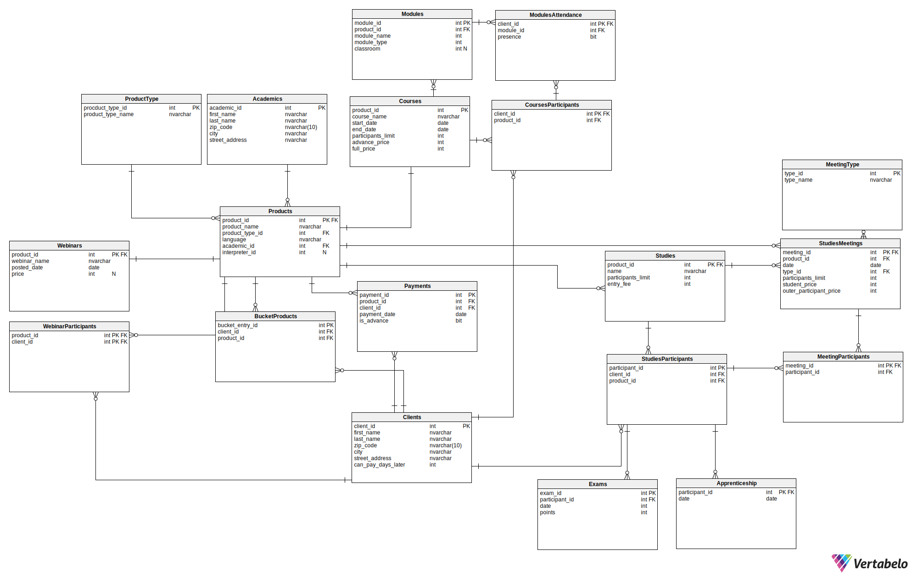

## 1. Opis systemu

Z tworzonej bazy danych skorzysta firma oferująca różnego rodzaju kursy i szkolenia:

* webinary - odbywają się na żywo na jednej z platform chmurowych, a ich nagrania są udostępniane klientom firmy. Nagrania nie są przechowywane w bazie - jedynie informacja o nich, którą usunąć może administrator.
* kursy - krótkie formy kształcenia, trwające zazwyczaj kilka dni, istnieją wyłącznie kursy płatne. Zaliczenie kursu wymaga zaliczenia min. 80% modułów.
* studia - kilkuletnie szkolenia odbywające się online i stacjonarnie, wymagają zaliczenia praktyk i zdania egzaminu końcowego

Każda z tych form kształcenia prowadzona jest przez konkretnego wykładowcę w konkretnym języku (najczęściej polskim). Czasami treść jest tłumaczona na żywo przez tłumacza, co też powinno zostać odnotowane w bazie danych.

Możemy wyróżnić następujących aktorów systemu:

* Klient - użytkownik chcący skorzystać z oferty firmy szkoleniowej
* Właściciel - osoba tworząca materiały video i treść kursów
* Administrator - zarządzanie bazą danych oraz jej ulepszanie
 Aktorzy mogą skorzystać z następujących funkcjonalności:

### 1.1 Klient

#### 1.1.1. Webinary

* Korzystanie z nagrań bezpłatnych webinarów przez okres 30 dni od ich umieszczenia na stronie
* Użytkownicy posiadający konto: Po opłaceniu dostępu do webinarów płatnych, korzystanie z nagrań tych webinarów przez kolejne 30 dni od potwierdzenia opłaty
*

#### 1.1.2. Kursy

* Kontrolowanie zaliczenia danego kursu
(procent zaliczonych modułów >= 80 %)
Sprawdzenie statusu swojej obecności na wybranych modułach
* Dostęp do listy kursów na które użytkownik jest zapisany i dostęp do statusu płatności przy każdym kursie (nieopłacone/ zaliczka/ opłacone w całości)
* Sprawdzenie dostępności wolnych miejsc na kursy hybrydowe i stacjonarne
* Dostęp do dodatkowych informacji o kursach takich jak: język kursu, obecność tłumacza, sposobie organizacji kursu (stacjonarnie/
o-line synchronicznie/ online asynchronicznie/ hybrydowo), dacie rozpoczęcia kursu czy sali zajęciowej (informacja dostępna po uiszczeniu wszelkich opłat)
Dostęp do nagranych modułów (moduły online), po opłaceniu dostępu

#### 1.1.3. Studia

* Sprawdzenie swojej obecności na zajęciach
* Możliwość zapisania się na odrabianie zajęć w kursie lub zajęciach innego kursu o podobnej tematyce
* Sprawdzenie wyników z egzaminów
* Sprawdzenie informacji o tym, czy odbyło się praktyki (14 dni - 2 razy w ciągu roku) i frekwencji na nich
* Możliwość zapisania się na pojedyncze zajęcia
* Wyświetlenie sylabusu studiów

#### 1.1.4. Koszyk

* dodawanie produktów do koszyka  (kursy, webinary, studia)
  
### 1.2. Sekretarz

* Wyświetlanie następujących raportów:
  * lista osób, które skorzystały z oferty firmy, ale za to nie zapłaciły
  * lista osób zapisanych na przyszłe wydarzenia z informacją, czy wydarzenia te odbywają się stacjonarnie, czy online
  * raport dotyczący frekwencji na wydarzeniach przeszłych - liczba osób które brały udział w każdym kursie/webinarze/studium i były obecne
  * lista osób, które są zapisane na kolidujące ze sobą wydarzenia
  * lista wyników egzaminów dla użytkowników
  * lista obecności na zajęciach dla danego użytkownika
  * lista odbytych praktyk
  * Dodanie nowego klienta
* Wyświetlanie spisu wszystkich zajęć i wszystkich spotkań z datami

### 1.3. Manager

Funkcje jakie ma sekretarz + dodatkowo:

* Wyświetlanie następujących raportów:
  * finansowe - zestawienie przychodów dla każdego kursu/studium/webinaru - przesyłana jest informacja o tym do właściciela
  * lista osób zapisanych na każde szkolenie zawierająca imię, nazwisko, informacja, czy klient był obecny
* Wyświetlanie spisu wszystkich zajęć i wszystkich spotkań z datami oraz możliwość ich zmiany (studia)
* Określenie limitu miejsc na kursy hybrydowe/stacjonarne oraz studia
* Możliwość generowania listy klientów którzy są uprawnieni do otrzymania dyplomów (ukończyli kurs/studia)

### 1.4. Nauczyciel

* Dodawanie nagrań szkoleń
* Dostęp do prowadzonych przez siebie nagrań i list obecności z prowadzonych przez siebie zajęć
  
### 1.5. Właściciel

Funkcje managera i sekretarza + dodatkowo:

* Zezwalanie na odroczenie płatności za szkolenia

### 1.6. Funkcje systemu

#### 1.6.1. Webinary

* kontrola dostępu klientów do webinarów
  * webinary bezpłatne - dostęp przez 30 dni od umieszczenia nagrania na platformie
  * webinary płatne - dostęp przez 30 dni od uiszczenia opłaty
  * uniemożliwienie korzystania z płatnych webinarów użytkownikom niezalogowanym i tym, którzy nie uiścili opłaty

#### 1.6.2. Kursy

* weryfikacja zaliczenia danych modułów wchodzących w skład kursu
* kontrola dostępu klientów do kursów:
  * kursy on-line synchronicznie (zasady jak przy webinarach)
  * kursy online asynchronicznie (dostęp po dodaniu materiałów przez właściciela i po uiszczeniu opłat przez klienta)
  * uniemożliwienie dostępu do kursów on-line użytkownikom którzy nie wpłacili całości kwoty 3 dni przed rozpoczęciem kursu

#### 1.6.3. Studia

* kontrola dostępu klientów do studiów
  * spotkania on-line
  * spotkania stacjonarnie
  * spotkania hybrydowe
  * możliwość wykupienia dostępu płatnego do jednego spotkania
  * limit miejsc ogólny (nie może być większy niż najmniejszy spośród limitów wszystkich spotkań)
* przechowywanie informacji o sylabusie (przechowywanie listy zajęć na danym studium i listy różnych studiów jeszcze przed danym rokiem)
* przechowywanie informacji o spisie wszystkich zajęć i wszystkich spotkań z datami
  * limit miejsc na spotkanie
* kontrola, czy studenci zaliczyli praktyki trwające 14 dni - 2 razy w ciągu roku
* kontrola obecności klientów na spotkaniach i praktykach
  * aby zaliczyć studium:
    * 80% obecności na spotkaniach
    * 100% obecności na praktykach
* kontrola, czy studenci uiścili opłatę wpisową oraz za każde spotkanie najpóźniej 3 dni przed zjazdem
* przyznawanie statusu zaliczenia i ew. wysłania dyplomu Pocztą polska na status korespondencyjny (na podstawie zaliczenia praktyk i egzaminu końcowego oraz obecności)

#### 1.6.4. Koszyk

* po kliknięciu przez klienta  “Zakończ i zapłać”, wygenerowanie linku do płatności.
* po zakończeniu transakcji przesłanie informacji zwrotnej o pomyślnym zakończeniu płatności lub błędzie.

## Schemat

