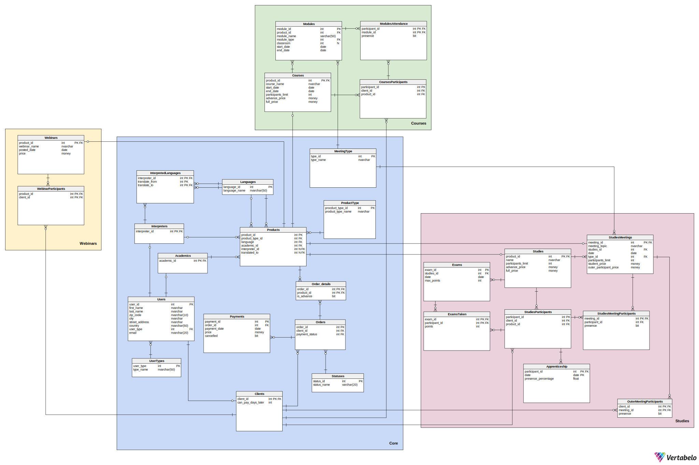

Systemy Baz Danych 
==============
***2023/2024 – projekt***

**Authors:** *Urszula Stankiewicz, Michalina Hytrek, Łukasz Kwinta*

## 1. Opis systemu

Z tworzonej bazy danych skorzysta firma oferująca różnego rodzaju kursy i szkolenia:

* webinary - odbywają się na żywo na jednej z platform chmurowych, a ich nagrania są udostępniane klientom firmy. Nagrania nie są przechowywane w bazie - jedynie informacja o nich, którą usunąć może administrator.
* kursy - krótkie formy kształcenia, trwające zazwyczaj kilka dni, istnieją wyłącznie kursy płatne. Zaliczenie kursu wymaga zaliczenia min. 80% modułów.
* studia - kilkuletnie szkolenia odbywające się online i stacjonarnie, wymagają zaliczenia praktyk i zdania egzaminu końcowego

Każda z tych form kształcenia prowadzona jest przez konkretnego wykładowcę w konkretnym języku (najczęściej polskim). Czasami treść jest tłumaczona na żywo przez tłumacza, co też powinno zostać odnotowane w bazie danych.

Możemy wyróżnić następujących aktorów systemu:

* Klient - użytkownik chcący skorzystać z oferty firmy szkoleniowej
* Właściciel - osoba tworząca materiały video i treść kursów
* Administrator - zarządzanie bazą danych oraz jej ulepszanie
 Aktorzy mogą skorzystać z następujących funkcjonalności:

### 1.1 Klient

#### 1.1.1. Webinary

* Korzystanie z nagrań bezpłatnych webinarów przez okres 30 dni od ich umieszczenia na stronie
* Użytkownicy posiadający konto: Po opłaceniu dostępu do webinarów płatnych, korzystanie z nagrań tych webinarów przez kolejne 30 dni od potwierdzenia opłaty
*

#### 1.1.2. Kursy

* Kontrolowanie zaliczenia danego kursu
(procent zaliczonych modułów >= 80 %)
Sprawdzenie statusu swojej obecności na wybranych modułach
* Dostęp do listy kursów na które użytkownik jest zapisany i dostęp do statusu płatności przy każdym kursie (nieopłacone/ zaliczka/ opłacone w całości)
* Sprawdzenie dostępności wolnych miejsc na kursy hybrydowe i stacjonarne
* Dostęp do dodatkowych informacji o kursach takich jak: język kursu, obecność tłumacza, sposobie organizacji kursu (stacjonarnie/
o-line synchronicznie/ online asynchronicznie/ hybrydowo), dacie rozpoczęcia kursu czy sali zajęciowej (informacja dostępna po uiszczeniu wszelkich opłat)
Dostęp do nagranych modułów (moduły online), po opłaceniu dostępu

#### 1.1.3. Studia

* Sprawdzenie swojej obecności na zajęciach
* Możliwość zapisania się na odrabianie zajęć w kursie lub zajęciach innego kursu o podobnej tematyce
* Sprawdzenie wyników z egzaminów
* Sprawdzenie informacji o tym, czy odbyło się praktyki (14 dni - 2 razy w ciągu roku) i frekwencji na nich
* Możliwość zapisania się na pojedyncze zajęcia
* Wyświetlenie sylabusu studiów

#### 1.1.4. Koszyk

* dodawanie produktów do koszyka  (kursy, webinary, studia)
  
### 1.2. Sekretarz

* Wyświetlanie następujących raportów:
  * lista osób, które skorzystały z oferty firmy, ale za to nie zapłaciły
  * lista osób zapisanych na przyszłe wydarzenia z informacją, czy wydarzenia te odbywają się stacjonarnie, czy online
  * raport dotyczący frekwencji na wydarzeniach przeszłych - liczba osób które brały udział w każdym kursie/webinarze/studium i były obecne
  * lista osób, które są zapisane na kolidujące ze sobą wydarzenia
  * lista wyników egzaminów dla użytkowników
  * lista obecności na zajęciach dla danego użytkownika
  * lista odbytych praktyk
  * Dodanie nowego klienta
* Wyświetlanie spisu wszystkich zajęć i wszystkich spotkań z datami

### 1.3. Manager

Funkcje jakie ma sekretarz + dodatkowo:

* Wyświetlanie następujących raportów:
  * finansowe - zestawienie przychodów dla każdego kursu/studium/webinaru - przesyłana jest informacja o tym do właściciela
  * lista osób zapisanych na każde szkolenie zawierająca imię, nazwisko, informacja, czy klient był obecny
* Wyświetlanie spisu wszystkich zajęć i wszystkich spotkań z datami oraz możliwość ich zmiany (studia)
* Określenie limitu miejsc na kursy hybrydowe/stacjonarne oraz studia
* Możliwość generowania listy klientów którzy są uprawnieni do otrzymania dyplomów (ukończyli kurs/studia)

### 1.4. Nauczyciel

* Dodawanie nagrań szkoleń
* Dostęp do prowadzonych przez siebie nagrań i list obecności z prowadzonych przez siebie zajęć
  
### 1.5. Właściciel

Funkcje managera i sekretarza + dodatkowo:

* Zezwalanie na odroczenie płatności za szkolenia

### 1.6. Funkcje systemu

#### 1.6.1. Webinary

* kontrola dostępu klientów do webinarów
  * webinary bezpłatne - dostęp przez 30 dni od umieszczenia nagrania na platformie
  * webinary płatne - dostęp przez 30 dni od uiszczenia opłaty
  * uniemożliwienie korzystania z płatnych webinarów użytkownikom niezalogowanym i tym, którzy nie uiścili opłaty

#### 1.6.2. Kursy

* weryfikacja zaliczenia danych modułów wchodzących w skład kursu
* kontrola dostępu klientów do kursów:
  * kursy on-line synchronicznie (zasady jak przy webinarach)
  * kursy online asynchronicznie (dostęp po dodaniu materiałów przez właściciela i po uiszczeniu opłat przez klienta)
  * uniemożliwienie dostępu do kursów on-line użytkownikom którzy nie wpłacili całości kwoty 3 dni przed rozpoczęciem kursu

#### 1.6.3. Studia

* kontrola dostępu klientów do studiów
  * spotkania on-line
  * spotkania stacjonarnie
  * spotkania hybrydowe
  * możliwość wykupienia dostępu płatnego do jednego spotkania
  * limit miejsc ogólny (nie może być większy niż najmniejszy spośród limitów wszystkich spotkań)
* przechowywanie informacji o sylabusie (przechowywanie listy zajęć na danym studium i listy różnych studiów jeszcze przed danym rokiem)
* przechowywanie informacji o spisie wszystkich zajęć i wszystkich spotkań z datami
  * limit miejsc na spotkanie
* kontrola, czy studenci zaliczyli praktyki trwające 14 dni - 2 razy w ciągu roku
* kontrola obecności klientów na spotkaniach i praktykach
  * aby zaliczyć studium:
    * 80% obecności na spotkaniach
    * 100% obecności na praktykach
* kontrola, czy studenci uiścili opłatę wpisową oraz za każde spotkanie najpóźniej 3 dni przed zjazdem
* przyznawanie statusu zaliczenia i ew. wysłania dyplomu Pocztą polska na status korespondencyjny (na podstawie zaliczenia praktyk i egzaminu końcowego oraz obecności)

#### 1.6.4. Koszyk

* po kliknięciu przez klienta  “Zakończ i zapłać”, wygenerowanie linku do płatności.
* po zakończeniu transakcji przesłanie informacji zwrotnej o pomyślnym zakończeniu płatności lub błędzie.

## 2. Schemat bazy danych



## 3. Implementacje tabel

### 3.1 Core

Główna część systemu

#### Users

Zawiera wszystkich użytkowników systemu oraz ich dane - imię, nazwisko, dane adresowe oraz typ użytkownika (klucz obcy do tabeli User_types), a także informację o tym, ile dni opóźnienia w płatności jest dozwolone danemu użytkownikowi.

```sql
create table Users
(
    user_id        int identity
        constraint user_id
            primary key,
    first_name     nvarchar(50)           not null,
    last_name      nvarchar(50)           not null,
    zip_code       nvarchar(10)           not null,
    city           nvarchar(50)           not null,
    street_address nvarchar(50)           not null,
    country        nvarchar(50)           not null,
    user_type      int
        constraint df_user_type default 1 not null
        constraint User_types_Users
            references User_types
            on update cascade on delete cascade,
    email          nvarchar(50)           not null
        constraint email_unique
            unique
        constraint ValidEmail
            check ([Email] like '%_@__%.__%')
)
go
```

#### Academics

Zawiera id wszystkich użytkowników, którzy są nauczycielami - zdecydowaliśmy się na dodanie tabel Academics, Interpreters i Clients, by rozdzielić logikę wykonywaną dla poszczególnych typów użytkownika.

```sql
create table Academics
(
    academic_id int not null
        constraint Academics_pk
            primary key
        constraint FK_Academics_Users
            references Users
            on update cascade on delete cascade
)
go
```

#### Interpreters

Zawiera id wszystkich tłumaczy

```sql
create table Interpreters
(
    interpreter_id int not null
        constraint Interpreters_pk
            primary key
        constraint Interpreters_Users
            references Users
            on update cascade on delete cascade
)
go

```

#### Clients

Zawiera id wszystkich klientów

```sql
create table Clients
(
    client_id          int                         not null
        constraint client_id
            primary key
        constraint Clients_Users
            references Users,
    can_pay_days_later int
        constraint df_Can_pay_days_later default 0 not null
)
go
```

#### User_types

Zawiera listę wszystkich typów użytkowników występujących w systemie

```sql
create table User_types
(
    user_type int identity
        constraint User_types_pk
            primary key,
    type_name nvarchar(50) not null
)
go
```

#### Interpreted_languages

Każdemu tłumaczowi przyporządkowuje informację o tym, z jakiego języka na jaki tłumaczy (są to FK do tabeli languages)

```sql
create table Interpreted_languages
(
    interpreter_id int not null
        constraint Interpreted_languages_Interpreters
            references Interpreters
            on update cascade on delete cascade,
    translate_from int not null
        constraint FK_Interpreted_languages_Languages
            references Languages
        constraint FK_Interpreted_languages_Languages2
            references Languages,
    translate_to   int not null
        constraint FK_Interpreted_languages_Languages1
            references Languages,
    constraint Interpreted_languages_pk
        primary key (interpreter_id, translate_from, translate_to)
)
go

```

#### Languages

Lista wszystkich języków, w jakich prowadzone są szkolenia, bądź na jakie są one tłumaczone

```sql
create table Languages
(
    language_id   int identity
        constraint PK_Languages
            primary key,
    language_name nvarchar(50) not null
        constraint language_name_unique
            unique
)
go
```

#### Products

Zawiera wszystkie produkty, informację o ich typie (odwołanie do tabeli ProductType), języku w jakim jest prowadzone dane szkolenie, wykładowcy, który je prowadzi oraz o tłumaczu i języku, na który tłumaczone jest szkolenie

```sql
create table Products
(
    product_id      int identity
        constraint Products_pk
            primary key,
    product_type_id int not null
        constraint Products_ProductType
            references ProductType
            on update cascade on delete cascade,
    language        int not null
        constraint FK_Products_Languages
            references Languages,
    academic_id     int not null
        constraint FK_Products_Academics
            references Academics
            on update cascade on delete cascade,
    interpreter_id  int
        constraint FK_Products_Interpreters1
            references Interpreters,
    translated_to   int
        constraint FK_Products_Languages1
            references Languages
)
go
```

#### ProductType

Zawiera wszystkie typy produktów (webinary, spotkania, kursy, studia)

```sql
create table ProductType
(
    product_type_id   int identity
        constraint ProductType_pk
            primary key,
    product_type_name nvarchar(50) not null
)
go
```

#### Payments

Spis wszystkich płatności (numer zamówienia, data płatności, wpłacona kwota)

```sql
create table Payments
(
    payment_id   int identity
        constraint Payments_pk
            primary key,
    order_id     int                               not null
        constraint Orders_Payments
            references Orders,
    payment_date date                              not null
        constraint payment_date_check
            check ([payment_date] >= '1990-01-01' AND [payment_date] <= getdate()),
    price        money                             not null,
    cancelled    bit
        constraint DF_Payments_cancelled default 0 not null
)
go
```

#### MeetingType

Rodzaje spotkań (online, hybrydowe, stacjonarne)

```sql
create table MeetingType
(
    type_id   int identity
        constraint type_id
            primary key,
    type_name nvarchar(50) not null
)
go
```

### Orders

Lista wszystkich zamówień (numer klienta, status płatności)

```sql
create table Orders
(
    order_id       int identity
        constraint Orders_pk
            primary key,
    client_id      int                         not null
        constraint Orders_Clients
            references Clients,
    payment_status int
        constraint df_payment_status default 2 not null
        constraint Statuses_Orders
            references Statuses
)
go
```

### OrdersDetails

Lista wszystkich zamówień (numer klienta, status płatności)

```sql
create table Order_details
(
    order_id   int                                       not null
        constraint Order_products_Orders
            references Orders,
    product_id int                                       not null
        constraint Order_products_Products
            references Products,
    is_advance bit
        constraint DF_Order_details_is_advance default 0 not null,
    constraint Order_details_pk
        primary key (order_id, product_id)
)
go
```
### Statuses

Rodzaje statusów zamówień ( nieopłacone, opłacone, częsciowo opłacone (z jakiegos produktu tylko zaliczka), anulowane )

```sql
create table Statuses
(
    status_id   int identity
        constraint Statuses_pk
            primary key,
    status_name varchar(20) not null
)
go

```


### 3.2. Webinars

#### Webinars

Lista wszystkich webinarów wraz z ich nazwami, datą publikacji i ceną

```sql
create table Webinars
(
    product_id   int                      not null
        constraint product_id_webinars
            primary key
        constraint Webinars_Products
            references Products
            on update cascade on delete cascade,
    webinar_name nvarchar(50)             not null
        constraint webinar_name_unique
            unique,
    posted_date  date                     not null
        constraint check_posted_date
            check ([posted_date] >= '1990-01-01' AND [posted_date] <= getdate()),
    price        money
        constraint def_price default 0.00 not null
)
go

```

#### WebinarParticipants

Lista uczestników poszczególnych webinarów

```sql
create table WebinarParticipants
(
    product_id int not null
        constraint WebinarParticipants_Webinars
            references Webinars
            on update cascade on delete cascade,
    client_id  int not null
        constraint FK_WebinarParticipants_Clients
            references Clients
            on update cascade on delete cascade,
    constraint WebinarParticipants_pk
        primary key (client_id, product_id)
)
go
```

### 3.3. Courses

#### Courses

Lista kursów wraz z ich nazwami, datami początku i końca kursu, limitem uczestników, ceną zaliczki oraz pełną ceną

```sql
create table Courses
(
    product_id         int                        not null
        constraint product_id
            primary key
        constraint FK_Courses_Products
            references Products
            on update cascade on delete cascade,
    course_name        nvarchar(50)               not null
        constraint course_name_unique
            unique,
    start_date         date                       not null,
    end_date           date                       not null,
    participants_limit int                        not null,
    advance_price      money
        constraint df_advance_price default 50.00 not null,
    full_price         money
        constraint df_full_price default 400.00   not null,
    constraint ch_advance_price
        check ([advance_price] < [full_price]),
    constraint ch_end_date
        check ([end_date] >= [start_date])
)
go

```

#### CoursesParticipants

Lista uczestników poszczególnych kursów

```sql
create table CoursesParticipants
(
    participant_id int identity
        constraint CoursesParticipants_pk
            primary key,
    client_id      int not null
        constraint CursesParticipants_Clients
            references Clients
            on update cascade on delete cascade,
    product_id     int not null
        constraint CoursesParticipants_Courses
            references Courses
)
go

```


#### Modules

Lista modułów kursów z nazwami, typem modułu (odwołanie do tabeli MeetingType), numerem sali oraz datą rozpoczęcia i zakończenia modułu

```sql
create table Modules
(
    module_id   int identity
        constraint Modules_pk
            primary key,
    product_id  int         not null
        constraint Courses_Modules
            references Courses
            on update cascade on delete cascade,
    module_name varchar(50) not null,
    module_type int         not null
        constraint Modules_MeetingType
            references MeetingType
            on update cascade on delete cascade,
    classroom   int,
    start_date  date        not null,
    end_date    date        not null,
    constraint ch_end_date_courses
        check ([end_date] >= [start_date])
)
go

create unique index Uniq_Modules
    on Modules (module_name)
go

```

#### ModulesAttendance

Zawiera listę obecności uczestników kursów na poszczególnych modułach

```sql
create table ModulesAttendance
(
    participant_id int                                     not null
        constraint FK_ModulesAttendance_CoursesParticipants
            references CoursesParticipants
            on update cascade on delete cascade,
    module_id      int                                     not null
        constraint ModulesAttendance_Modules
            references Modules
            on update cascade on delete cascade,
    presence       bit
        constraint DF_ModulesAttendance_presence default 0 not null,
    constraint PK_ModulesAttendance
        primary key (participant_id, module_id)
)
go

```

### 3.4. Studies

#### Studies

Zawiera listę produktów typu "studia", nazwę studiów, limit uczestników oraz wysokość wpisowego

```sql
create table Studies
(
    product_id         int                               not null
        constraint studies_id
            primary key
        constraint Studies_Products
            references Products
            on update cascade on delete cascade,
    name               nvarchar(50)                      not null
        constraint studies_name_unique
            unique
        constraint check_name
            check (len([name]) >= 5),
    participants_limit int default 100                   not null
        constraint check_praticipant_limit
            check ([participants_limit] >= 10)
        constraint check_praticipant_limit
            check ([participants_limit] >= 10 AND [participants_limit] <= 300),
    full_price         money
        constraint df_studies_full_price default 7000.00 not null
        constraint check_full_price
            check ([full_price] >= 0),
    advance_price      money
        constraint df_studies_advance_price default 100.00,
    constraint check_advance_price
        check ([advance_price] <= [Studies].[full_price] AND [advance_price] >= 0)
)
go

exec sp_addextendedproperty 'MS_Description', 'Studies name should be at least 5 characters long', 'SCHEMA', 'dbo',
     'TABLE', 'Studies', 'CONSTRAINT', 'check_name'
go

```

#### StudiesParticipants

Zawiera uczestników poszczególnych studiów

```sql
create table StudiesParticipants
(
    participant_id int identity
        constraint participant_id_studies_participants
            primary key,
    client_id      int not null
        constraint StudiesParticipants_Clients
            references Clients
            on update cascade on delete cascade,
    product_id     int not null
        constraint StudiesParticipants_Studies
            references Studies
)
go
```
#### Exams

Zawiera przypisane studiom egzaminy, datę odbycia się egzaminów  oraz maksymalne możłiwe do zdobycia punkty

```sql
create table Exams
(
    exam_id    int identity
        constraint PK_Exams
            primary key,
    studies_id int                    not null
        constraint Exams_Studies
            references Studies
            on update cascade on delete cascade,
    date       date default getdate() not null,
    max_points int  default 100       not null
        constraint check_max_points
            check ([max_points] > 0 AND [max_points] < 200)
)
go

```

#### ExamsTaken
Zawiera dane odnośnie wyników egzaminów w których uczestnik studiów wziął udział
```sql
create table ExamsTaken
(
    exam_id        int            not null
        constraint ExamsTaken_Exams
            references Exams
            on update cascade
        constraint check_date
            check ([dbo].[checkExamDate]([exam_id]) <= getdate()),
    participant_id int            not null
        constraint ExamsTaken_StudiesParticipants
            references StudiesParticipants,
    points         int default 50 not null,
    constraint ExamsTaken_pk
        primary key (participant_id, exam_id),
    constraint check_points
        check ([points] >= 0 AND [points] <= [dbo].[checkExamMaxPoints]([exam_id]))
)
go

```

##

#### Apprenticeship

Zawiera uczestników, którzy odbyli praktyki w określonym terminie

```sql
create table Apprenticeship
(
    participant_id      int               not null
        constraint Apprenticeship_StudiesParticipants
            references StudiesParticipants
            on update cascade on delete cascade,
    date                date              not null,
    presence_percentage float default 100 not null
        constraint check_presence_percentage
            check ([presence_percentage] >= 0 AND [presence_percentage] <= 100)
)
go
```

#### StudiesMeetingParticipants

Zawiera listę obecnych studentów na danych spotkaniach

```sql
create table StudiesMeetingParticipants
(
    meeting_id     int not null
        constraint FK_MeetingParticipants_StudiesMeetings
            references StudiesMeetings
            on update cascade on delete cascade,
    participant_id int not null
        constraint MeetingParticipants_StudiesParticipants
            references StudiesParticipants
            on update cascade on delete cascade,
    presence       bit default 0,
    constraint meeting_id
        primary key (meeting_id, participant_id)
)
go

```

#### StudiesMeetings

Lista spotkań poszczególnych studiów, data spotkania, typ spotkania (FK do MeetingTypes), limit uczestników spotkania, cena dla studentów, cena dla uczestników, którzy nie są studentami

```sql
create table StudiesMeetings
(
    meeting_id              int                              not null
        constraint StudiesMeetings_pk
            primary key
        constraint StudiesMeetings_Products
            references Products
            on update cascade on delete cascade,
    studies_id              int                              not null
        constraint StudiesMeetings_Studies
            references Studies,
    date                    date                             not null,
    type_id                 int default 1                    not null
        constraint StudiesMeetings_MeetingType
            references MeetingType
            on update cascade on delete cascade,
    participants_limit      int default 300                  not null,
    student_price           money
        constraint df_student_price default 60.00            not null
        constraint check_student_price
            check ([student_price] >= 0),
    outer_participant_price money
        constraint df_outer_participant_price default 100.00 not null
        constraint check_outer_participant_price
            check ([outer_participant_price] >= 0),
    meeting_topic           nvarchar(50)                     not null
        constraint unique_meeting_topic
            unique
        constraint check_meeting_topic_length
            check (len([meeting_topic]) > 5),
    constraint check_participants_limit
        check ([dbo].[checkParicipantsLimit]([studies_id]) <= [StudiesMeetings].[participants_limit])
)
go
```

### OuterMeetingsParticipants
Tabela zawierająca uczestników spotkań na studiach nie będących uczestnikami studiów
```sql
create table OuterMeetingParticipants
(
    client_id  int                                     not null
        constraint FK_OuterMeetingParticipants_Clients
            references Clients,
    meeting_id int                                     not null
        constraint FK_OuterMeetingParticipants_StudiesMeetings
            references StudiesMeetings,
    presence   bit
        constraint df_outer_meeting_presence default 0 not null,
    constraint PK_OuterMeetingParticipants
        primary key (client_id, meeting_id)
)
go
```

## Widoki

### Dla Sekretarza

#### BorrowersList

Lista klientów którzy skorzystali z oferty i za nią nie zapłacili (client_id, order_id)

```sql
CREATE VIEW [dbo].[BorrowersList] AS
	Select client_id, order_id
	From Orders as o
	Where order_id in ( Select order_id
			From Order_details as od
			inner join 
			(Select product_id as p_id, posted_date from Webinars where posted_date <= GETDATE()
			UNION Select product_id as p_id, start_date from Courses where start_date <= GETDATE()
			UNION Select studies_id as p_id, min(date)
				from StudiesMeetings group by studies_id having (MIN(date)) <= GETDATE( ))
			as p
			on p.p_id=od.product_id)
	and not( payment_status = 1)
```

#### PastEvents

Raport dotyczący frekwencji na danym wydarzeniu (moduł, spotkanie ze studiów) wraz z postawowymi informacjami

```sql
CREATE VIEW PastEventsAttendance
AS
SELECT p.product_id, pt.product_type_name as category, s.name as product_name, sm.meeting_id as id, sm.date as date, mt.type_name as type, COUNT(mp.client_id) as attendance
FROM StudiesMeetings as sm
	inner join (SELECT participant_id as client_id, meeting_id
				FROM StudiesMeetingParticipants
				WHERE presence=1
				UNION
				SELECT client_id, meeting_id
				FROM OuterMeetingParticipants
				WHERE presence = 1) as mp
				on mp.client_id=sm.meeting_id
	inner join Studies as s on s.product_id=sm.studies_id and sm.date <= GETDATE()
	inner join Products as p on p.product_id=s.product_id
	join MeetingType as mt on mt.type_id=sm.type_id
	join ProductType as pt on pt.product_type_id=p.product_type_id
GROUP BY p.product_id, pt.product_type_name, s.name, sm.meeting_id, sm.date, mt.type_name
UNION
SELECT p.product_id, pt.product_type_name as category, c.course_name as product_name, m.module_id as id, m.start_date as date, mt.type_name  as type, COUNT(ma.presence) as attendance
FROM Modules as m
	inner join ModulesAttendance as ma on m.module_id=ma.module_id and ma.presence=1
	inner join Courses as c on c.product_id=m.product_id and m.end_date <= GETDATE()
	inner join Products as p on p.product_id=c.product_id
	join MeetingType as mt on mt.type_id=m.module_type
	join ProductType as pt on pt.product_type_id=p.product_type_id
GROUP BY p.product_id, pt.product_type_name, c.course_name, m.module_id, m.start_date, mt.type_name
GO
```

#### EventsThisMonth

Spis webinarów, modułów oraz spotkań ze studiów, które odbywają się w aktualnym miesiącu

```sql
CREATE VIEW EventsThisMonth
AS
SELECT p.product_id, pt.product_type_name as category, s.name as product_name, sm.meeting_id as id, sm.date as date, mt.type_name  as type
FROM StudiesMeetings as sm
	inner join Studies as s on s.product_id=sm.studies_id and YEAR(sm.date) = YEAR(GETDATE()) and MONTH(sm.date) = MONTH(GETDATE())
	inner join Products as p on p.product_id=s.product_id
	join MeetingType as mt on mt.type_id = sm.type_id
	join ProductType as pt on pt.product_type_id=p.product_type_id
UNION
SELECT p.product_id, pt.product_type_name as category, w.webinar_name as product_name, w.product_id, w.posted_date as date, 'on-line' as type
FROM Webinars as w
 	inner join Products as p on p.product_id=w.product_id and YEAR(w.posted_date) = YEAR(GETDATE()) and MONTH(w.posted_date) = MONTH(GETDATE())
	join ProductType as pt on pt.product_type_id=p.product_type_id
UNION
SELECT p.product_id, pt.product_type_name as category, c.course_name as product_name, m.module_id as id, m.start_date as date, mt.type_name as type
FROM Modules as m
	inner join Courses as c on c.product_id=m.product_id and YEAR(m.start_date) = YEAR(GETDATE()) and MONTH(m.start_date) = MONTH(GETDATE())
	inner join Products as p on p.product_id=c.product_id
	join MeetingType as mt on mt.type_id = m.module_type
	join ProductType as pt on pt.product_type_id=p.product_type_id
GO
```

#### Exams Stats

Lista egzaminów wraz z srednia ilościa punktów uzyskanych przez studentów

```sql
CREATE VIEW ExamsStats
AS
SELECT e.studies_id as studies, e.exam_id as exam, e.max_points as max_points, AVG(et.points) as average_points
FROM Exams as e
	inner join ExamsTaken as et on et.exam_id=e.exam_id
GROUP BY e.studies_id, e.exam_id, e.max_points
```
#### StudentsApprenticeships

Lista studentów wraz z iloscią odbytych praktyk

```sql
CREATE VIEW StudentsApprenticeship
AS
SELECT a.participant_id, COUNT(a.date) as apprenticeships_taken
FROM Apprenticeship as a
GROUP BY a.participant_id
```

#### Bilocations

Lista osób zapisanych na kilka wydarzeń odbywajacych sie w tym samym czasie (client_id, date, num_of_events

```sql
CREATE VIEW [dbo].[Bilocations] As
	Select c.client_id, p.date, COUNT(p.date) as eventsNumber
	From Clients as c
	inner join Orders as o on c.can_pay_days_later=o.client_id
	inner join Order_details as od on od.order_id=o.order_id
	inner join( Select m.module_id as p_id, start_date as date from Modules as m where  not m.module_type = 1
		UNION
		Select sm.meeting_id as p_id, sm.date as date from StudiesMeetings as sm where not sm.type_id = 1
		UNION
		Select w.product_id as p_id, w.posted_date as date from Webinars as w
		UNION
		Select sm.student_price as p_id, sm.date as date from StudiesMeetings as sm where not sm.type_id = 1) as p
	on p.p_id = od.product_id
	where p.date >= GETDATE()
	group by c.client_id, p.date
```

### Dla Managera
#### Financial Report
Przedstawia podsumowanie finansowe 
```sql
CREATE VIEW FinancialReport AS
SELECT Products.product_id, dbo.getProductName(Products.product_id) AS product_name, product_type_name, SUM(price) AS 		total_income
FROM Payments
         INNER JOIN Orders ON Payments.order_id = Orders.order_id
         INNER JOIN Order_details ON Orders.order_id = Order_details.order_id
         INNER JOIN Products ON Order_details.product_id = Products.product_id
         INNER JOIN ProductType ON Products.product_type_id = ProductType.product_type_id
GROUP BY Products.product_id, Products.product_id, product_type_name
GO
```

#### GraduationCandidates
Przedstawia listę osób które zaliczyły studia lub kurs - są kandydatami do otrzymania certyfikatu
```sql
CREATE VIEW GraduationCandidates AS
    SELECT Clients.client_id, first_name, last_name, dbo.getProductName(product_id) AS product_name
    FROM StudiesParticipants
        INNER JOIN Clients ON StudiesParticipants.client_id = Clients.client_id
        INNER JOIN Users ON Clients.client_id = Users.user_id
    WHERE dbo.studiesPass(participant_id) = 1
    UNION
    SELECT Clients.client_id, first_name, last_name, dbo.getProductName(product_id) AS product_name
    FROM CoursesParticipants
        INNER JOIN Clients ON CoursesParticipants.client_id = Clients.client_id
        INNER JOIN Users ON Clients.client_id = Users.user_id
    WHERE dbo.coursePass(participant_id) = 1
GO

```

#### All Meetings
Wyświetla daty wszystkich spotkań 
```sql
CREATE VIEW AllMeetings AS
    SELECT product_id,'Module' AS type, module_name AS title, start_date AS date
    FROM Modules
    UNION
    SELECT studies_id,'Studies Meeting' AS type, meeting_topic AS title, date AS date
    FROM StudiesMeetings
    UNION
    SELECT product_id, 'Webinar' AS type, webinar_name, posted_date AS date
    FROM Webinars
GO
```
## Procedury

### AddWebinar

Dodaje webinar o podanej nazwie, id nauczyciela, nazwie języka oraz opcjonalnie danych o tłumaczu i języku, na który jest tłumaczone dane szkolenie do tabeli webinars oraz products

```sql
CREATE PROCEDURE uspAddWebinar
 @language_name nvarchar(50),
 @academic_id int,
 @interpreter_id int=null,
 @translated_to_name nvarchar(50)=null,
 @webinar_name nvarchar(50)
AS
BEGIN
 SET NOCOUNT ON;
 BEGIN TRY
  IF EXISTS(
   SELECT *
   FROM webinars
   where @webinar_name=webinar_name
  )
  BEGIN
   ;
   THROW 52000, N'Webinar o tej nazwie już istnieje',1 
  END
  IF NOT EXISTS(
   SELECT *
   FROM Academics
   WHERE academic_id=@academic_id
  )
  BEGIN
   ;
   THROW 52000, N'Nie ma takiego nauczyciela!',1 
  END
  IF NOT EXISTS(
   SELECT *
   FROM Languages
   WHERE @language_name=language_name
  )
  BEGIN
   ;
   THROW 52000, N'Nie ma takiego języka!',1 
  END
  IF NOT EXISTS(
   SELECT *
   FROM Languages
   WHERE @translated_to_name=language_name
  ) AND @translated_to_name is not null
  BEGIN
   ;
   THROW 52000, N'Nie ma takiego języka!',1 
  END
  IF NOT EXISTS(
   SELECT *
   FROM Interpreters
   WHERE interpreter_id=@interpreter_id
  ) AND @interpreter_id is not null
  BEGIN
   ;
   THROW 52000, N'Nie ma takiego tłumacza!',1 
  END

  DECLARE @type_id INT
  SELECT @type_id = product_type_id
  FROM ProductType
  WHERE 'webinar' = product_type_name

  DECLARE @language_id INT
  SELECT @language_id=language_id
  FROM languages
  WHERE @language_name=language_name

  DECLARE @translate_to_id INT
  SELECT  @translate_to_id=language_id
  FROM languages
  WHERE  @translated_to_name=language_name

  
  INSERT INTO Products (product_type_id,language,academic_id,interpreter_id,translated_to)

    values(@type_id,@language_id,@academic_id,@interpreter_id,@translate_to_id)

  DECLARE @product_id INT;
  SET  @product_id= SCOPE_IDENTITY();

  INSERT INTO Webinars(product_id,webinar_name, posted_date)
  Values (@product_id,@webinar_name, GETDATE());

  
 END TRY
 BEGIN CATCH
  DECLARE @msg nvarchar(2048)=N'Błąd dodania webinaru: ' + ERROR_MESSAGE();
  THROW 52000, @msg, 1;
 END CATCH
END

```

### SetWebinarPrice

Zmienia cenę webinaru o podanej nazwie

```sql

SET ANSI_NULLS ON
GO
SET QUOTED_IDENTIFIER ON
GO

CREATE PROCEDURE uspSetWebinarPrice
 @webinar_name nvarchar(50),
 @price money
AS
BEGIN

 SET NOCOUNT ON;
 BEGIN TRY
  IF NOT EXISTS(
   SELECT *
   FROM webinars
   where @webinar_name=webinar_name
  )
  BEGIN
   ;
   THROW 52000, N'Webinar o tej nazwie nie istnieje',1 
  END

  DECLARE @webinar_id INT;
  SELECT @webinar_id=product_id
  FROM webinars
  WHERE @webinar_name=webinar_name

  UPDATE webinars
  SET price=@price
  where product_id=@webinar_id
 END TRY
 BEGIN CATCH
  DECLARE @msg nvarchar(2048)=N'Błąd zmiany ceny webinaru: ' + ERROR_MESSAGE();
  THROW 52000, @msg, 1;
 END CATCH
END
GO

```

### AddCourse

Dodaje kurs o podanej nazwie, id nauczyciela, nazwie języka oraz opcjonalnie danych o tłumaczu i języku, na który jest tłumaczone dane szkolenie oraz dacie rozpoczęcia i zakończenia i limicie uczestników do tabeli courses oraz products

```sql
SET ANSI_NULLS ON
GO
SET QUOTED_IDENTIFIER ON
GO

CREATE PROCEDURE [dbo].[uspAddCourse] 
 @language_name nvarchar(50),
 @academic_id int,
 @interpreter_id int=null,
 @translated_to_name nvarchar(50)=null,
 @course_name nvarchar(50),
 @start_date date,
 @end_date date,
 @participants_limit int
AS
BEGIN
 SET NOCOUNT ON;
 BEGIN TRY
  IF EXISTS(
   SELECT *
   FROM Courses
   where @course_name=course_name
  )
  BEGIN
   ;
   THROW 52000, N'Lurs o tej nazwie już istnieje',1 
  END
  IF NOT EXISTS(
   SELECT *
   FROM Academics
   WHERE academic_id=@academic_id
  )
  BEGIN
   ;
   THROW 52000, N'Nie ma takiego nauczyciela!',1 
  END
  IF NOT EXISTS(
   SELECT *
   FROM Languages
   WHERE @language_name=language_name
  )
  BEGIN
   ;
   THROW 52000, N'Nie ma takiego języka!',1 
  END
  IF NOT EXISTS(
   SELECT *
   FROM Languages
   WHERE @translated_to_name=language_name
  ) AND @translated_to_name is not null
  BEGIN
   ;
   THROW 52000, N'Nie ma takiego języka!',1 
  END
  IF NOT EXISTS(
   SELECT *
   FROM Interpreters
   WHERE interpreter_id=@interpreter_id
  ) AND @interpreter_id is not null
  BEGIN
   ;
   THROW 52000, N'Nie ma takiego tłumacza!',1 
  END

  DECLARE @type_id INT
  SELECT @type_id = product_type_id
  FROM ProductType
  WHERE 'course' = product_type_name

  DECLARE @language_id INT
  SELECT @language_id=language_id
  FROM languages
  WHERE @language_name=language_name

  DECLARE @translate_to_id INT
  SELECT  @translate_to_id=language_id
  FROM languages
  WHERE  @translated_to_name=language_name

  
  INSERT INTO Products (product_type_id,language,academic_id,interpreter_id,translated_to)

    values(@type_id,@language_id,@academic_id,@interpreter_id,@translate_to_id)

  DECLARE @product_id INT;
  SET  @product_id= SCOPE_IDENTITY();

  INSERT INTO Courses(product_id,course_name, start_date,end_date,participants_limit)
  Values (@product_id,@course_name, @start_date,@end_date,@participants_limit);

  
 END TRY
 BEGIN CATCH
  DECLARE @msg nvarchar(2048)=N'Błąd dodania kursu: ' + ERROR_MESSAGE();
  THROW 52000, @msg, 1;
 END CATCH
END

```

### setCoursePrice

Ustawia cenę zaliczki i/lub pełną cenę kursu

```sql
CREATE PROCEDURE [dbo].[uspSetCoursePrice]
	@course_name nvarchar(50),
	@advance_price money=null,
	@full_price money=null
AS
BEGIN

	SET NOCOUNT ON;
	BEGIN TRY
		IF NOT EXISTS(
			SELECT *
			FROM courses
			where @course_name=course_name
		)
		BEGIN
			;
			THROW 52000, N'Kurs o tej nazwie nie istnieje',1 
		END

		DECLARE @course_id INT;
		SELECT @course_id=product_id
		FROM courses
		WHERE @course_name=course_name
		
		IF @advance_price is not null
		Begin
			UPDATE courses
			SET advance_price=@advance_price
			where product_id=@course_id
		end
		
		IF @full_price is not null
		begin
			UPDATE courses
			SET full_price=@full_price
			where product_id=@course_id
		end

	END TRY
	BEGIN CATCH
		DECLARE @msg nvarchar(2048)=N'Błąd zmiany ceny kursu: ' + ERROR_MESSAGE();
		THROW 52000, @msg, 1;
	END CATCH
END

```

### AddStudies

Dodaje studia o podanej nazwie, id nauczyciela, nazwie języka oraz opcjonalnie danych o tłumaczu i języku, na który jest tłumaczone dane szkolenie oraz limicie uczestników do tabeli studies oraz products

```sql

CREATE PROCEDURE [dbo].[uspAddStudies] 
	@language_name nvarchar(50),
	@academic_id int,
	@interpreter_id int=null,
	@translated_to_name nvarchar(50)=null,
	@name nvarchar(50),
	@participants_limit int
AS
BEGIN
	SET NOCOUNT ON;
	BEGIN TRY
		IF EXISTS(
			SELECT *
			FROM Studies
			where @name=name
		)
		BEGIN
			;
			THROW 52000, N'Studia o tej nazwie już istnieją',1 
		END
		IF NOT EXISTS(
			SELECT *
			FROM Academics
			WHERE academic_id=@academic_id
		)
		BEGIN
			;
			THROW 52000, N'Nie ma takiego nauczyciela!',1 
		END
		IF NOT EXISTS(
			SELECT *
			FROM Languages
			WHERE @language_name=language_name
		)
		BEGIN
			;
			THROW 52000, N'Nie ma takiego języka!',1 
		END
		IF NOT EXISTS(
			SELECT *
			FROM Languages
			WHERE @translated_to_name=language_name
		) AND @translated_to_name is not null
		BEGIN
			;
			THROW 52000, N'Nie ma takiego języka!',1 
		END
		IF NOT EXISTS(
			SELECT *
			FROM Interpreters
			WHERE interpreter_id=@interpreter_id
		) AND @interpreter_id is not null
		BEGIN
			;
			THROW 52000, N'Nie ma takiego tłumacza!',1 
		END

		DECLARE @type_id INT
		SELECT @type_id = product_type_id
		FROM ProductType
		WHERE 'studies' = product_type_name

		DECLARE @language_id INT
		SELECT @language_id=language_id
		FROM languages
		WHERE @language_name=language_name

		DECLARE @translate_to_id INT
		SELECT  @translate_to_id=language_id
		FROM languages
		WHERE  @translated_to_name=language_name

		
		INSERT INTO Products (product_type_id,language,academic_id,interpreter_id,translated_to)

				values(@type_id,@language_id,@academic_id,@interpreter_id,@translate_to_id)

		DECLARE @product_id INT;
		SET  @product_id= SCOPE_IDENTITY();

		INSERT INTO Studies(product_id,name,participants_limit)
		Values (@product_id,@name,@participants_limit);

		
	END TRY
	BEGIN CATCH
		DECLARE @msg nvarchar(2048)=N'Błąd dodania kursu: ' + ERROR_MESSAGE();
		THROW 52000, @msg, 1;
	END CATCH
END

```

### setStudiesPrice

Ustawia cenę zaliczki i/lub pełną cenę studiów o podanej nazwie

```sql

CREATE PROCEDURE [dbo].[uspSetStudiesPrice]
	@name nvarchar(50),
	@advance_price money=null,
	@full_price money=null
AS
BEGIN

	SET NOCOUNT ON;
	BEGIN TRY
		IF NOT EXISTS(
			SELECT *
			FROM studies
			where @name=name
		)
		BEGIN
			;
			THROW 52000, N'Studia o tej nazwie nie istnieją',1 
		END

		DECLARE @studies_id INT;
		SELECT @studies_id=product_id
		FROM studies
		WHERE @name=name
		
		IF @advance_price is not null
		Begin
			UPDATE studies
			SET advance_price=@advance_price
			where product_id=@studies_id
		end
		
		IF @full_price is not null
		begin
			UPDATE studies
			SET full_price=@full_price
			where product_id=@studies_id
		end

	END TRY
	BEGIN CATCH
		DECLARE @msg nvarchar(2048)=N'Błąd zmiany ceny studiów: ' + ERROR_MESSAGE();
		THROW 52000, @msg, 1;
	END CATCH
END

```

### AddStudiesMeetings

Dodaje spotkanie o podanej nazwie, id nauczyciela, nazwie języka oraz opcjonalnie danych o tłumaczu i języku, na który jest tłumaczone dane szkolenie oraz limicie uczestników, dacie spotkania i przynależności do danych studiów do tabeli StudiesMeetings oraz products


```sql
CREATE PROCEDURE [dbo].[uspAddStudiesMeetings] 
	@language_name nvarchar(50),
	@academic_id int,
	@interpreter_id int=null,
	@translated_to_name nvarchar(50)=null,
	@participants_limit int,
	@type_name nvarchar(50),
	@date date,
	@studies_name nvarchar(50),
	@meeting_topic nvarchar(50)
AS
BEGIN
	SET NOCOUNT ON;
	BEGIN TRY
		IF NOT EXISTS(
			SELECT *
			FROM Academics
			WHERE academic_id=@academic_id
		)
		BEGIN
			;
			THROW 52000, N'Nie ma takiego nauczyciela!',1 
		END
		IF NOT EXISTS(
			SELECT *
			FROM Languages
			WHERE @language_name=language_name
		)
		BEGIN
			;
			THROW 52000, N'Nie ma takiego języka!',1 
		END
		IF NOT EXISTS(
			SELECT *
			FROM Languages
			WHERE @translated_to_name=language_name
		) AND @translated_to_name is not null
		BEGIN
			;
			THROW 52000, N'Nie ma takiego języka!',1 
		END
		IF NOT EXISTS(
			SELECT *
			FROM Interpreters
			WHERE interpreter_id=@interpreter_id
		) AND @interpreter_id is not null
		BEGIN
			;
			THROW 52000, N'Nie ma takiego tłumacza!',1 
		END
		IF NOT EXISTS(
			SELECT *
			FROM MeetingType
			WHERE type_name=@type_name
		) 
		BEGIN
			;
			THROW 52000, N'Nie ma takiich studiów!',1 
		END
		IF NOT EXISTS(
			SELECT *
			FROM Studies
			WHERE name=@studies_name
		) 
		BEGIN
			;
			THROW 52000, N'Nie ma takiego typu spotkania!',1 
		END

		if @meeting_topic IS NULL
            BEGIN
                ;
                THROW 52000, N'Temat spotkania nie może być pusty!',1
            END

		DECLARE @studies_id INT
		SELECT @studies_id = product_id
		FROM Studies
		WHERE name=@studies_name

		DECLARE @type_meeting_id INT
		SELECT  @type_meeting_id = type_id
		FROM MeetingType
		WHERE type_name=@type_name

		DECLARE @type_id INT
		SELECT @type_id = product_type_id
		FROM ProductType
		WHERE 'meeting' = product_type_name

		DECLARE @language_id INT
		SELECT @language_id=language_id
		FROM languages
		WHERE @language_name=language_name

		DECLARE @translate_to_id INT
		SELECT  @translate_to_id=language_id
		FROM languages
		WHERE  @translated_to_name=language_name

		
		INSERT INTO Products (product_type_id,language,academic_id,interpreter_id,translated_to)

				values(@type_id,@language_id,@academic_id,@interpreter_id,@translate_to_id)

		DECLARE @product_id INT;
		SET  @product_id= SCOPE_IDENTITY();

		INSERT INTO StudiesMeetings(meeting_id,studies_id,date,type_id,participants_limit, meeting_topic)
		Values (@product_id,@studies_id,@date,@type_meeting_id,@participants_limit, @meeting_topic);

		
	END TRY
	BEGIN CATCH
		DECLARE @msg nvarchar(2048)=N'Błąd dodania kursu: ' + ERROR_MESSAGE();
		THROW 52000, @msg, 1;
	END CATCH
END
go


```

### SetMeetingPrice

Ustawia cenę danego spotkania dla studentów i/lub uczestników spoza studiów

```sql
CREATE PROCEDURE [dbo].[uspSetMeetingPrice]
	@meeting_id int,
	@student_price money=null,
	@outer_participant_price money=null
AS
BEGIN

	SET NOCOUNT ON;
	BEGIN TRY
		IF NOT EXISTS(
			SELECT *
			FROM StudiesMeetings
			where @meeting_id=meeting_id
		)
		BEGIN
			;
			THROW 52000, N'Taki meeting nie istnieje',1 
		END
		
		IF @student_price is not null
		Begin
			UPDATE StudiesMeetings
			SET student_price=@student_price
			where meeting_id=@meeting_id
		end
		
		IF @outer_participant_price is not null
		begin
			UPDATE StudiesMeetings
			SET outer_participant_price=@outer_participant_price
			where meeting_id=@meeting_id
		end

	END TRY
	BEGIN CATCH
		DECLARE @msg nvarchar(2048)=N'Błąd zmiany ceny spotkania: ' + ERROR_MESSAGE();
		THROW 52000, @msg, 1;
	END CATCH
END
```

### AddWCSParticipant

Dodaje uczestnika do szkolenia podanego typu (kurs, studia, webinar)

```sql
CREATE PROCEDURE [dbo].[uspAddWCSParticipant]
	@type_name nvarchar(50),
	@client_id int,
	@product_id int

AS
BEGIN

	SET NOCOUNT ON;
	BEGIN TRY
		DECLARE @type_id INT
		SELECT @type_id = product_type_id
		FROM ProductType
		WHERE @type_name = product_type_name
		
		IF NOT EXISTS(
			SELECT *
			FROM ProductType
			where @type_name=product_type_name
		)
		BEGIN
			;
			THROW 52000, N'Taki rodzaj szkolenia nie istnieje',1 
		END
		IF NOT EXISTS(
			SELECT *
			FROM Clients
			where @client_id=client_id
		)
		BEGIN
			;
			THROW 52000, N'Klient o podanym id nie istnieje',1 
		END
		IF NOT EXISTS(
			SELECT *
			FROM Products
			where @product_id=product_id and @type_id=product_type_id
		)
		BEGIN
			;
			THROW 52000, N'Produkt nie istnieje lub jest innego typu niż podany',1 
		END
		

		IF @type_name='webinars'
		begin
			INSERT INTO WebinarParticipants(product_id,client_id)
			values(@product_id,@client_id)
		end
		else IF @type_name='course'
		begin
			INSERT INTO CoursesParticipants(product_id,client_id)
			values(@product_id,@client_id)
		end
		else IF @type_name='studies'
		begin
			INSERT INTO StudiesParticipants(product_id,client_id)
			values(@product_id,@client_id)
		end


	END TRY
	BEGIN CATCH
		DECLARE @msg nvarchar(2048)=N'Błąd dodania uczestnika: ' + ERROR_MESSAGE();
		THROW 52000, @msg, 1;
	END CATCH
END

```

### CancelPayment

Dla danego payment_id ustawia pole cancelled w tabeli Payments na true - anuluje płatność

```sql
CREATE PROCEDURE [dbo].[uspCancelPayment]
	@payment_id int
AS
BEGIN

	SET NOCOUNT ON;
	BEGIN TRY

		
		IF NOT EXISTS(
			SELECT *
			FROM Payments
			where @payment_id=payment_id
		)
		BEGIN
			;
			THROW 52000, N'Płatność o podanym id nie istnieje',1 
		END

		UPDATE Payments
		SET cancelled=1
		where payment_id=@payment_id

	END TRY
	BEGIN CATCH
		DECLARE @msg nvarchar(2048)=N'Błąd anulowania płatności: ' + ERROR_MESSAGE();
		THROW 52000, @msg, 1;
	END CATCH
END

```

### LetPayDaysLater

Zezwala użytkownikowi o podanym id na płacenie z podanym opóźnieniem (wartość w dniach)

```sql
CREATE PROCEDURE [dbo].[uspLetPayDaysLater]
	@client_id int,
	@days int
AS
BEGIN

	SET NOCOUNT ON;
	BEGIN TRY

		
		IF NOT EXISTS(
			SELECT *
			FROM Clients
			where @client_id=client_id
		)
		BEGIN
			;
			THROW 52000, N'Klient o podanym id nie istnieje',1 
		END

		UPDATE Clients
		SET can_pay_days_later=@days
		where client_id=@client_id

	END TRY
	BEGIN CATCH
		DECLARE @msg nvarchar(2048)=N'Błąd zezwolenia na opóźnienie w płatności: ' + ERROR_MESSAGE();
		THROW 52000, @msg, 1;
	END CATCH
END

```

### SetParticipantsLimit

Ustawia limit uczestników dla produktu podanego typu produktu (spotkania, kursu lub studiów)

```sql
CREATE PROCEDURE [dbo].[uspSetParticipantsLimit]
	@product_id int,
	@limit int,
	@product_type_name nvarchar(50)
AS
BEGIN

	SET NOCOUNT ON;
	BEGIN TRY
		
		IF NOT EXISTS(
			SELECT *
			FROM ProductType
			where @product_type_name=product_type_name
		)
		BEGIN
			;
			THROW 52000, N'Taki rodzaj szkolenia nie istnieje',1 
		END


		IF @product_type_name='course'
		begin		
			IF NOT EXISTS(
				SELECT *
				FROM Courses
				where @product_id=product_id
			)
			BEGIN
				;
				THROW 52000, N'Taki kurs nie istnieje',1 
			END

			UPDATE Courses
			SET participants_limit=@limit
			where product_id=@product_id
		end
		else IF @product_type_name='studies'
		begin		
			IF NOT EXISTS(
				SELECT *
				FROM Studies
				where @product_id=product_id
			)
			BEGIN
				;
				THROW 52000, N'Takie studia nie istnieją',1 
			END

			UPDATE Studies
			SET participants_limit=@limit
			where product_id=@product_id
		end
		else IF @product_type_name='meeting'
		begin		
			IF NOT EXISTS(
				SELECT *
				FROM StudiesMeetings
				where @product_id=meeting_id
			)
			BEGIN
				;
				THROW 52000, N'Takie spotkanie nie istnieje',1 
			END

			UPDATE StudiesMeetings
			SET participants_limit=@limit
			where meeting_id=@product_id
		end
		else
		BEGIN
			;
			THROW 52000, N'Na podanym rodzaju szkolenia nie obowiązuje limit miejsc',1 
		END

	END TRY
	BEGIN CATCH
		DECLARE @msg nvarchar(2048)=N'Błąd zezwolenia na opóźnienie w płątności: ' + ERROR_MESSAGE();
		THROW 52000, @msg, 1;
	END CATCH
END

```

### AddPresence

Dodaje status obecności dla podanego użytkownika oraz id produktu. Konieczne jest również określenie, czy szkolenie jest modułem, czy spotkaniem.

```sql
CREATE PROCEDURE [dbo].[uspAddPresence]
	@type_name nvarchar(50),
	@product_id int,
	@participant_id int,
	@presence bit
AS
BEGIN

	SET NOCOUNT ON;
	BEGIN TRY
		
		IF @type_name!='module' and @type_name!='meeting'
		BEGIN
			;
			THROW 52000, N'Taki rodzaj szkolenia nie istnieje lub nie jest na nim sprawdzana obecność',1 
		END


		IF @type_name='module'
		begin		
			IF NOT EXISTS(
				SELECT *
				FROM Modules
				where @product_id=module_id
			)
			BEGIN
				;
				THROW 52000, N'Taki moduł nie istnieje',1 
			END

			INSERT INTO ModulesAttendance(participant_id,module_id,presence)
			values(@participant_id,@product_id,@presence)
		end
		else IF @type_name='meeting'
		begin		
			IF NOT EXISTS(
				SELECT *
				FROM StudiesMeetings
				where @product_id=meeting_id
			)
			BEGIN
				;
				THROW 52000, N'Takie spotkanie nie istnieje',1 
			END

			INSERT INTO MeetingParticipants(participant_id,meeting_id,presence)
			values(@participant_id,@presence,@presence)
		end

	END TRY
	BEGIN CATCH
		DECLARE @msg nvarchar(2048)=N'Błąd wpisywania obecności: ' + ERROR_MESSAGE();
		THROW 52000, @msg, 1;
	END CATCH
END

```

### AddExamResult

Dodaje wynik egzaminu po podaniu przez użytkownika id egzaminu, id uczestnika studiów i punktów przez niego zdobytych

```sql
CREATE PROCEDURE [dbo].[uspAddExamResult]
	@exam_id int,
	@participant_id int,
	@points int
AS
BEGIN

	SET NOCOUNT ON;
	BEGIN TRY
		
		IF NOT EXISTS(
			SELECT *
			FROM Exams
			where @exam_id=exam_id
		)
		BEGIN
			;
			THROW 52000, N'Taki egzamin nie istnieje',1 
		END

		IF NOT EXISTS(
			SELECT *
			FROM StudiesParticipants
			where @participant_id=participant_id
		)
		BEGIN
			;
			THROW 52000, N'Taki uczestnik studiów nie istnieje',1 
		END

		DECLARE @max_points INT;
		SELECT @max_points = max_points
		FROM Exams
		WHERE exam_id=@exam_id

		IF @max_points<@points
		Begin 
			;
			THROW 52000, N'Liczba punktów przekracza wartość maksymalną',1 
		END

		INSERT INTO ExamsTaken(exam_id,participant_id,points)
		values(@exam_id,@participant_id,@points)


	END TRY
	BEGIN CATCH
		DECLARE @msg nvarchar(2048)=N'Błąd wpisywania wyniku egzaminu: ' + ERROR_MESSAGE();
		THROW 52000, @msg, 1;
	END CATCH
END
```

### AddApprenticeship

Dla podanego uczestnika studiów dodaje datę odbycia przez niego praktyk do tabeli Apprenticeship

```sql
CREATE PROCEDURE [dbo].[uspAddApprenticeship]
	@date date,
	@participant_id int,
	@presence_percent float
AS
BEGIN

	SET NOCOUNT ON;
	BEGIN TRY
		
		IF NOT EXISTS(
			SELECT *
			FROM StudiesParticipants
			where @participant_id=participant_id
		)
		BEGIN
			;
			THROW 52000, N'Taki uczestnik studiów nie istnieje',1 
		END


		IF GETDATE()<@date
		Begin 
			;
			THROW 52000, N'Wprowadzenie praktyk o dacie przyszłej niemożliwe',1 
		END

		IF @presence_percent NOT BETWEEN 0.0 AND 100.0
        Begin
            ;
            THROW 52000, N'Procent obecności musi być w przedziale 0..100%',1
        END

		INSERT INTO Apprenticeship(participant_id,date,presence_percentage)
		values(@participant_id,@date, @presence_percent)


	END TRY
	BEGIN CATCH
		DECLARE @msg nvarchar(2048)=N'Błąd dodania praktyk: ' + ERROR_MESSAGE();
		THROW 52000, @msg, 1;
	END CATCH
END

```

### ChangeMeetingDate

Zmienia datę spotkania

```sql
CREATE PROCEDURE [dbo].[uspChangeMeetingDate]
	@meeting_id int,
	@date date
AS
BEGIN

	SET NOCOUNT ON;
	BEGIN TRY
		IF NOT EXISTS(
			SELECT *
			FROM StudiesMeetings
			where @meeting_id=meeting_id
		)
		BEGIN
			;
			THROW 52000, N'Taki meeting nie istnieje',1 
		END
		
		DECLARE @former_date DATE;
		SELECT @former_date=date
		FROM StudiesMeetings
		WHERE meeting_id=@meeting_id

		IF @former_date<GETDATE()
		Begin
			;
			THROW 52000, N'Spotkanie się już odbyło - nie można zmienić jego daty!',1 
		END	
		
		IF @date<GETDATE()
		Begin
			;
			THROW 52000, N'Data spotkania może być zmieniona tylko na przyszłą',1 
		END

		
		UPDATE StudiesMeetings
		SET date=@date
		where meeting_id=@meeting_id

	END TRY
	BEGIN CATCH
		DECLARE @msg nvarchar(2048)=N'Błąd zmiany daty spotkania: ' + ERROR_MESSAGE();
		THROW 52000, @msg, 1;
	END CATCH
END

```

### DeleteProduct

Usuwa produkt o podanym id z bazy

```sql
CREATE PROCEDURE [dbo].[uspDeleteProduct]
	@product_id int
AS
BEGIN

	SET NOCOUNT ON;
	BEGIN TRY
		IF NOT EXISTS(
			SELECT *
			FROM Products
			where @product_id=product_id
		)
		BEGIN
			;
			THROW 52000, N'Taki produkt nie istnieje',1 
		END
		
		DELETE FROM Products Where @product_id=product_id

	END TRY
	BEGIN CATCH
		DECLARE @msg nvarchar(2048)=N'Błąd usuwania produktu: ' + ERROR_MESSAGE();
		THROW 52000, @msg, 1;
	END CATCH
END

```

### Pay

Dla podanego order_id sumuje ceny produktów wyszczególnionych w order_details i dodaje do płatność do tabeli Payments oraz uczestników do tabel odpowiadających opłaconym szkoleniom

```sql
CREATE PROCEDURE [dbo].[uspPay]
	@order_id int
AS
BEGIN

	SET NOCOUNT ON;
	BEGIN TRY

		IF NOT EXISTS(
			SELECT *
			FROM Orders
			where @order_id=order_id
		)
		BEGIN
			;
			THROW 52000, N'Takie zamówienie nie istnieje',1 
		END

		Declare @total_price money;
		SET @total_price=0;

		DECLARE @client_id INT
		SELECT @client_id=client_id
		from orders
		where order_id=@order_id

		DECLARE @status INT;
		SELECT @status=status_id
		from statuses s
		join orders o
		on o.payment_status=s.status_id
		where order_id=@order_id

		DECLARE @initial_status INT;
		SET @initial_status=@status

		SELECT @status=status_id
		from statuses 
		where status_name='paid'

		print(@status)

		DECLARE curOrder cursor for
		select product_id
		from Order_details
		where order_id=@order_id


		DECLARE @product_id INT;

		Open curOrder

		FETCH NEXT FROM curOrder INTO @product_id
		WHILE @@FETCH_STATUS = 0
		BEGIN	
			DECLARE @is_advance bit
			SELECT @is_advance=is_advance
			from Order_details
			where @product_id=product_id and @order_id=order_id


			DECLARE @product_type nvarchar(50)
			SELECT @product_type=product_type_name
			from Products p
			join ProductType pt on pt.product_type_id=p.product_type_id
			where product_id=@product_id

			DECLARE @price money

			IF @product_type='webinar'
			BEGIN
				select @price=price
				from webinars
				where @product_id=product_id
				
				if not exists(
				select *
				from WebinarParticipants
				where @client_id=client_id
				)
				begin
					Insert into WebinarParticipants(product_id,client_id)
					values (@product_id,@client_id)
				end
			END

			else IF @product_type='course'
			BEGIN
				IF @is_advance=1
				begin
					SELECT @status=status_id
					from statuses 
					where status_name='partially_paid'

					select @price=advance_price
					from courses
					where @product_id=product_id
				end
				ELSE
				begin
					select @price=full_price
					from courses
					where @product_id=product_id
				end
				if not exists(
				select *
				from CoursesParticipants
				where @client_id=client_id
				)
				begin

					Insert into CoursesParticipants(product_id,client_id)
					values (@product_id,@client_id)
				end
			END

			else IF @product_type='studies'
			BEGIN
				IF @is_advance=1
				begin
					SELECT @status=status_id
					from statuses 
					where status_name='partially_paid'


					select @price=advance_price
					from Studies
					where @product_id=product_id
				end
				ELSE
				begin
					select @price=full_price
					from studies
					where @product_id=product_id
				end
				if not exists(
				select *
				from StudiesParticipants
				where @client_id=client_id
				)
				begin
					Insert into StudiesParticipants(product_id,client_id)
					values (@product_id,@client_id)
				end
			END
			else if @product_type='meeting'
			begin
				
				if exists(
					Select * 
					from StudiesParticipants
					where @client_id=client_id
				)
				begin
					select @price=student_price
					from StudiesMeetings
					where @product_id=meeting_id

					DECLARE @participant_id int
					select @participant_id=participant_id
					from StudiesParticipants
					where client_id=@client_id
					if not exists(
					select *
					from MeetingParticipants
					where @participant_id=participant_id
					)
					begin
						Insert into MeetingParticipants(meeting_id,participant_id,presence)
						values (@product_id,@participant_id,0)
					end
				end
				else
				begin
					select @price=outer_participant_price
					from StudiesMeetings
					where @product_id=meeting_id


					if not exists(
					select *
					from OuterMeetingParticipants
					where @client_id=client_id
					)
					begin
						Insert into OuterMeetingParticipants(meeting_id,client_id,presence)
						values (@product_id,@client_id,0)
					end
				end
			end

			SET @total_price = @total_price +@price;

			FETCH NEXT FROM curOrder INTO @product_id;
		

		END

		close curOrder
		DEALLOCATE curOrder;


		IF @initial_status=(
		select status_id
		from Statuses
		where status_name='partially_paid'
		)
		Begin
			declare @former_price money;
			set @former_price=(select sum(price)
			from payments
			where order_id=@order_id
			group by order_id)
			print(@total_price)

			set @total_price=@total_price-@former_price
		end

		INSERT INTO Payments(order_id,payment_date, price)
		Values (@order_id,GETDATE(),@total_price);

		UPDATE Orders
		SET payment_status=@status
		where order_id=@order_id

	END TRY
	BEGIN CATCH
		DECLARE @msg nvarchar(2048)=N'Błąd płatności: ' + ERROR_MESSAGE();
		THROW 52000, @msg, 1;
	END CATCH
END

```
### AddOrder

Tworzy zamówienie dla klienta o podanym id

```sql
CREATE PROCEDURE [dbo].[uspAddOrder]
	@client_id int
AS
BEGIN

	SET NOCOUNT ON;
	BEGIN TRY
		
		IF NOT EXISTS(
			SELECT *
			FROM Clients
			where @client_id=client_id
		)
		BEGIN
			;
			THROW 52000, N'Taki klient nie istnieje',1 
		END


		INSERT INTO Orders(client_id)
		values(@client_id)


	END TRY
	BEGIN CATCH
		DECLARE @msg nvarchar(2048)=N'Błąd tworzenia nowego zamówienia: ' + ERROR_MESSAGE();
		THROW 52000, @msg, 1;
	END CATCH
END


```

### AddProductToOrder

Dodaje produkt do podanego zamówienia oraz informację, czy jest to zaliczka czy nie

```sql
CREATE PROCEDURE [dbo].[uspAddProductToOrder]
	@order_id int,
	@product_id int,
	@is_advance bit
AS
BEGIN

	SET NOCOUNT ON;
	BEGIN TRY
		
		IF NOT EXISTS(
			SELECT *
			FROM orders
			where @order_id=order_id
		)
		BEGIN
			;
			THROW 52000, N'Takie zamówienie nie istnieje',1 
		END

		IF NOT EXISTS(
			SELECT *
			FROM products
			where @product_id=product_id
		)
		BEGIN
			;
			THROW 52000, N'Taki produkt nie istnieje',1 
		END
		
		declare @status nvarchar(50)
		select @status=status_name
		from Statuses s
		join orders o
		on o.payment_status=s.status_id
		where order_id=@order_id

		IF @status!='not_paid'
		BEGIN
			;
			THROW 52000, N'Nie można dodać produktu do zamówienia, którego płatność zaczęła być realizowana',1 
		END


		INSERT INTO Order_details(order_id,product_id,is_advance)
		values(@order_id,@product_id,@is_advance)


	END TRY
	BEGIN CATCH
		DECLARE @msg nvarchar(2048)=N'Błąd dodawania produktu zamówienia: ' + ERROR_MESSAGE();
		THROW 52000, @msg, 1;
	END CATCH
END

```

### ChangeToFullPrice

Zmienia pole is_advance tabeli Order_details na false - oznacza to, że klient chce zapłacić pełną cenę po uprzednim zapłaceniu zaliczki

```sql
CREATE PROCEDURE [dbo].[uspChangeToFullPrice]
	@order_id int,
	@product_id int
AS
BEGIN

	SET NOCOUNT ON;
	BEGIN TRY
		
		IF NOT EXISTS(
			SELECT *
			FROM orders
			where @order_id=order_id
		)
		BEGIN
			;
			THROW 52000, N'Takie zamówienie nie istnieje',1 
		END

		IF NOT EXISTS(
			SELECT *
			FROM products
			where @product_id=product_id
		)
		BEGIN
			;
			THROW 52000, N'Taki produkt nie istnieje',1 
		END


		Update Order_details
		set is_advance=0
		where order_id=@order_id and product_id=@product_id


	END TRY
	BEGIN CATCH
		DECLARE @msg nvarchar(2048)=N'Błąd zmiany zaliczki na pełną cenę: ' + ERROR_MESSAGE();
		THROW 52000, @msg, 1;
	END CATCH
END


```

### DeleteProductFromOrder

```sql

CREATE PROCEDURE [dbo].[uspDeleteProductFromOrder]
	@order_id int,
	@product_id int
AS
BEGIN

	SET NOCOUNT ON;
	BEGIN TRY
		
		IF NOT EXISTS(
			SELECT *
			FROM orders
			where @order_id=order_id
		)
		BEGIN
			;
			THROW 52000, N'Takie zamówienie nie istnieje',1 
		END

		IF NOT EXISTS(
			SELECT *
			FROM Order_details
			where @product_id=product_id and @order_id=order_id
		)
		BEGIN
			;
			THROW 52000, N'Taki produkt nie istnieje w podanym zamówieniu',1 
		END

		declare @status nvarchar(50)
		select @status=status_name
		from Statuses s
		join orders o
		on o.payment_status=s.status_id
		where order_id=@order_id

		IF @status!='not_paid'
		BEGIN
			;
			THROW 52000, N'Nie można usunąć produktu z zamówienia, którego płatność zaczęła być realizowana',1 
		END
		
		DELETE FROM Order_details
		where product_id=@product_id and order_id=@order_id


	END TRY
	BEGIN CATCH
		DECLARE @msg nvarchar(2048)=N'Błąd usunięcia produktu z zamówienia: ' + ERROR_MESSAGE();
		THROW 52000, @msg, 1;
	END CATCH
END


```

## Funkcje

### Ogólne

#### GetProductName
Umożliwia konwersję id productu na nazwę, wykorzystrywana w innych funkcjach i widokach
```sql
CREATE FUNCTION getProductName(@product_id int)
    RETURNS nvarchar(50)
AS
    BEGIN
        DECLARE @product_type nvarchar(50)
        SET @product_type = ISNULL((SELECT product_type_name
                             FROM Products INNER JOIN ProductType ON Products.product_type_id = ProductType.product_type_id
                             WHERE product_id = @product_id), 'Nan')

        RETURN CASE @product_type
                WHEN 'Nan' THEN ''
                WHEN 'webinar' THEN (SELECT webinar_name FROM Webinars WHERE product_id = @product_id)
                WHEN 'studies' THEN (SELECT name FROM Studies WHERE product_id = @product_id)
                WHEN 'meeting' THEN (SELECT meeting_topic FROM StudiesMeetings WHERE meeting_id = @product_id)
                WHEN 'course' THEN (SELECT course_name FROM Courses WHERE product_id = @product_id)
            END
    END
```
#### GetUserIdFromUserEmail
```sql
CREATE FUNCTION getUserIdFromUserEmail(@user_email nvarchar(50))
    RETURNS int
AS
    BEGIN
        DECLARE @user_id int
        SET @user_id = (SELECT user_id FROM Users WHERE email = @user_email)

        RETURN @user_id
    END
```
#### GetParticipantIdFromUserAndProduct
```sql
CREATE FUNCTION getParticipantIdFromUserAndProduct(@user_id int, @product_id int)
    RETURNS int
AS
    BEGIN
        DECLARE @product_type nvarchar(50)
        SET @product_type = (SELECT product_type_name
                             FROM Products
                                INNER JOIN ProductType ON Products.product_type_id = ProductType.product_type_id
                             WHERE product_id = @product_id)

        RETURN CASE @product_type
            WHEN 'webinar' THEN (SELECT client_id
                                 FROM WebinarParticipants
                                 WHERE product_id = @product_id AND client_id = @user_id )
            WHEN 'course' THEN (SELECT participant_id
                                FROM CoursesParticipants
                                WHERE product_id = @product_id AND client_id = @user_id)
            WHEN 'studies' THEN (SELECT participant_id
                                 FROM StudiesParticipants
                                 WHERE product_id = @product_id AND client_id = @user_id)
            WHEN 'meeting' THEN (SELECT client_id
                                 FROM OuterMeetingParticipants
                                 WHERE meeting_id = @product_id AND client_id = @user_id)
        END
    END
```
### Sekretarz

#### ClientsExams

Lista wyników egzaminów dla danego klienta

```sql
CREATE FUNCTION clientsExam(@participant_id int)
	RETURNS table
		AS
		RETURN Select e.studies_id, et.exam_id, et.points
		FROM Exams as e
		inner join ExamsTaken as et on et.exam_id=e.exam_id and et.participant_id = @participant_id
```

#### ClientsApprenticeships

Liczba odbytych praktyk przez danego klienta

```sql
CREATE FUNCTION clientsApprenticeships(@participant_id int)
	RETURNS int
AS
BEGIN
	RETURN ( SELECT COUNT(date) FROM Apprenticeship
	Where participant_id = @participant_id
	Group By participant_id)
END
```


### Kursy

#### CoursePass

Wypisanie wartości 1 gdy uczestnik zaliczył kurs i 0 gdy nie zaliczył

```sql
CREATE FUNCTION coursePass(@participant_id int)
	RETURNS bit
AS
BEGIN
	DECLARE @course_id int
	SET @course_id = (Select product_id
						FROM CoursesParticipants 
						WHERE @participant_id=participant_id) 
	DECLARE @presence float
	SET @presence = [dbo].[coursesPresence](@participant_id, @course_id)
	DECLARE @pass bit
	SET @pass = IIF(@presence >= 80, 1, 0)
	RETURN @pass
END
```

#### CourseInfo

Wypisanie podstawowych informacji o kursie takich jak: nazwa, cena, zaliczka, data rozpoczecia, data zakonczenia oraz język główny i jezyk na który kurs jest tłumaczony.

```sql
CREATE FUNCTION courseInfo(@product_id int)
	RETURNS table
		AS
		RETURN Select c.course_name as course_name,
		c.full_price as price,
		c.advance_price as advance_price,
		c.start_date as start_date,
		c.end_date as end_date,
		p.language as orginal_language,
		l.language_name as translated_to
		FROM Products as p
		join Courses as c on c.product_id=p.product_id
		left outer join Languages as l on l.language_id=p.translated_to
		WHERE p.product_id=@product_id
```

#### ModulesPresence

Sprawdzenie statusu swojej obecności na wybranych modułach
```sql
CREATE FUNCTION modulesPresence(@participant_id int, @module_id int)
	RETURNS bit
AS
BEGIN
	DECLARE @presence BIT
	SET @presence = ISNULL((SELECT presence
				FROM ModulesAttendance
				WHERE participant_id=@participant_id AND
				module_id=@module_id),0)
	RETURN @presence
END
```

#### CoursesPresence

Sprawdzenie procentowej obecności na modułach w danym kursie

```sql
CREATE FUNCTION [dbo].[coursesPresence](@participant_id int, @product_id int)
	RETURNS FLOAT
AS
BEGIN
	DECLARE @presence float
	SET @presence = ISNULL((SELECT COUNT(ma.presence)
								FROM ModulesAttendance as ma
								inner join Modules as m
									on m.module_id=ma.module_id and m.product_id = @product_id
								WHERE ma.participant_id=@participant_id and ma.presence=1),0)
	DECLARE @modules_num int
	SET @modules_num = ISNULL((SELECT COUNT(module_id)
						FROM Modules
						WHERE product_id = @product_id),0)
	IF @modules_num = 0
	    RETURN 100
	RETURN (@presence/@modules_num) *100
END
go
```

#### CoursesFreeSlots

Sprawdzenie ilości wolnych miejsc na kursach hybrydowych i stacjonarnych

```sql
CREATE FUNCTION coursesFreeSlots(@product_id int)
	RETURNS INT
AS
BEGIN
	DECLARE @slots INT
	SET @slots = ISNULL((SELECT c.participants_limit
						From Courses as c
						Where c.product_id = @product_id), 0)
	DECLARE @occupied INT
	SET @occupied = ISNULL((SELECT COUNT(cp.participant_id)
					From CoursesParticipants as cp
					WHERE cp.product_id = @product_id
					GROUP BY cp.product_id),0)
	RETURN @slots - @occupied
END
```

#### ClientsCourses

Sprawdzenie na jakie kursy jest zapisany dany klient oraz status płatności tego kursu

```sql
CREATE FUNCTION clientCourses(@client_id int)
	RETURNS table
		AS
		RETURN Select c.course_name, s.status_name
		FROM Orders as o inner join Order_details as od on od.order_id=o.order_id
		inner join Courses as c on c.product_id=od.product_id
		inner join Statuses as s on s.status_id=o.payment_status
		WHERE o.client_id=@client_id
```

### Studia
##### StudiesPass
Umożliwia sprawdzenie czy dany uczesnik studiów zaliczył studia
```sql
CREATE FUNCTION studiesPass(@participant_id int)
    RETURNS bit
AS
    BEGIN
       IF dbo.checkApprenticeshipStatus(@participant_id) = 1 AND
          dbo.studiesPresence(@participant_id) >= 80 AND
          dbo.checkExamStatus(@participant_id) = 1
            RETURN 1
       RETURN 0
    END
```

#### StudiesPresence

Sprawdzenie obecności danego uczestnika studiów

```sql
CREATE FUNCTION studiesPresence(@participant_id int)
    RETURNS float
AS
    BEGIN
        DECLARE @meetingsCount int
        SET @meetingsCount = ISNULL((SELECT COUNT(*)
                                  FROM StudiesMeetings
                                    INNER JOIN StudiesMeetingParticipants ON StudiesMeetings.meeting_id = StudiesMeetingParticipants.meeting_id
                                  WHERE date < GETDATE() AND participant_id = @participant_id), 0)
        IF @meetingsCount = 0 BEGIN
           RETURN 100
        END

        DECLARE @attendedMeetings int
        SET @attendedMeetings = ISNULL((SELECT COUNT(*)
                                       FROM StudiesMeetings
                                           INNER JOIN StudiesMeetingParticipants ON StudiesMeetings.meeting_id = StudiesMeetingParticipants.meeting_id
                                           
                                       WHERE
                                           date < GETDATE() AND
                                           presence = 1 AND
                                           participant_id = @participant_id), 0)

        RETURN CAST(@attendedMeetings AS float)/@meetingsCount * 100.0
    END
go
```

#### GetExamScores
Umożliwia wyświetlenie punktów i wyniku procentowego z egzaminów w których uczestnik studiów brał udział (dla wszystkich studiów na które dany klient zostął zapisany)

```sql
CREATE FUNCTION getExamScores(@student_id int)
    RETURNS table
AS
    RETURN
        SELECT name, date, points, CAST(points AS float)/max_points*100 AS percentScore
        FROM ExamsTaken
            INNER JOIN Exams ON ExamsTaken.exam_id = Exams.exam_id
            INNER JOIN dbo.Studies S on Exams.studies_id = S.product_id
        WHERE participant_id = @student_id
```
#### CheckExamStatus
Umożliwia sprawdzenie czy dany uczestnik studiów zaliczył egzaminy 

```sql
CREATE FUNCTION checkExamStatus(@participan_id int)
    RETURNS bit
AS
    BEGIN
        DECLARE @passed_exams_count int
        SET @passed_exams_count = ISNULL((SELECT COUNT(*)
                                          FROM dbo.getExamScores(@participan_id)
                                          WHERE percentScore >= 50), 0)
        IF @passed_exams_count >= 1
            RETURN 1
        RETURN 0
    END
go
```

#### CheckExamMaxPoints
Pozwala sprawdzić maksymalną ilość punktów na danym egzaminie
```sql
CREATE FUNCTION checkExamMaxPoints(@exam_id int)
    RETURNS int
AS
BEGIN
    DECLARE @exam_max_points int
    SET @exam_max_points = ISNULL((SELECT max_points
                             FROM Exams
                             WHERE exam_id = @exam_id), 0)
    RETURN @exam_max_points
END
go
```

#### CheckExamDate
Pozwala sprawdzić datę wybranego egzaminu
```sql
CREATE FUNCTION checkExamDate(@exam_id int)
    RETURNS date
AS
BEGIN
    DECLARE @exam_date date
    SET @exam_date = ISNULL((SELECT date
                                    FROM Exams
                                    WHERE exam_id = @exam_id), NULL)
    RETURN @exam_date
END
```

#### CheckExamDate
Pozwala sprawdzić maksymalną ilość punktów na egzaminie
```sql
CREATE FUNCTION checkExamDate(@exam_id int)
    RETURNS date
AS
BEGIN
    DECLARE @exam_date date
    SET @exam_date = ISNULL((SELECT date
                                    FROM Exams
                                    WHERE exam_id = @exam_id), NULL)
    RETURN @exam_date
END
```

#### GetStudiesMeetings
Umożliwia wyświetlenie wszystkich zaplanowanych spotkań na studiach
```sql
CREATE FUNCTION getStudiesMeetings(@studies_id int)
    RETURNS table
AS RETURN 
        SELECT meeting_topic, date, participants_limit
        FROM StudiesMeetings
        WHERE studies_id = @studies_id
        ORDER BY date
```

#### GetRegisteredApprenticeship
Umożliwia wyświetlenie praktyk danego uczestnika studiów
```sql
CREATE FUNCTION getRegisteredApprenticeship(@participant_id int)
    RETURNS table
AS RETURN
        SELECT name, Apprenticeship.*
        FROM Apprenticeship
            INNER JOIN StudiesParticipants ON Apprenticeship.participant_id = StudiesParticipants.participant_id
            INNER JOIN Studies ON StudiesParticipants.product_id = Studies.product_id
        WHERE Apprenticeship.participant_id = @participant_id
```

#### CheckApprenticeshipStatus
Umożliwia sprawdzenie czy dany uczestnik studiów ma zaliczone praktyki
```sql
CREATE FUNCTION checkApprenticeshipStatus(@participant_id int)
    RETURNS bit
AS
    BEGIN
        DECLARE @acceptedApprenticeshipStatus int
        SET @acceptedApprenticeshipStatus = ISNULL((SELECT COUNT(*)
                                            FROM Apprenticeship
                                            WHERE presence_percentage = 100 AND participant_id = @participant_id), 0)
        IF @acceptedApprenticeshipStatus >= 2
           RETURN 1

        RETURN 0
    END
go
```

#### CheckParticipantsLimit
Pozwala sprawdzić limit osób zapisanych na studiach
```sql
CREATE FUNCTION checkParicipantsLimit(@studies_id int)
    RETURNS int
AS
    BEGIN
        DECLARE @paricipantsLimit int
        SET @paricipantsLimit = ISNULL((SELECT participants_limit
                                        FROM Studies
                                        WHERE product_id = @studies_id), 0)
        RETURN @paricipantsLimit
    END
go

```

####
Pozwala sprawdzić czy do listy uczestników spotkania na studiach można dopisać więcej osób
```sql
CREATE FUNCTION checkIfStudiesMeetingParticipantsAllowed(@meeting_id int)
    RETURNS bit
AS
    BEGIN
        DECLARE @outer_participant_count int
        DECLARE @studies_participant_count int
        DECLARE @participant_limit int

        SET @studies_participant_count = ISNULL((SELECT COUNT(*)
                                                 FROM StudiesMeetingParticipants
                                                 WHERE meeting_id = @meeting_id
                                                 GROUP BY meeting_id), 0)
        SET @outer_participant_count = ISNULL((SELECT COUNT(*)
                                               FROM OuterMeetingParticipants
                                               WHERE meeting_id = @meeting_id
                                               GROUP BY meeting_id), 0)
        SET @participant_limit = ISNULL((SELECT participants_limit
                                         FROM StudiesMeetings
                                         WHERE meeting_id = @meeting_id), 0)


        IF @studies_participant_count + @outer_participant_count > @participant_limit BEGIN
            RETURN 0
        END
        RETURN 1
    END
```

### Nauczyciel

#### GetTaughtWebinars
Umożliwia wyświetlenie prowadzonych przez nauczyciela webinarów
```sql

CREATE FUNCTION getTaughtWebinars(@academic_id int)
    RETURNS table
AS RETURN
    SELECT webinar_name, Webinars.product_id
    FROM Products
        INNER JOIN Webinars ON Products.product_id = Webinars.product_id
    WHERE academic_id = @academic_id

```

#### GetTaughtWebinars
Umożliwia wyświetlenie prowadzonych przez nauczyciela kurśów
```sql

CREATE FUNCTION getTaughtCurses(@academic_id int)
    RETURNS table
AS RETURN
    SELECT course_name, Courses.product_id
    FROM Products
        INNER JOIN Courses ON Products.product_id = Courses.product_id
    WHERE academic_id = @academic_id
		
```

#### GetTaughtMeetings
Umożliwia wyświetlenie prowadzonych przez nauczyciela kurśów
```sql

CREATE FUNCTION getTaughtStudiesMeetings(@academic_id int)
    RETURNS table
AS RETURN
    SELECT meeting_topic, meeting_id
    FROM Products
        INNER JOIN StudiesMeetings ON Products.product_id = StudiesMeetings.meeting_id
    WHERE academic_id = @academic_id
		
```

#### GetTaughtStudies
Umożliwia wyświetlenie prowadzonych przez nauczyciela kurśów
```sql
CREATE FUNCTION getTaughtStudies(@academic_id int)
    RETURNS table
AS RETURN
    SELECT name, Studies.product_id
    FROM Products
        INNER JOIN Studies ON Products.product_id = Studies.product_id
    WHERE academic_id = @academic_id
		
```


#### GetStudiesMeetingAttendanceList
Umożliwia wyswietlenie listy obecności na danym spotkaniu na studiach
```sql
CREATE FUNCTION getStudiesMeetingAttendanceList(@meeting_id int)
    RETURNS table
AS RETURN
    SELECT StudiesMeetingParticipants.participant_id, U.last_name, U.first_name
    FROM StudiesMeetingParticipants
        INNER JOIN dbo.StudiesMeetings SM on StudiesMeetingParticipants.meeting_id = SM.meeting_id
        INNER JOIN StudiesParticipants SP on StudiesMeetingParticipants.participant_id = SP.participant_id
        INNER JOIN Clients C on SP.client_id = C.client_id
        INNER JOIN Users U on C.client_id = U.user_id
    WHERE SM.meeting_id = @meeting_id
    UNION
    SELECT OuterMeetingParticipants.client_id, U.last_name, U.first_name
    FROM OuterMeetingParticipants
        INNER JOIN Clients C ON OuterMeetingParticipants.client_id = C.client_id
        INNER JOIN Users U ON C.client_id = U.user_id
    WHERE meeting_id = @meeting_id
go

```

#### GetCourseModuleAttendanceList

Wyświetla liste uczestników danego modułu z kursu

```sql
CREATE FUNCTION getCourseModuleAttendanceList(@module_id int)
    RETURNS table
AS RETURN
    SELECT ModulesAttendance.participant_id, last_name, first_name
    FROM ModulesAttendance
        INNER JOIN CoursesParticipants CP ON ModulesAttendance.participant_id = CP.participant_id
        INNER JOIN dbo.Clients C on C.client_id = CP.client_id
        INNER JOIN Users U on C.client_id = U.user_id
    WHERE module_id = @module_id
```

### Klient

#### GetOwnedWebinars
Umożliwia wyświetlenie zakupionych webinarów przez klienta
```sql
CREATE FUNCTION getOwnedWebinars(@client_id int)
    RETURNS table
AS RETURN
    SELECT webinar_name
    FROM Webinars
        INNER JOIN Products ON Webinars.product_id = Products.product_id
        INNER JOIN Order_details ON Products.product_id = Order_details.product_id
        INNER JOIN Orders ON Order_details.order_id = Orders.order_id
        INNER JOIN Statuses ON Orders.payment_status = Statuses.status_id
    WHERE status_name = 'paid' AND client_id = @client_id
```
#### GetOwnedStudies
Umożliwia wyświetlenie zakupionych studiów przez klienta

```sql

CREATE FUNCTION getOwnedStudies(@client_id int)
    RETURNS table
        AS RETURN
        SELECT name
        FROM Studies
                 INNER JOIN Products ON Studies.product_id = Products.product_id
                 INNER JOIN Order_details ON Products.product_id = Order_details.product_id
                 INNER JOIN Orders ON Order_details.order_id = Orders.order_id
                 INNER JOIN Statuses ON Orders.payment_status = Statuses.status_id
        WHERE status_name = 'paid' AND client_id = @client_id
```
#### GetOwnedStudiesMeetings
Umożliwia wyświetlenie zakupionych spotkań ze studiów przez klienta

```sql
CREATE FUNCTION getOwnedStudiesMeetings(@client_id int)
    RETURNS table
        AS RETURN
        SELECT meeting_topic
        FROM StudiesMeetings
                 INNER JOIN Products ON StudiesMeetings.meeting_id = Products.product_id
                 INNER JOIN Order_details ON Products.product_id = Order_details.product_id
                 INNER JOIN Orders ON Order_details.order_id = Orders.order_id
                 INNER JOIN Statuses ON Orders.payment_status = Statuses.status_id
        WHERE status_name = 'paid' AND client_id = @client_id
```
#### GetOwnedCourses
Umożliwia wyświetlenie zakupionych kursów przez klienta
```sql
CREATE FUNCTION getOwnedCourses(@client_id int)
    RETURNS table
        AS RETURN
        SELECT course_name
        FROM Courses
                 INNER JOIN Products ON Courses.product_id = Products.product_id
                 INNER JOIN Order_details ON Products.product_id = Order_details.product_id
                 INNER JOIN Orders ON Order_details.order_id = Orders.order_id
                 INNER JOIN Statuses ON Orders.payment_status = Statuses.status_id
        WHERE status_name = 'paid' AND client_id = @client_id
```

#### GetBucket
Pozwala wyświetlić zawartość koszyka klientów
```sql
CREATE FUNCTION getBucket(@client_id int)
    RETURNS table
AS RETURN
    SELECT dbo.getProductName(Products.product_id) AS product_name, product_type_name, Payments.price
    FROM Products
        INNER JOIN Order_details ON Products.product_id = Order_details.product_id
        INNER JOIN Orders ON Order_details.order_id = Orders.order_id
        INNER JOIN ProductType ON Products.product_type_id = ProductType.product_type_id
        INNER JOIN Payments ON Orders.order_id = Payments.order_id
        INNER JOIN Statuses ON Orders.payment_status = Statuses.status_id
    WHERE status_name = 'not_paid' AND client_id = @client_id
go

```

#### GetPaymentHistory
Umożliwia wyświetlenie historii płatności danego klienta

```sql
CREATE FUNCTION getPaymentHistory(@client_id int)
    RETURNS table
AS RETURN
    SELECT payment_date, price, Orders.order_id
    FROM Payments
        INNER JOIN Orders ON Payments.order_id = Orders.order_id
        INNER JOIN Statuses ON Orders.payment_status = Statuses.status_id
    WHERE status_name = 'paid' AND client_id = @client_id
go
```

## Triggery

### Studia

#### checkStudiesMeetingLimit
Przy dodawaniu nowych uczestników spotkań sprawdza czy nie został przekroczony limit miejsc na spotkaniu na studiach podczas wpisywania do 
tabeli `StudiesMeetingParticipants` lub `OuterMeetingParticipants`
```sql
CREATE TRIGGER checkStudiesMeetingLimit_studiesParticipants_trg
ON StudiesMeetingParticipants
AFTER INSERT
AS
    BEGIN
        SET NOCOUNT ON
        DECLARE @meeting_id int
        DECLARE curs CURSOR FOR
            (SELECT meeting_id FROM inserted)

        OPEN curs

        FETCH NEXT FROM curs INTO @meeting_id
        WHILE @@FETCH_STATUS = 0 BEGIN
            IF NOT dbo.checkIfStudiesMeetingParticipantsAllowed(@meeting_id) = 1 BEGIN
                RAISERROR(N'Studies Meetings participants limit exceeded', 12, 1)
            END

            FETCH NEXT FROM curs INTO @meeting_id
        END
        CLOSE curs
        DEALLOCATE curs
    END

CREATE TRIGGER checkStudiesMeetingLimit_outerParticipants_trg
ON OuterMeetingParticipants
AFTER INSERT
AS
    BEGIN
        SET NOCOUNT ON
        DECLARE @meeting_id int
        DECLARE curs CURSOR FOR
            (SELECT meeting_id FROM inserted)

        OPEN curs

        FETCH NEXT FROM curs INTO @meeting_id
        WHILE @@FETCH_STATUS = 0 BEGIN
            IF NOT dbo.checkIfStudiesMeetingParticipantsAllowed(@meeting_id) = 1 BEGIN
                RAISERROR(N'Studies Meetings participants limit exceeded', 12, 1)
            END

            FETCH NEXT FROM curs INTO @meeting_id
        END
        CLOSE curs
        DEALLOCATE curs
    END
```
## Role i upoważnienia

### Sekretarz

```sql
Create role secretary

GRANT SELECT ON PastEventsAttendance to secretary
GRANT SELECT ON BorrowersList to secretary
GRANT SELECT ON EventsThisMonth to secretary
GRANT SELECT ON ExamsStats to secretary
GRANT SELECT ON StudentsApprenticeship to secretary
GRANT SELECT ON Bilocations to secretary

GRANT EXECUTE ON GetProductName to secretary
GRANT EXECUTE ON GetUserIdFromUserEmail to secretary
GRANT EXECUTE ON GetParticipantIdFromUserAndProduct to secretary
GRANT SELECT ON ClientsExam to secretary
GRANT EXECUTE ON ClientsApprenticeships to secretary
GRANT EXECUTE ON CoursePass to secretary
GRANT SELECT ON CourseInfo to secretary
GRANT EXECUTE ON ModulesPresence to secretary
GRANT EXECUTE ON GetProductName to secretary
GRANT EXECUTE ON CoursesPresence to secretary
GRANT EXECUTE ON CoursesFreeSlots to secretary
GRANT SELECT ON ClientCourses to secretary
GRANT EXECUTE ON StudiesPass to secretary
GRANT EXECUTE ON StudiesPresence to secretary
GRANT EXECUTE ON CheckExamStatus to secretary
GRANT EXECUTE ON CheckExamDate to secretary
GRANT SELECT ON GetStudiesMeetings to secretary
GRANT SELECT ON GetRegisteredApprenticeship to secretary
GRANT EXECUTE ON GetApprenticeshipStatus to secretary
GRANT EXECUTE ON ParticipantsLimit to secretary
GRANT EXECUTE ON checkIfStudiesMeetingParticipantsAllowed to secretary
GRANT EXECUTE ON GetStudiesMeetingAttendance to secretary
GRANT EXECUTE ON GetCourseModuleAttendanceList to secretary
GRANT EXECUTE ON GetProductName to secretary
```
### Manager

```sql
Create role manager

GRANT SELECT ON FinancialReport to manager
GRANT SELECT ON GraduationCandidates to manager
GRANT SELECT ON AllMeetings to manager
GRANT SELECT ON PastEventsAttendance to manager
GRANT SELECT ON BorrowersList to manager
GRANT SELECT ON EventsThisMonth to manager
GRANT SELECT ON ExamsStats to manager
GRANT SELECT ON StudentsApprenticeship to manager
GRANT SELECT ON Bilocations to manager

GRANT EXECUTE ON GetProductName to manager
GRANT EXECUTE ON GetUserIdFromUserEmail to manager
GRANT EXECUTE ON GetParticipantIdFromUserAndProduct to manager
GRANT SELECT ON ClientsExam to manager
GRANT EXECUTE ON ClientsApprenticeships to manager
GRANT EXECUTE ON CoursePass to manager
GRANT SELECT ON CourseInfo to manager
GRANT EXECUTE ON ModulesPresence to manager
GRANT EXECUTE ON GetProductName to manager
GRANT EXECUTE ON CoursesPresence to manager
GRANT EXECUTE ON CoursesFreeSlots to manager
GRANT SELECT ON ClientCourses to manager
GRANT EXECUTE ON StudiesPass to manager
GRANT EXECUTE ON StudiesPresence to manager
GRANT EXECUTE ON CheckExamStatus to manager
GRANT EXECUTE ON CheckExamDate to manager
GRANT SELECT ON GetStudiesMeetings to manager
GRANT SELECT ON GetRegisteredApprenticeship to manager
GRANT EXECUTE ON GetApprenticeshipStatus to manager
GRANT EXECUTE ON ParticipantsLimit to manager
GRANT EXECUTE ON checkIfStudiesMeetingParticipantsAllowed to manager
GRANT EXECUTE ON GetStudiesMeetingAttendance to manager
GRANT EXECUTE ON GetCourseModuleAttendanceList to manager
GRANT EXECUTE ON GetProductName to manager
```

### Nauczyciel

```sql
Create role teacher

GRANT SELECT ON getTaughtWebinars to teacher
GRANT SELECT ON getTaughtCurses to teacher
GRANT SELECT ON getTaughtStudiesMeetings to teacher
GRANT SELECT ON getTaughtStudies to teacher
GRANT SELECT ON getStudiesMeetingAttendanceList to teacher
GRANT SELECT ON getCourseModuleAttendanceList to teacher
GRANT SELECT ON getTaughtWebinars to teacher
```

### Klient

```sql
Create role client

GRANT EXECUTE on CoursePass to client
GRANT SELECT on CourseInfo to client
GRANT EXECUTE on ModulesPresence to client
GRANT EXECUTE on CoursesPresence to client
GRANT EXECUTE on coursesFreeSlots to client
GRANT SELECT on ClientCourses to client
GRANT EXECUTE on StudiesPass to client
GRANT EXECUTE on StudiesPresence to client
GRANT SELECT on getExamScores to client
GRANT EXECUTE on checkExamStatus to client
GRANT EXECUTE on checkExamMaxPoints to client
GRANT EXECUTE on checkExamDate to client
GRANT SELECT on getStudiesmeetings to client
GRANT SELECT on getRegisteredApprenticeship to client
GRANT EXECUTE on CheckApprenticeshipStatus to client
GRANT EXECUTE on checkParicipantsLimit to client
```

### Właściciel

```sql
Create role owner

grant all privileges ON u_stankiew to owner
```


## Dane testowe

### Academics
| academic\_id |
| :--- |
| 2 |
| 8 |
| 10 |
| 12 |
| 21 |
| 27 |


### Apprenticeship
| participant_id | date       | presence_percentage |
|----------------|------------|---------------------|
| 1              | 2023-11-15 | 100                 |
| 4              | 2023-08-23 | 100                 |
| 4              | 2023-12-17 | 100                 |

### Clients
| client\_id | can\_pay\_days\_later |
| :--- | :--- |
| 1 | 0 |
| 3 | 0 |
| 4 | 0 |
| 5 | 12 |
| 6 | 0 |
| 7 | 0 |
| 9 | 10 |
| 11 | 0 |
| 13 | 0 |
| 15 | 0 |
| 23 | 0 |
| 24 | 0 |
| 26 | 0 |
| 29 | 2 |
| 30 | 0 |
| 31 | 4 |
| 38 | 0 |


### Courses
| product\_id | course\_name | start\_date | end\_date | participants\_limit | advance\_price | full\_price |
| :--- | :--- | :--- | :--- | :--- | :--- | :--- |
| 2 | SQL for begineers | 2022-12-12 | 2023-02-20 | 15 | 500.0000 | 2500.0000 |
| 6 | SQL for intermediate | 2024-03-20 | 2024-06-30 | 10 | 1000.0000 | 3000.0000 |
| 10 | Python algoritms and structures | 2023-10-10 | 2024-01-20 | 25 | 1500.0000 | 4000.0000 |
| 14 | UNIX comends | 2024-01-05 | 2024-01-31 | 20 | 200.0000 | 1000.0000 |
| 22 | Object oriented Programming in C++ | 2024-01-01 | 2024-06-28 | 23 | 20.0000 | 400.0000 |


### CoursesParticipants
| participant\_id | client\_id | product\_id |
| :--- | :--- | :--- |
| 1 | 1 | 2 |
| 2 | 1 | 6 |
| 3 | 4 | 2 |
| 4 | 4 | 6 |
| 5 | 7 | 10 |
| 6 | 7 | 14 |
| 7 | 1 | 10 |
| 8 | 1 | 14 |
| 9 | 11 | 10 |
| 10 | 15 | 10 |
| 11 | 5 | 10 |
| 12 | 13 | 10 |
| 13 | 9 | 10 |
| 14 | 3 | 10 |
| 15 | 24 | 22 |
| 16 | 24 | 14 |


### Exams
| exam\_id | studies\_id | date | max\_points |
| :--- | :--- | :--- | :--- |
| 1 | 4 | 2023-10-12 | 60 |
| 2 | 8 | 2024-12-06 | 100 |
| 3 | 12 | 2024-08-14 | 20 |
| 4 | 16 | 2023-11-23 | 97 |
| 5 | 19 | 2024-05-23 | 150 |
| 6 | 4 | 2023-12-16 | 100 |
| 7 | 20 | 2023-10-04 | 80 |
| 8 | 20 | 2023-12-08 | 60 |


### ExamsTaken
| exam\_id | participant\_id | points |
| :--- | :--- | :--- |
| 1 | 1 | 55 |
| 6 | 1 | 92 |
| 7 | 4 | 66 |
| 8 | 4 | 53 |
| 4 | 5 | 82 |
| 4 | 6 | 95 |
| 1 | 9 | 40 |
| 1 | 10 | 49 |


### Interpreted_language
| interpreter\_id | translate\_from | translate\_to |
| :--- | :--- | :--- |
| 14 | 2 | 1 |
| 14 | 2 | 3 |
| 14 | 3 | 1 |
| 22 | 4 | 1 |


### Interpreters
| interpreter\_id |
| :--- |
| 14 |
| 22 |


### Languages
| language\_id | language\_name |
| :--- | :--- |
| 3 | English |
| 2 | German |
| 4 | Italian |
| 1 | Polish |
| 5 | Spanish |

### MeetingType
| type_id | type_name |
|---------|-----------|
| 1       | on-line   |
| 2       | in-person |
| 3       | hybrid    |

### Modules
| module\_id | product\_id | module\_name | module\_type | classroom | start\_date | end\_date |
| :--- | :--- | :--- | :--- | :--- | :--- | :--- |
| 1 | 2 | Primary Keys | 2 | 10 | 2022-12-12 | 2022-12-14 |
| 2 | 2 | Basic commands | 1 | null | 2022-12-19 | 2022-12-20 |
| 3 | 2 | The basics of joins | 1 | null | 2023-01-04 | 2023-01-10 |
| 4 | 2 | Exercises | 1 | null | 2023-01-15 | 2023-02-20 |
| 5 | 6 | Group by your data | 2 | 15 | 2024-03-20 | 2024-04-20 |
| 6 | 6 | Sort your data | 2 | 15 | 2024-04-25 | 2024-04-30 |
| 7 | 6 | Exercices | 1 | null | 2024-05-01 | 2024-06-30 |
| 8 | 10 | Sorting algoritms | 2 | 20 | 2023-10-10 | 2023-11-10 |
| 9 | 10 | Graph Algoritms | 3 | 15 | 2023-11-15 | 2023-12-15 |
| 10 | 10 | Dynamic Programming | 2 | 20 | 2023-12-20 | 2024-01-20 |
| 11 | 14 | Files and folders | 1 | null | 2024-01-05 | 2024-01-10 |
| 12 | 14 | Grep and awk | 1 | null | 2024-01-11 | 2024-01-20 |
| 13 | 14 | Bash and regex | 1 | null | 2024-01-21 | 2024-01-31 |

### ModulesAttendance
| participant\_id | module\_id | presence |
| :--- | :--- | :--- |
| 1 | 1 | true |
| 1 | 2 | true |
| 1 | 3 | true |
| 1 | 4 | true |
| 3 | 1 | true |
| 3 | 2 | false |
| 3 | 3 | false |
| 3 | 4 | true |
| 5 | 8 | true |
| 5 | 9 | true |
| 7 | 8 | true |
| 7 | 9 | true |
| 9 | 8 | true |
| 9 | 9 | true |
| 10 | 8 | true |
| 10 | 9 | false |
| 11 | 8 | true |
| 11 | 9 | true |
| 12 | 8 | true |
| 12 | 9 | true |
| 13 | 8 | true |
| 13 | 9 | true |
| 14 | 8 | true |
| 14 | 9 | true |
| 15 | 1 | true |
| 15 | 13 | true |

### Order_details
| order\_id | product\_id | is\_advance |
| :--- | :--- | :--- |
| 1 | 5 | false |
| 1 | 9 | false |
| 1 | 21 | false |
| 2 | 5 | false |
| 3 | 9 | false |
| 3 | 13 | false |
| 4 | 9 | false |
| 5 | 21 | false |
| 6 | 5 | false |
| 7 | 13 | false |
| 7 | 21 | false |
| 8 | 13 | false |
| 8 | 14 | false |
| 8 | 22 | false |
| 12 | 2 | false |
| 12 | 6 | false |
| 12 | 10 | false |
| 12 | 14 | true |
| 14 | 2 | false |
| 14 | 6 | false |
| 15 | 10 | false |
| 15 | 14 | true |
| 16 | 10 | false |
| 17 | 10 | false |
| 18 | 10 | false |
| 19 | 10 | false |
| 20 | 6 | false |
| 21 | 10 | false |
| 22 | 10 | false |
| 23 | 4 | false |
| 24 | 12 | false |
| 25 | 16 | false |
| 26 | 20 | false |
| 27 | 16 | false |
| 28 | 16 | false |
| 29 | 19 | false |
| 30 | 20 | false |
| 31 | 4 | false |
| 32 | 4 | false |
| 33 | 8 | false |

### Orders
| order\_id | client\_id | payment\_status |
| :--- | :--- | :--- |
| 1 | 1 | 1 |
| 2 | 7 | 1 |
| 3 | 9 | 1 |
| 4 | 15 | 1 |
| 5 | 23 | 1 |
| 6 | 30 | 1 |
| 7 | 24 | 1 |
| 8 | 24 | 1 |
| 9 | 4 | 2 |
| 12 | 1 | 1 |
| 14 | 4 | 1 |
| 15 | 7 | 4 |
| 16 | 11 | 1 |
| 17 | 5 | 1 |
| 18 | 13 | 1 |
| 19 | 3 | 1 |
| 20 | 3 | 2 |
| 21 | 15 | 1 |
| 22 | 9 | 1 |
| 23 | 30 | 1 |
| 24 | 23 | 1 |
| 25 | 4 | 1 |
| 26 | 23 | 1 |
| 27 | 23 | 1 |
| 28 | 24 | 1 |
| 29 | 3 | 1 |
| 30 | 4 | 1 |
| 31 | 5 | 1 |
| 32 | 29 | 1 |
| 33 | 5 | 1 |


### OuterMeetingParticipants
| client\_id | meeting\_id | presence |
| :--- | :--- | :--- |
| 1 | 24 | false |
| 3 | 24 | false |
| 5 | 24 | false |
| 38 | 24 | false |


### Payments
| payment\_id | order\_id | payment\_date | price | cancelled |
| :--- | :--- | :--- | :--- | :--- |
| 4 | 2 | 2023-12-10 | 50.0000 | false |
| 5 | 3 | 2023-12-14 | 60.0000 | false |
| 6 | 4 | 2023-12-17 | 60.0000 | false |
| 7 | 5 | 2023-12-15 | 12.0000 | false |
| 8 | 6 | 2023-12-16 | 50.0000 | false |
| 9 | 7 | 2023-12-16 | 12.0000 | false |
| 14 | 1 | 2023-12-17 | 122.0000 | false |
| 15 | 8 | 2023-12-17 | 220.0000 | false |
| 22 | 8 | 2023-12-17 | 800.0000 | false |
| 23 | 8 | 2023-12-17 | 380.0000 | false |
| 24 | 12 | 2022-12-01 | 5250.0000 | false |
| 25 | 12 | 2023-10-01 | 4500.0000 | false |
| 26 | 14 | 2022-12-05 | 5500.0000 | false |
| 27 | 15 | 2023-09-10 | 4250.0000 | false |
| 28 | 16 | 2023-07-23 | 4000.0000 | false |
| 29 | 17 | 2023-02-20 | 4000.0000 | false |
| 30 | 18 | 2023-06-01 | 1500.0000 | true |
| 31 | 18 | 2023-06-02 | 1500.0000 | false |
| 32 | 18 | 2023-08-01 | 2500.0000 | false |
| 33 | 19 | 2023-09-12 | 4000.0000 | false |
| 36 | 21 | 2023-10-01 | 4000.0000 | false |
| 37 | 22 | 2023-10-02 | 4000.0000 | false |
| 38 | 23 | 2023-10-03 | 40.0000 | false |
| 39 | 24 | 2023-10-04 | 35.0000 | false |
| 40 | 25 | 2023-10-11 | 25.0000 | false |
| 41 | 26 | 2023-10-11 | 10.0000 | false |
| 42 | 27 | 2023-10-20 | 25.0000 | false |
| 43 | 28 | 2023-10-04 | 25.0000 | false |
| 44 | 29 | 2023-10-03 | 25.0000 | false |
| 45 | 30 | 2023-10-01 | 10.0000 | false |
| 46 | 31 | 2023-09-22 | 40.0000 | false |
| 47 | 32 | 2023-09-23 | 40.0000 | false |
| 48 | 33 | 2023-09-29 | 30.0000 | false |


### Products
| product\_id | product\_type\_id | language | academic\_id | interpreter\_id | translated\_to |
| :--- | :--- | :--- | :--- | :--- | :--- |
| 1 | 1 | 3 | 8 | null | null |
| 2 | 2 | 2 | 2 | 14 | 1 |
| 3 | 1 | 4 | 10 | 22 | 1 |
| 4 | 3 | 1 | 21 | null | null |
| 5 | 1 | 3 | 2 | null | null |
| 6 | 2 | 4 | 8 | 22 | 1 |
| 7 | 4 | 2 | 10 | 14 | 3 |
| 8 | 3 | 1 | 12 | null | null |
| 9 | 1 | 3 | 12 | null | null |
| 10 | 2 | 2 | 2 | null | null |
| 11 | 4 | 4 | 10 | null | null |
| 12 | 3 | 1 | 21 | null | null |
| 13 | 1 | 3 | 21 | null | null |
| 14 | 2 | 4 | 2 | null | null |
| 15 | 4 | 2 | 8 | 14 | 3 |
| 16 | 3 | 2 | 2 | null | null |
| 17 | 1 | 1 | 8 | 14 | 1 |
| 18 | 2 | 1 | 8 | 22 | 3 |
| 19 | 3 | 2 | 10 | null | null |
| 20 | 3 | 3 | 12 | null | null |
| 21 | 1 | 3 | 2 | null | null |
| 22 | 2 | 2 | 2 | null | null |
| 23 | 3 | 2 | 2 | null | null |
| 24 | 4 | 2 | 2 | null | null |
| 26 | 4 | 2 | 2 | null | null |
| 27 | 4 | 3 | 12 | null | null |
| 28 | 4 | 2 | 10 | null | null |
| 29 | 4 | 2 | 12 | 14 | 1 |
| 30 | 4 | 2 | 8 | null | null |
| 31 | 4 | 1 | 8 | 22 | 3 |
| 32 | 4 | 1 | 21 | null | null |
| 33 | 4 | 1 | 21 | null | null |
| 34 | 4 | 2 | 2 | 22 | 3 |
| 35 | 4 | 3 | 2 | null | null |


### ProductType
| procduct_type_id | product_type_name |
|------------------|-------------------|
| 1                | webinar           |
| 2                | course            |
| 3                | studies           |
| 4                | meeting           |


### Statuses
| status\_id | status\_name |
| :--- | :--- |
| 1 | paid |
| 2 | not\_paid |
| 4 | partially\_paid |


### Studies
| product\_id | name | participants\_limit | full\_price | advance\_price |
| :--- | :--- | :--- | :--- | :--- |
| 4 | Computer Science | 50 | 40.0000 | 20.0000 |
| 8 | Astrophysics | 20 | 30.0000 | 12.0000 |
| 12 | Cybersecurity | 30 | 35.0000 | 10.0000 |
| 16 | Biomedic Engineering | 15 | 50.0000 | 25.0000 |
| 19 | Economy | 100 | 25.0000 | 10.0000 |
| 20 | Marketing | 200 | 10.0000 | 5.0000 |
| 23 | Geschichte und Okonomie | 23 | 2000.0000 | 100.0000 |

### StudiesMeetings
| meeting\_id | studies\_id | date | type\_id | participants\_limit | student\_price | outer\_participant\_price | meeting\_topic |
| :--- | :--- | :--- | :--- | :--- | :--- | :--- | :--- |
| 3 | 4 | 2023-10-30 | 1 | 60 | 0.0000 | 15.0000 | "Programming Basics" |
| 6 | 8 | 2023-10-20 | 2 | 30 | 0.0000 | 20.0000 | "Black holes explained" |
| 7 | 4 | 2023-12-25 | 1 | 50 | 0.0000 | 10.0000 | "Operating Systems" |
| 11 | 4 | 2023-12-15 | 2 | 65 | 0.0000 | 5.0000 | "Network Architecture" |
| 15 | 4 | 2023-11-22 | 1 | 100 | 60.0000 | 100.0000 | "Algorithms Part 1" |
| 24 | 4 | 2023-12-23 | 1 | 50 | 60.0000 | 200.0000 | "Object Oriented Programing" |
| 26 | 4 | 2023-12-05 | 1 | 150 | 60.0000 | 15.0000 | "Algorithms Part 2" |
| 27 | 8 | 2023-10-18 | 2 | 35 | 60.0000 | 20.0000 | "Introduction to Astrophysiscs " |
| 28 | 8 | 2023-10-25 | 3 | 40 | 60.0000 | 100.0000 | "Modern cosmology theories" |
| 29 | 12 | 2023-12-24 | 3 | 50 | 5.0000 | 20.0000 | "Introduction to cybersecurity" |
| 30 | 19 | 2023-11-13 | 2 | 100 | 0.0000 | 5.0000 | "Basics of market analysys" |
| 31 | 20 | 2023-12-28 | 2 | 200 | 0.0000 | 13.0000 | "Data-driven marketing introduction" |
| 32 | 4 | 2024-01-03 | 3 | 100 | 0.0000 | 12.0000 | "Introduction to AI" |
| 33 | 4 | 2024-03-04 | 2 | 65 | 6.0000 | 20.0000 | "Functional Programming" |
| 34 | 20 | 2024-03-05 | 2 | 200 | 7.0000 | 30.0000 | "Digital marketing strategies" |
| 35 | 20 | 2024-03-12 | 2 | 200 | 2.0000 | 10.0000 | "Introduction to marketing metrics" |

### StudiesMeetingParticipants
| meeting\_id | participant\_id | presence |
| :--- | :--- | :--- |
| 3 | 1 | false |
| 3 | 9 | true |
| 6 | 11 | true |
| 7 | 1 | true |
| 7 | 9 | false |
| 7 | 10 | false |
| 27 | 11 | true |
| 28 | 11 | false |
| 29 | 2 | true |
| 30 | 7 | true |

### StudiesParticipants
| participant\_id | client\_id | product\_id |
| :--- | :--- | :--- |
| 1 | 30 | 4 |
| 2 | 23 | 12 |
| 3 | 4 | 16 |
| 4 | 23 | 20 |
| 5 | 23 | 16 |
| 6 | 24 | 16 |
| 7 | 3 | 19 |
| 8 | 4 | 20 |
| 9 | 5 | 4 |
| 10 | 29 | 4 |
| 11 | 5 | 8 |


### User_type
| user_type | type_name   |
|-----------|-------------|
| 1         | client      |
| 2         | academic    |
| 3         | interpreter |
| 4         | owner       |
| 5         | manager     |
| 6         | secretary   |

### Users
| user\_id | first\_name | last\_name | zip\_code | city | street\_address | country | user\_type | email |
| :--- | :--- | :--- | :--- | :--- | :--- | :--- | :--- | :--- |
| 1 | Jan | Nowak | 00-001 | Warsaw | ul. Prosta 5 | Poland                                             | 1 | Jan.Nowak@gmail.com |
| 2 | Hans | Müller | 10115 | Berlin | Unter den Linden 15 | Germany                                            | 2 | Hans.Müller@gmail.com |
| 3 | John | Smith | 10001 | New York | 123 Main St | USA                                                | 1 | John.Smith@gmail.com |
| 4 | Alice | Williams | SW1A 1AA | London | Buckingham Palace Rd | England                                            | 1 | Alice.Williams@gmail.com |
| 5 | Giuseppe | Rossi | 00100 | Rome | Via del Corso 10 | Italy                                              | 1 | Giuseppe.Rossi@gmail.com |
| 6 | Katarzyna | Kowalska | 03-040 | Krakow | ul. Glówna 20 | Poland                                             | 1 | Katarzyna.Kowalska@gmail.com |
| 7 | Lukas | Schmidt | 10178 | Berlin | Alexanderplatz 1 | Germany                                            | 1 | Lukas.Schmidt@gmail.com |
| 8 | Emily | Jones | 90210 | Los Angeles | 345 Maple St | USA                                                | 2 | Emily.Jones@gmail.com |
| 9 | Sophie | Taylor | SW1A 1BA | London | Westminster Bridge Rd | England                                            | 1 | Sophie.Taylor@gmail.com |
| 10 | Luca | Bianchi | 00144 | Rome | Via Appia Nuova 25 | Italy                                              | 2 | Luca.Bianchi@gmail.com |
| 11 | Marek | Wozniak | 50-001 | Wroclaw | ul. Rynek 1 | Poland                                             | 1 | Marek.Wozniak@gmail.com |
| 12 | Elena | Schneider | 60311 | Frankfurt | Hauptwache 6 | Germany                                            | 2 | Elena.Schneider@gmail.com |
| 13 | Michael | Brown | 33101 | Miami | 678 Ocean Dr | USA                                                | 1 | Michael.Brown@gmail.com |
| 14 | Olivia | Smith | SW1A 1AB | London | Buckingham Gate 12 | England                                            | 3 | Olivia.Smith@gmail.com |
| 15 | Giovanni | Ferrari | 00192 | Rome | Via della Conciliazione 50 | Italy                                              | 1 | Giovanni.Ferrari@gmail.com |
| 16 | Karolina | Lewandowska | 02-020 | Warsaw | ul. Kwiatowa 7 | Poland                                             | 4 | Karolina.Lewandowska@gmail.com |
| 17 | Mateusz | Kowalczyk | 50-500 | Wroclaw | ul. Piekna 12 | Poland                                             | 5 | Mateusz.Kowalczyk@gmail.com |
| 18 | Adrian | Szymanski | 80-080 | Gdansk | ul. Morska 3 | Poland                                             | 6 | Adrian.Szymanski@gmail.com |
| 19 | Ewa | Jankowska | 01-010 | Lodz | ul. Ogrodowa 25 | Poland                                             | 6 | Ewa.Jankowska@gmail.com |
| 20 | Mikolaj | Wójcik | 33-330 | Krakow | ul. Slowackiego 10 | Poland                                             | 5 | Mikolaj.Wójcik@gmail.com |
| 21 | Aleksandra | Dabrowska | 03-030 | Warsaw | ul. Lipowa 8 | Poland                                             | 2 | Aleksandra.Dabrowska@gmail.com |
| 22 | Andrzej | Kowalczyk | 50-501 | Wroclaw | ul. Zielona 14 | Poland                                             | 3 | Andrzej.Kowalczyk@gmail.com |
| 23 | Welby | Churchouse | 22300 | Dallas | Hunt St 10 | USA                                                | 1 | Welby.Churchouse@gmail.com |
| 24 | Ive | Boyington | 10550 | Hamburg | Alter Vall 43 | Germany                                            | 1 | Ive.Boyington@gmail.com |
| 25 | Eric  | Warren | 90543 | Brema | Neuenstrasse 12 | Germany                                            | 6 | Eric.Warren@gmail.com |
| 26 | Vincent  | Cunningham | 15250 | Vancouver | Davie St 12 | Canada                                             | 1 | Vincent.Cunningham@gmail.com |
| 27 | Janina | Wiśniowska | 43-442 | Szczeciń | ul. Długa 15 | Poland                                             | 2 | Janina.Wiśniowska@gmail.com |
| 28 | John  | Richardson | 32455 | Florencja | via Palazzulo 95 | Italy                                              | 6 | John.Richardson@gmail.com |
| 29 | Alexander  | Fowler | 43533 | Neapol | Via Campania 5 | Italy                                              | 1 | Alexander..Fowler@gmail.com |
| 30 | Andrzej | Bogdański | 35-234 | Gdańsk | ul. Portowa 41 | Poland                                             | 1 | Andrzej.Bogdański@gmail.com |
| 31 | Mark | Brown | 12-234 | London | Downing Street 5 | England | 1 | br@gmail.com |
| 38 | Aleksander | Kowalski | 20-200 | Kraków | Lea 5 | Poland | 1 | alkowalski@gmail.com |

### WebinarParticipants
| product\_id | client\_id |
| :--- | :--- |
| 1 | 1 |
| 5 | 1 |
| 9 | 1 |
| 21 | 1 |
| 1 | 3 |
| 5 | 3 |
| 9 | 3 |
| 13 | 4 |
| 9 | 7 |
| 9 | 9 |
| 5 | 11 |
| 9 | 13 |
| 1 | 15 |
| 13 | 24 |

### Webinars
| product\_id | webinar\_name | posted\_date | price |
| :--- | :--- | :--- | :--- |
| 1 | Present Simple for beginners | 2023-12-02 | 0.0000 |
| 5 | Cooking is fun | 2023-01-01 | 50.0000 |
| 9 | Robotics for children | 2023-10-11 | 60.0000 |
| 13 | Advanced constructions in English | 2023-12-12 | 0.0000 |
| 21 | First Aid Basics | 2023-12-14 | 12.0000 |


