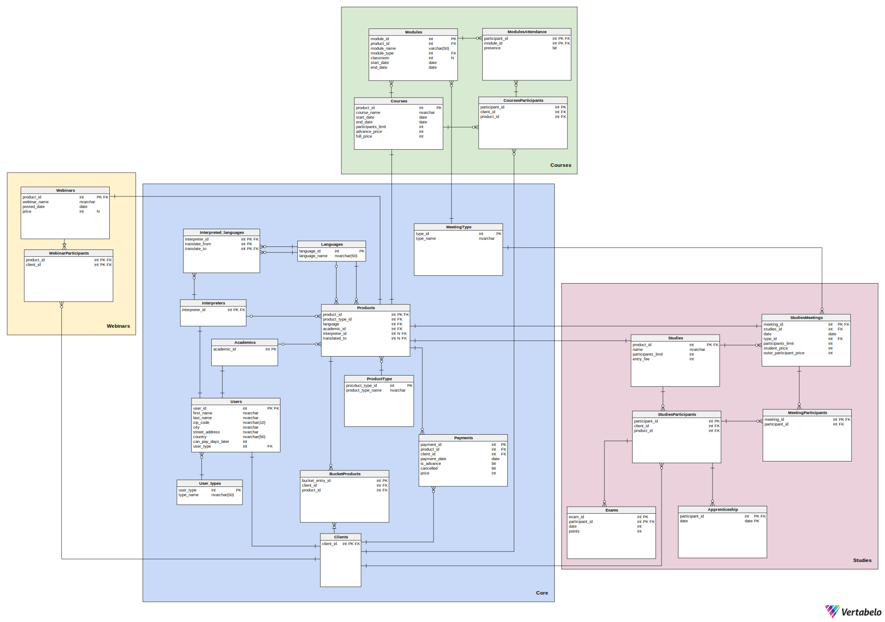

## 1. Opis systemu

Z tworzonej bazy danych skorzysta firma oferująca różnego rodzaju kursy i szkolenia:

* webinary - odbywają się na żywo na jednej z platform chmurowych, a ich nagrania są udostępniane klientom firmy. Nagrania nie są przechowywane w bazie - jedynie informacja o nich, którą usunąć może administrator.
* kursy - krótkie formy kształcenia, trwające zazwyczaj kilka dni, istnieją wyłącznie kursy płatne. Zaliczenie kursu wymaga zaliczenia min. 80% modułów.
* studia - kilkuletnie szkolenia odbywające się online i stacjonarnie, wymagają zaliczenia praktyk i zdania egzaminu końcowego

Każda z tych form kształcenia prowadzona jest przez konkretnego wykładowcę w konkretnym języku (najczęściej polskim). Czasami treść jest tłumaczona na żywo przez tłumacza, co też powinno zostać odnotowane w bazie danych.

Możemy wyróżnić następujących aktorów systemu:

* Klient - użytkownik chcący skorzystać z oferty firmy szkoleniowej
* Właściciel - osoba tworząca materiały video i treść kursów
* Administrator - zarządzanie bazą danych oraz jej ulepszanie
 Aktorzy mogą skorzystać z następujących funkcjonalności:

### 1.1 Klient

#### 1.1.1. Webinary

* Korzystanie z nagrań bezpłatnych webinarów przez okres 30 dni od ich umieszczenia na stronie
* Użytkownicy posiadający konto: Po opłaceniu dostępu do webinarów płatnych, korzystanie z nagrań tych webinarów przez kolejne 30 dni od potwierdzenia opłaty
*

#### 1.1.2. Kursy

* Kontrolowanie zaliczenia danego kursu
(procent zaliczonych modułów >= 80 %)
Sprawdzenie statusu swojej obecności na wybranych modułach
* Dostęp do listy kursów na które użytkownik jest zapisany i dostęp do statusu płatności przy każdym kursie (nieopłacone/ zaliczka/ opłacone w całości)
* Sprawdzenie dostępności wolnych miejsc na kursy hybrydowe i stacjonarne
* Dostęp do dodatkowych informacji o kursach takich jak: język kursu, obecność tłumacza, sposobie organizacji kursu (stacjonarnie/
o-line synchronicznie/ online asynchronicznie/ hybrydowo), dacie rozpoczęcia kursu czy sali zajęciowej (informacja dostępna po uiszczeniu wszelkich opłat)
Dostęp do nagranych modułów (moduły online), po opłaceniu dostępu

#### 1.1.3. Studia

* Sprawdzenie swojej obecności na zajęciach
* Możliwość zapisania się na odrabianie zajęć w kursie lub zajęciach innego kursu o podobnej tematyce
* Sprawdzenie wyników z egzaminów
* Sprawdzenie informacji o tym, czy odbyło się praktyki (14 dni - 2 razy w ciągu roku) i frekwencji na nich
* Możliwość zapisania się na pojedyncze zajęcia
* Wyświetlenie sylabusu studiów

#### 1.1.4. Koszyk

* dodawanie produktów do koszyka  (kursy, webinary, studia)
  
### 1.2. Sekretarz

* Wyświetlanie następujących raportów:
  * lista osób, które skorzystały z oferty firmy, ale za to nie zapłaciły
  * lista osób zapisanych na przyszłe wydarzenia z informacją, czy wydarzenia te odbywają się stacjonarnie, czy online
  * raport dotyczący frekwencji na wydarzeniach przeszłych - liczba osób które brały udział w każdym kursie/webinarze/studium i były obecne
  * lista osób, które są zapisane na kolidujące ze sobą wydarzenia
  * lista wyników egzaminów dla użytkowników
  * lista obecności na zajęciach dla danego użytkownika
  * lista odbytych praktyk
  * Dodanie nowego klienta
* Wyświetlanie spisu wszystkich zajęć i wszystkich spotkań z datami

### 1.3. Manager

Funkcje jakie ma sekretarz + dodatkowo:

* Wyświetlanie następujących raportów:
  * finansowe - zestawienie przychodów dla każdego kursu/studium/webinaru - przesyłana jest informacja o tym do właściciela
  * lista osób zapisanych na każde szkolenie zawierająca imię, nazwisko, informacja, czy klient był obecny
* Wyświetlanie spisu wszystkich zajęć i wszystkich spotkań z datami oraz możliwość ich zmiany (studia)
* Określenie limitu miejsc na kursy hybrydowe/stacjonarne oraz studia
* Możliwość generowania listy klientów którzy są uprawnieni do otrzymania dyplomów (ukończyli kurs/studia)

### 1.4. Nauczyciel

* Dodawanie nagrań szkoleń
* Dostęp do prowadzonych przez siebie nagrań i list obecności z prowadzonych przez siebie zajęć
  
### 1.5. Właściciel

Funkcje managera i sekretarza + dodatkowo:

* Zezwalanie na odroczenie płatności za szkolenia

### 1.6. Funkcje systemu

#### 1.6.1. Webinary

* kontrola dostępu klientów do webinarów
  * webinary bezpłatne - dostęp przez 30 dni od umieszczenia nagrania na platformie
  * webinary płatne - dostęp przez 30 dni od uiszczenia opłaty
  * uniemożliwienie korzystania z płatnych webinarów użytkownikom niezalogowanym i tym, którzy nie uiścili opłaty

#### 1.6.2. Kursy

* weryfikacja zaliczenia danych modułów wchodzących w skład kursu
* kontrola dostępu klientów do kursów:
  * kursy on-line synchronicznie (zasady jak przy webinarach)
  * kursy online asynchronicznie (dostęp po dodaniu materiałów przez właściciela i po uiszczeniu opłat przez klienta)
  * uniemożliwienie dostępu do kursów on-line użytkownikom którzy nie wpłacili całości kwoty 3 dni przed rozpoczęciem kursu

#### 1.6.3. Studia

* kontrola dostępu klientów do studiów
  * spotkania on-line
  * spotkania stacjonarnie
  * spotkania hybrydowe
  * możliwość wykupienia dostępu płatnego do jednego spotkania
  * limit miejsc ogólny (nie może być większy niż najmniejszy spośród limitów wszystkich spotkań)
* przechowywanie informacji o sylabusie (przechowywanie listy zajęć na danym studium i listy różnych studiów jeszcze przed danym rokiem)
* przechowywanie informacji o spisie wszystkich zajęć i wszystkich spotkań z datami
  * limit miejsc na spotkanie
* kontrola, czy studenci zaliczyli praktyki trwające 14 dni - 2 razy w ciągu roku
* kontrola obecności klientów na spotkaniach i praktykach
  * aby zaliczyć studium:
    * 80% obecności na spotkaniach
    * 100% obecności na praktykach
* kontrola, czy studenci uiścili opłatę wpisową oraz za każde spotkanie najpóźniej 3 dni przed zjazdem
* przyznawanie statusu zaliczenia i ew. wysłania dyplomu Pocztą polska na status korespondencyjny (na podstawie zaliczenia praktyk i egzaminu końcowego oraz obecności)

#### 1.6.4. Koszyk

* po kliknięciu przez klienta  “Zakończ i zapłać”, wygenerowanie linku do płatności.
* po zakończeniu transakcji przesłanie informacji zwrotnej o pomyślnym zakończeniu płatności lub błędzie.

## 2. Schemat bazy danych



## 3. Implementacje tabel

### 3.1 Core

Główna część systemu

#### Users

Zawiera wszystkich użytkowników systemu oraz ich dane - imię, nazwisko, dane adresowe oraz typ użytkownika (klucz obcy do tabeli User_types), a także informację o tym, ile dni opóźnienia w płatności jest dozwolone danemu użytkownikowi.

```sql
create table Users
(
    user_id            int                                  not null
        constraint user_id
            primary key,
    first_name         nvarchar(50)                         not null,
    last_name          nvarchar(50)                         not null,
    zip_code           nvarchar(10)                         not null,
    city               nvarchar(50)                         not null,
    street_address     nvarchar(50)                         not null,
    country            nchar(50)                            not null,
    can_pay_days_later int
        constraint DF__Users__can_pay_d__719CDDE7 default 0 not null,
    user_type          int                                  not null
        constraint User_types_Users
            references User_types
)
go
```

#### Academics

Zawiera id wszystkich użytkowników, którzy są nauczycielami - zdecydowaliśmy się na dodanie tabel Academics, Interpreters i Clients, by rozdzielić logikę wykonywaną dla poszczególnych typów użytkownika.

```sql
create table Academics
(
    academic_id int not null
        constraint Academics_pk
            primary key
        constraint FK_Academics_Users
            references Users
)
go
```

#### Interpreters

Zawiera id wszystkich tłumaczy

```sql
create table Interpreters
(
    interpreter_id int not null
        constraint Interpreters_pk
            primary key
        constraint Interpreters_Users
            references Users
)
go

```

#### Clients

Zawiera id wszystkich klientów

```sql
create table Clients
(
    client_id int not null
        constraint client_id
            primary key
        constraint Clients_Users
            references Users
)
go
```

#### User_types

Zawiera listę wszystkich typów użytkowników występujących w systemie

```sql
create table User_types
(
    user_type int          not null
        constraint User_types_pk
            primary key,
    type_name nvarchar(50) not null
)
go
```

#### Interpreted_languages

Każdemu tłumaczowi przyporządkowuje informację o tym, z jakiego języka na jaki tłumaczy (są to FK do tabeli languages)

```sql
create table Interpreted_languages
(
    interpreter_id int not null
        constraint Interpreted_languages_Interpreters
            references Interpreters,
    translate_from int not null
        constraint FK_Interpreted_languages_Languages
            references Languages,
    translate_to   int not null
        constraint FK_Interpreted_languages_Languages1
            references Languages,
    constraint Interpreted_languages_pk
        primary key (interpreter_id, translate_from, translate_to)
)
go
```

#### Languages

Lista wszystkich języków, w jakich prowadzone są szkolenia, bądź na jakie są one tłumaczone

```sql
create table Languages
(
    language_id   int          not null
        constraint PK_Languages
            primary key,
    language_name nvarchar(50) not null
)
go
```

#### Products

Zawiera wszystkie produkty, informację o ich typie (odwołanie do tabeli ProductType), języku w jakim jest prowadzone dane szkolenie, wykładowcy, który je prowadzi oraz o tłumaczu i języku, na który tłumaczone jest szkolenie

```sql
create table Products
(
    product_id      int not null
        constraint Products_pk
            primary key,
    product_type_id int not null
        constraint Products_ProductType
            references ProductType,
    language        int not null
        constraint FK_Products_Languages
            references Languages,
    academic_id     int not null
        constraint FK_Products_Academics
            references Academics,
    interpreter_id  int
        constraint FK_Products_Interpreters1
            references Interpreters,
    translated_to   int
        constraint FK_Products_Languages1
            references Languages
)
go
```

#### ProductType

Zawiera wszystkie typy produktów (webinary, spotkania, kursy, studia)

```sql
create table ProductType
(
    procduct_type_id  int          not null
        constraint ProductType_pk
            primary key,
    product_type_name nvarchar(50) not null
)
go

```

#### BucketProducts

Zawiera informację o produktach wrzuconych do koszyka przez klientów

```sql
create table BucketProducts
(
    bucket_entry_id int not null
        constraint BucketProducts_pk
            primary key,
    client_id       int not null
        constraint BucketItems_Clients
            references Clients,
    product_id      int not null
        constraint BucketItems_ProductType
            references Products
)
go
```

#### Payments

Spis wszystkich płatności (numer klienta, data płatności, wpłacona kwota, informacja czy kwota jest zaliczką, informacja czy płatność została anulowana)

```sql
create table Payments
(
    payment_id   int  not null
        constraint Payments_pk
            primary key,
    product_id   int  not null
        constraint Payments_Products
            references Products,
    client_id    int  not null
        constraint Clients_Payments
            references Clients,
    payment_date date not null,
    is_advance   bit  not null,
    cancelled    bit  not null,
    price        int  not null
)
go
```

#### MeetingType

Rodzaje spotkań (online, hybrydowe, stacjonarne)

```sql
create table MeetingType
(
    type_id   int          not null
        constraint type_id
            primary key,
    type_name nvarchar(50) not null
)
go
```

### 3.2. Webinars

#### Webinars

Lista wszystkich webinarów wraz z ich nazwami, datą publikacji i ceną

```sql
create table Webinars
(
    product_id   int          not null
        constraint product_id_webinars
            primary key
        constraint Webinars_Products
            references Products,
    webinar_name nvarchar(50) not null,
    posted_date  date         not null,
    price        int
)
go
```

#### WebinarParticipants

Lista uczestników poszczególnych webinarów

```sql
create table WebinarParticipants
(
    product_id int not null
        constraint WebinarParticipants_Webinars
            references Webinars,
    client_id  int not null
        constraint FK_WebinarParticipants_Clients
            references Clients,
    constraint WebinarParticipants_pk
        primary key (client_id, product_id)
)
go
```

### 3.3. Courses

#### Courses

Lista kursów wraz z ich nazwami, datami początku i końca kursu, limitem uczestników, ceną zaliczki oraz pełną ceną

```sql
create table Courses
(
    product_id         int          not null
        constraint product_id
            primary key
        constraint FK_Courses_Products
            references Products,
    course_name        nvarchar(50) not null,
    start_date         date         not null,
    end_date           date         not null,
    participants_limit int          not null,
    advance_price      int          not null,
    full_price         int          not null
)
go

```

#### CoursesParticipants

Lista uczestników poszczególnych kursów

```sql
create table CoursesParticipants
(
    participant_id int not null
        constraint CoursesParticipants_pk
            primary key,
    client_id      int not null
        constraint CursesParticipants_Clients
            references Clients,
    product_id     int not null
        constraint CoursesParticipants_Courses
            references Courses
)
go
```


#### Modules

Lista modułów kursów z nazwami, typem modułu (odwołanie do tabeli MeetingType), numerem sali oraz datą rozpoczęcia i zakończenia modułu

```sql
create table Modules
(
    module_id   int         not null
        constraint Modules_pk
            primary key,
    product_id  int         not null
        constraint Courses_Modules
            references Courses,
    module_name varchar(50) not null,
    module_type int         not null
        constraint Modules_MeetingType
            references MeetingType,
    classroom   int,
    start_date  date        not null,
    end_date    date        not null
)
go
```

#### ModulesAttendance

Zawiera listę obecności uczestników kursów na poszczególnych modułach

```sql
create table ModulesAttendance
(
    participant_id int not null
        constraint FK_ModulesAttendance_CoursesParticipants
            references CoursesParticipants,
    module_id      int not null
        constraint ModulesAttendance_Modules
            references Modules,
    presence       bit not null,
    constraint PK_ModulesAttendance
        primary key (participant_id, module_id)
)
go

```

### 3.4. Studies

#### Studies

Zawiera listę produktów typu "studia", nazwę studiów, limit uczestników oraz wysokość wpisowego

```sql
create table Studies
(
    product_id         int          not null
        constraint studies_id
            primary key
        constraint Studies_Products
            references Products,
    name               nvarchar(50) not null,
    participants_limit int          not null,
    entry_fee          int          not null
)
go
```

#### StudiesParticipants

Zawiera uczestników poszczególnych studiów

```sql
create table StudiesParticipants
(
    participant_id int not null
        constraint participant_id_studies_participants
            primary key,
    client_id      int not null
        constraint StudiesParticipants_Clients
            references Clients,
    product_id     int not null
        constraint StudiesParticipants_Studies
            references Studies
)
go
```
#### Exams

Zawiera wyniki z egzaminów poszczególnych uczestników, datę napisania egzaminu oraz zdobyte punkty

```sql
create table Exams
(
    exam_id        int not null,
    participant_id int not null
        constraint Exams_StudiesParticipants
            references StudiesParticipants,
    date           int not null,
    points         int not null,
    constraint Exams_pk
        primary key (exam_id, participant_id)
)
go
```

#### Apprenticeship

Zawiera uczestników, którzy odbyli praktyki w określonym terminie

```sql
create table Apprenticeship
(
    participant_id int  not null
        constraint Apprenticeship_StudiesParticipants
            references StudiesParticipants,
    date           date not null,
    constraint participant_id
        primary key (participant_id, date)
)
go
```

#### MeetingParticipants

Zawiera listę obecnych studentów na danych spotkaniach

```sql
create table MeetingParticipants
(
    meeting_id     int not null
        constraint FK_MeetingParticipants_StudiesMeetings
            references StudiesMeetings,
    participant_id int not null
        constraint MeetingParticipants_StudiesParticipants
            references StudiesParticipants,
    constraint meeting_id
        primary key (meeting_id, participant_id)
)
go

```

#### StudiesMeetings

Lista spotkań poszczególnych studiów, data spotkania, typ spotkania (FK do MeetingTypes), limit uczestników spotkania, cena dla studentów, cena dla uczestników, którzy nie są studentami

```sql
create table StudiesMeetings
(
    meeting_id              int  not null
        constraint meeting_id_studies_meetings
            primary key
        constraint StudiesMeetings_Products
            references Products,
    studies_id              int  not null
        constraint StudiesMeetings_Studies
            references Studies,
    date                    date not null,
    type_id                 int  not null
        constraint StudiesMeetings_MeetingType
            references MeetingType,
    participants_limit      int  not null,
    student_price           int  not null,
    outer_participant_price int  not null
)
go
```
