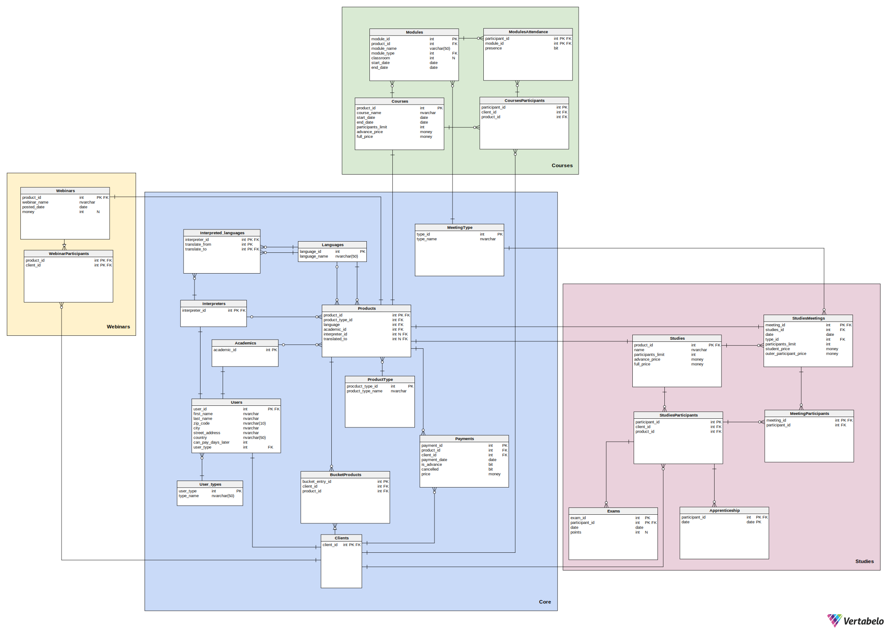

## 1. Opis systemu

Z tworzonej bazy danych skorzysta firma oferująca różnego rodzaju kursy i szkolenia:

* webinary - odbywają się na żywo na jednej z platform chmurowych, a ich nagrania są udostępniane klientom firmy. Nagrania nie są przechowywane w bazie - jedynie informacja o nich, którą usunąć może administrator.
* kursy - krótkie formy kształcenia, trwające zazwyczaj kilka dni, istnieją wyłącznie kursy płatne. Zaliczenie kursu wymaga zaliczenia min. 80% modułów.
* studia - kilkuletnie szkolenia odbywające się online i stacjonarnie, wymagają zaliczenia praktyk i zdania egzaminu końcowego

Każda z tych form kształcenia prowadzona jest przez konkretnego wykładowcę w konkretnym języku (najczęściej polskim). Czasami treść jest tłumaczona na żywo przez tłumacza, co też powinno zostać odnotowane w bazie danych.

Możemy wyróżnić następujących aktorów systemu:

* Klient - użytkownik chcący skorzystać z oferty firmy szkoleniowej
* Właściciel - osoba tworząca materiały video i treść kursów
* Administrator - zarządzanie bazą danych oraz jej ulepszanie
 Aktorzy mogą skorzystać z następujących funkcjonalności:

### 1.1 Klient

#### 1.1.1. Webinary

* Korzystanie z nagrań bezpłatnych webinarów przez okres 30 dni od ich umieszczenia na stronie
* Użytkownicy posiadający konto: Po opłaceniu dostępu do webinarów płatnych, korzystanie z nagrań tych webinarów przez kolejne 30 dni od potwierdzenia opłaty
*

#### 1.1.2. Kursy

* Kontrolowanie zaliczenia danego kursu
(procent zaliczonych modułów >= 80 %)
Sprawdzenie statusu swojej obecności na wybranych modułach
* Dostęp do listy kursów na które użytkownik jest zapisany i dostęp do statusu płatności przy każdym kursie (nieopłacone/ zaliczka/ opłacone w całości)
* Sprawdzenie dostępności wolnych miejsc na kursy hybrydowe i stacjonarne
* Dostęp do dodatkowych informacji o kursach takich jak: język kursu, obecność tłumacza, sposobie organizacji kursu (stacjonarnie/
o-line synchronicznie/ online asynchronicznie/ hybrydowo), dacie rozpoczęcia kursu czy sali zajęciowej (informacja dostępna po uiszczeniu wszelkich opłat)
Dostęp do nagranych modułów (moduły online), po opłaceniu dostępu

#### 1.1.3. Studia

* Sprawdzenie swojej obecności na zajęciach
* Możliwość zapisania się na odrabianie zajęć w kursie lub zajęciach innego kursu o podobnej tematyce
* Sprawdzenie wyników z egzaminów
* Sprawdzenie informacji o tym, czy odbyło się praktyki (14 dni - 2 razy w ciągu roku) i frekwencji na nich
* Możliwość zapisania się na pojedyncze zajęcia
* Wyświetlenie sylabusu studiów

#### 1.1.4. Koszyk

* dodawanie produktów do koszyka  (kursy, webinary, studia)
  
### 1.2. Sekretarz

* Wyświetlanie następujących raportów:
  * lista osób, które skorzystały z oferty firmy, ale za to nie zapłaciły
  * lista osób zapisanych na przyszłe wydarzenia z informacją, czy wydarzenia te odbywają się stacjonarnie, czy online
  * raport dotyczący frekwencji na wydarzeniach przeszłych - liczba osób które brały udział w każdym kursie/webinarze/studium i były obecne
  * lista osób, które są zapisane na kolidujące ze sobą wydarzenia
  * lista wyników egzaminów dla użytkowników
  * lista obecności na zajęciach dla danego użytkownika
  * lista odbytych praktyk
  * Dodanie nowego klienta
* Wyświetlanie spisu wszystkich zajęć i wszystkich spotkań z datami

### 1.3. Manager

Funkcje jakie ma sekretarz + dodatkowo:

* Wyświetlanie następujących raportów:
  * finansowe - zestawienie przychodów dla każdego kursu/studium/webinaru - przesyłana jest informacja o tym do właściciela
  * lista osób zapisanych na każde szkolenie zawierająca imię, nazwisko, informacja, czy klient był obecny
* Wyświetlanie spisu wszystkich zajęć i wszystkich spotkań z datami oraz możliwość ich zmiany (studia)
* Określenie limitu miejsc na kursy hybrydowe/stacjonarne oraz studia
* Możliwość generowania listy klientów którzy są uprawnieni do otrzymania dyplomów (ukończyli kurs/studia)

### 1.4. Nauczyciel

* Dodawanie nagrań szkoleń
* Dostęp do prowadzonych przez siebie nagrań i list obecności z prowadzonych przez siebie zajęć
  
### 1.5. Właściciel

Funkcje managera i sekretarza + dodatkowo:

* Zezwalanie na odroczenie płatności za szkolenia

### 1.6. Funkcje systemu

#### 1.6.1. Webinary

* kontrola dostępu klientów do webinarów
  * webinary bezpłatne - dostęp przez 30 dni od umieszczenia nagrania na platformie
  * webinary płatne - dostęp przez 30 dni od uiszczenia opłaty
  * uniemożliwienie korzystania z płatnych webinarów użytkownikom niezalogowanym i tym, którzy nie uiścili opłaty

#### 1.6.2. Kursy

* weryfikacja zaliczenia danych modułów wchodzących w skład kursu
* kontrola dostępu klientów do kursów:
  * kursy on-line synchronicznie (zasady jak przy webinarach)
  * kursy online asynchronicznie (dostęp po dodaniu materiałów przez właściciela i po uiszczeniu opłat przez klienta)
  * uniemożliwienie dostępu do kursów on-line użytkownikom którzy nie wpłacili całości kwoty 3 dni przed rozpoczęciem kursu

#### 1.6.3. Studia

* kontrola dostępu klientów do studiów
  * spotkania on-line
  * spotkania stacjonarnie
  * spotkania hybrydowe
  * możliwość wykupienia dostępu płatnego do jednego spotkania
  * limit miejsc ogólny (nie może być większy niż najmniejszy spośród limitów wszystkich spotkań)
* przechowywanie informacji o sylabusie (przechowywanie listy zajęć na danym studium i listy różnych studiów jeszcze przed danym rokiem)
* przechowywanie informacji o spisie wszystkich zajęć i wszystkich spotkań z datami
  * limit miejsc na spotkanie
* kontrola, czy studenci zaliczyli praktyki trwające 14 dni - 2 razy w ciągu roku
* kontrola obecności klientów na spotkaniach i praktykach
  * aby zaliczyć studium:
    * 80% obecności na spotkaniach
    * 100% obecności na praktykach
* kontrola, czy studenci uiścili opłatę wpisową oraz za każde spotkanie najpóźniej 3 dni przed zjazdem
* przyznawanie statusu zaliczenia i ew. wysłania dyplomu Pocztą polska na status korespondencyjny (na podstawie zaliczenia praktyk i egzaminu końcowego oraz obecności)

#### 1.6.4. Koszyk

* po kliknięciu przez klienta  “Zakończ i zapłać”, wygenerowanie linku do płatności.
* po zakończeniu transakcji przesłanie informacji zwrotnej o pomyślnym zakończeniu płatności lub błędzie.

## 2. Schemat bazy danych



## 3. Implementacje tabel

### 3.1 Core

Główna część systemu

#### Users

Zawiera wszystkich użytkowników systemu oraz ich dane - imię, nazwisko, dane adresowe oraz typ użytkownika (klucz obcy do tabeli User_types), a także informację o tym, ile dni opóźnienia w płatności jest dozwolone danemu użytkownikowi.

```sql
create table Users
(
    user_id            int                                  not null
        constraint user_id
            primary key,
    first_name         nvarchar(50)                         not null,
    last_name          nvarchar(50)                         not null,
    zip_code           nvarchar(10)                         not null,
    city               nvarchar(50)                         not null,
    street_address     nvarchar(50)                         not null,
    country            nchar(50)                            not null,
    can_pay_days_later int
        constraint DF__Users__can_pay_d__719CDDE7 default 0 not null,
    user_type          int                                  not null
        constraint User_types_Users
            references User_types
)
go
```

#### Academics

Zawiera id wszystkich użytkowników, którzy są nauczycielami - zdecydowaliśmy się na dodanie tabel Academics, Interpreters i Clients, by rozdzielić logikę wykonywaną dla poszczególnych typów użytkownika.

```sql
create table Academics
(
    academic_id int not null
        constraint Academics_pk
            primary key
        constraint FK_Academics_Users
            references Users
)
go
```

#### Interpreters

Zawiera id wszystkich tłumaczy

```sql
create table Interpreters
(
    interpreter_id int not null
        constraint Interpreters_pk
            primary key
        constraint Interpreters_Users
            references Users
)
go

```

#### Clients

Zawiera id wszystkich klientów

```sql
create table Clients
(
    client_id int not null
        constraint client_id
            primary key
        constraint Clients_Users
            references Users
)
go
```

#### User_types

Zawiera listę wszystkich typów użytkowników występujących w systemie

```sql
create table User_types
(
    user_type int          not null
        constraint User_types_pk
            primary key,
    type_name nvarchar(50) not null
)
go
```

#### Interpreted_languages

Każdemu tłumaczowi przyporządkowuje informację o tym, z jakiego języka na jaki tłumaczy (są to FK do tabeli languages)

```sql
create table Interpreted_languages
(
    interpreter_id int not null
        constraint Interpreted_languages_Interpreters
            references Interpreters,
    translate_from int not null
        constraint FK_Interpreted_languages_Languages
            references Languages,
    translate_to   int not null
        constraint FK_Interpreted_languages_Languages1
            references Languages,
    constraint Interpreted_languages_pk
        primary key (interpreter_id, translate_from, translate_to)
)
go
```

#### Languages

Lista wszystkich języków, w jakich prowadzone są szkolenia, bądź na jakie są one tłumaczone

```sql
create table Languages
(
    language_id   int          not null
        constraint PK_Languages
            primary key,
    language_name nvarchar(50) not null
)
go
```

#### Products

Zawiera wszystkie produkty, informację o ich typie (odwołanie do tabeli ProductType), języku w jakim jest prowadzone dane szkolenie, wykładowcy, który je prowadzi oraz o tłumaczu i języku, na który tłumaczone jest szkolenie

```sql
create table Products
(
    product_id      int not null
        constraint Products_pk
            primary key,
    product_type_id int not null
        constraint Products_ProductType
            references ProductType,
    language        int not null
        constraint FK_Products_Languages
            references Languages,
    academic_id     int not null
        constraint FK_Products_Academics
            references Academics,
    interpreter_id  int
        constraint FK_Products_Interpreters1
            references Interpreters,
    translated_to   int
        constraint FK_Products_Languages1
            references Languages
)
go
```

#### ProductType

Zawiera wszystkie typy produktów (webinary, spotkania, kursy, studia)

```sql
create table ProductType
(
    procduct_type_id  int          not null
        constraint ProductType_pk
            primary key,
    product_type_name nvarchar(50) not null
)
go
```

#### Payments

Spis wszystkich płatności (numer zamówienia, data płatności, wpłacona kwota)

```sql
create table Payments
(
    payment_id   int   not null
        constraint Payments_pk
            primary key,
    order_id     int   not null
	constraint Payments_Orders
            references Orders,
    payment_date date  not null,
    price        money not null
)
go
```

#### MeetingType

Rodzaje spotkań (online, hybrydowe, stacjonarne)

```sql
create table MeetingType
(
    type_id   int          not null
        constraint type_id
            primary key,
    type_name nvarchar(50) not null
)
go
```

### Orders

Lista wszystkich zamówień (numer klienta, status płatności)

```sql
CREATE TABLE Orders (
    order_id int  NOT NULL,
    client_id int  NOT NULL,
    payment_status int  NOT NULL,
    	CONSTRAINT Orders_pk PRIMARY KEY  (order_id)
)
go
```

### OrdersDetails

Lista wszystkich zamówień (numer klienta, status płatności)

```sql
create table Order_details (
    order_id int  NOT NULL,
    product_id int  NOT NULL,
    is_advance bit  NOT NULL,
    	CONSTRAINT Order_details_pk
		PRIMARY KEY  (order_id,product_id)
)
go
```
### Statuses

Rodzaje statusów zamówień ( nieopłacone, opłacone, częsciowo opłacone (z jakiegos produktu tylko zaliczka), anulowane )

```sql
CREATE TABLE Statuses (
    status_id int  NOT NULL,
    status_name varchar(20)  NOT NULL,
    	CONSTRAINT Statuses_pk
		PRIMARY KEY  (status_id)
)
go

```


### 3.2. Webinars

#### Webinars

Lista wszystkich webinarów wraz z ich nazwami, datą publikacji i ceną

```sql
create table Webinars
(
    product_id   int          not null
        constraint product_id_webinars
            primary key
        constraint Webinars_Products
            references Products,
    webinar_name nvarchar(50) not null,
    posted_date  date         not null,
    price        money
)
go

```

#### WebinarParticipants

Lista uczestników poszczególnych webinarów

```sql
create table WebinarParticipants
(
    product_id int not null
        constraint WebinarParticipants_Webinars
            references Webinars,
    client_id  int not null
        constraint FK_WebinarParticipants_Clients
            references Clients,
    constraint WebinarParticipants_pk
        primary key (client_id, product_id)
)
go
```

### 3.3. Courses

#### Courses

Lista kursów wraz z ich nazwami, datami początku i końca kursu, limitem uczestników, ceną zaliczki oraz pełną ceną

```sql
create table Courses
(
    product_id         int          not null
        constraint product_id
            primary key
        constraint FK_Courses_Products
            references Products,
    course_name        nvarchar(50) not null,
    start_date         date         not null,
    end_date           date         not null,
    participants_limit int          not null,
    advance_price      money        not null,
    full_price         money        not null
)
go

```

#### CoursesParticipants

Lista uczestników poszczególnych kursów

```sql
create table CoursesParticipants
(
    participant_id int not null
        constraint CoursesParticipants_pk
            primary key,
    client_id      int not null
        constraint CursesParticipants_Clients
            references Clients,
    product_id     int not null
        constraint CoursesParticipants_Courses
            references Courses
)
go
```


#### Modules

Lista modułów kursów z nazwami, typem modułu (odwołanie do tabeli MeetingType), numerem sali oraz datą rozpoczęcia i zakończenia modułu

```sql
create table Modules
(
    module_id   int         not null
        constraint Modules_pk
            primary key,
    product_id  int         not null
        constraint Courses_Modules
            references Courses,
    module_name varchar(50) not null,
    module_type int         not null
        constraint Modules_MeetingType
            references MeetingType,
    classroom   int,
    start_date  date        not null,
    end_date    date        not null
)
go
```

#### ModulesAttendance

Zawiera listę obecności uczestników kursów na poszczególnych modułach

```sql
create table ModulesAttendance
(
    participant_id int not null
        constraint FK_ModulesAttendance_CoursesParticipants
            references CoursesParticipants,
    module_id      int not null
        constraint ModulesAttendance_Modules
            references Modules,
    presence       bit not null,
    constraint PK_ModulesAttendance
        primary key (participant_id, module_id)
)
go

```

### 3.4. Studies

#### Studies

Zawiera listę produktów typu "studia", nazwę studiów, limit uczestników oraz wysokość wpisowego

```sql
create table Studies
(
    product_id         int          not null
        constraint studies_id
            primary key
        constraint Studies_Products
            references Products,
    name               nvarchar(50) not null,
    participants_limit int          not null,
    advance_price      money        not null,
    full_price         money        not null,
)
go
```

#### StudiesParticipants

Zawiera uczestników poszczególnych studiów

```sql
create table StudiesParticipants
(
    participant_id int not null
        constraint participant_id_studies_participants
            primary key,
    client_id      int not null
        constraint StudiesParticipants_Clients
            references Clients,
    product_id     int not null
        constraint StudiesParticipants_Studies
            references Studies
)
go
```
#### Exams

Zawiera wyniki z egzaminów poszczególnych uczestników, datę napisania egzaminu oraz zdobyte punkty

```sql
create table Exams
(
    exam_id        int  not null,
    participant_id int  not null
        constraint Exams_StudiesParticipants
            references StudiesParticipants,
    date           date not null,
    points         int,
    constraint Exams_pk
        primary key (exam_id, participant_id)
)
go
```

#### Apprenticeship

Zawiera uczestników, którzy odbyli praktyki w określonym terminie

```sql
create table Apprenticeship
(
    participant_id int  not null
        constraint Apprenticeship_StudiesParticipants
            references StudiesParticipants,
    date           date not null,
    constraint participant_id
        primary key (participant_id, date)
)
go
```

#### MeetingParticipants

Zawiera listę obecnych studentów na danych spotkaniach

```sql
create table MeetingParticipants
(
    meeting_id     int not null
        constraint FK_MeetingParticipants_StudiesMeetings
            references StudiesMeetings,
    participant_id int not null
        constraint MeetingParticipants_StudiesParticipants
            references StudiesParticipants,
    constraint meeting_id
        primary key (meeting_id, participant_id)
)
go

```

#### StudiesMeetings

Lista spotkań poszczególnych studiów, data spotkania, typ spotkania (FK do MeetingTypes), limit uczestników spotkania, cena dla studentów, cena dla uczestników, którzy nie są studentami

```sql
create table StudiesMeetings
(
    meeting_id              int   not null
        constraint meeting_id_studies_meetings
            primary key
        constraint StudiesMeetings_Products
            references Products,
    studies_id              int   not null
        constraint StudiesMeetings_Studies
            references Studies,
    date                    date  not null,
    type_id                 int   not null
        constraint StudiesMeetings_MeetingType
            references MeetingType,
    participants_limit      int   not null,
    student_price           money not null,
    outer_participant_price money not null
)
go
```
## Dane testowe

### Academics
| academic\_id |
| :--- |
| 2 |
| 8 |
| 10 |
| 12 |
| 21 |
| 27 |


### Apprenticeship


### Clients
| client\_id |
| :--- |
| 1 |
| 3 |
| 4 |
| 5 |
| 6 |
| 7 |
| 9 |
| 11 |
| 13 |
| 15 |
| 23 |
| 24 |
| 26 |
| 29 |
| 30 |


### Courses
| product_id | course_name                     | start_date | end_date   | participants_limit | advance_price | full_price |
|------------|---------------------------------|------------|------------|--------------------|---------------|------------|
| 2          | SQL for begineers               | 2022-12-12 | 2023-02-20 | 15                 | 500           | 2500       |
| 6          | SQL for intermediate            | 2024-03-20 | 2024-06-30 | 10                 | 1000          | 3000       |
| 10         | Python algoritms and structures | 2023-10-10 | 2024-01-20 | 25                 | 1500          | 4000       |
| 14         | UNIX comends                    | 2024-01-05 | 2024-01-31 | 20                 | 250           | 1000       |

### CoursesParticipants
| participant_id | client_id | product_id |
|----------------|-----------|------------|
| 1              | 1         | 2          |
| 2              | 1         | 6          |
| 3              | 4         | 2          |
| 4              | 4         | 6          |
| 5              | 7         | 10         |
| 6              | 7         | 14         |
| 7              | 1         | 10         |
| 8              | 1         | 14         |
| 9              | 11        | 10         |
| 10             | 15        | 10         |
| 11             | 5         | 10         |
| 12             | 13        | 10         |
| 13             | 9         | 10         |
| 14             | 3         | 10         |

### Exams

### Interpreted_language
| interpreter_id | translate_from | translate_to |
|----------------|----------------|--------------|
| 14             | 2              | 1            |
| 14             | 2              | 3            |
| 14             | 3              | 1            |
| 22             | 4              | 1            |

### Interpreters
| interpreter_id |
|----------------|
| 14             |
| 22             |

### Languages
| language_id | language_name |
|-------------|---------------|
| 1           | Polish        |
| 2           | German        |
| 3           | English       |
| 4           | Italian       |

### MeetingParticipants

### MeetingType
| type_id | type_name |
|---------|-----------|
| 1       | on-line   |
| 2       | in-person |
| 3       | hybrid    |

### Modules
| module_id | product_id | module_name         | module_type | classroom | start_date | end_date   |
|-----------|------------|---------------------|-------------|-----------|------------|------------|
| 1         | 2          | Primary Keys        | 2           | 10        | 2022-12-12 | 2022-12-14 |
| 2         | 2          | Basic commands      | 1           | NULL      | 2022-12-19 | 2022-12-20 |
| 3         | 2          | The basics of joins | 1           | NULL      | 2023-01-04 | 2023-01-10 |
| 4         | 2          | Exercises           | 1           | NULL      | 2023-01-15 | 2023-02-20 |
| 5         | 6          | Group by your data  | 2           | 15        | 2024-03-20 | 2024-04-20 |
| 6         | 6          | Sort your data      | 2           | 15        | 2024-04-25 | 2024-04-30 |
| 7         | 6          | Exercices           | 1           | NULL      | 2024-05-01 | 2024-06-30 |
| 8         | 10         | Sorting algoritms   | 2           | 20        | 2023-10-10 | 2023-11-10 |
| 9         | 10         | Graph Algoritms     | 3           | 15        | 2023-11-15 | 2023-12-15 |
| 10        | 10         | Dynamic Programming | 2           | 20        | 2023-12-20 | 2024-01-20 |
| 11        | 14         | Files and folders   | 1           | NULL      | 2024-01-05 | 2024-01-10 |
| 12        | 14         | Grep and awk        | 1           | NULL      | 2024-01-11 | 2024-01-20 |
| 13        | 14         | Bash and regex      | 1           | NULL      | 2024-01-21 | 2024-01-31 |

### ModulesAttendance
| participant_id | module_id | presence |
|----------------|-----------|----------|
| 1              | 1         | 1        |
| 1              | 2         | 1        |
| 1              | 3         | 1        |
| 1              | 4         | 1        |
| 3              | 1         | 1        |
| 3              | 2         | 0        |
| 3              | 3         | 0        |
| 3              | 4         | 1        |
| 5              | 8         | 1        |
| 5              | 9         | 1        |
| 7              | 8         | 1        |
| 7              | 9         | 1        |
| 9              | 8         | 1        |
| 9              | 9         | 1        |
| 10             | 8         | 1        |
| 10             | 9         | 0        |
| 11             | 8         | 1        |
| 11             | 9         | 1        |
| 12             | 8         | 1        |
| 12             | 9         | 1        |
| 13             | 8         | 1        |
| 13             | 9         | 1        |
| 14             | 8         | 1        |
| 14             | 9         | 1        |

### Payments

### Products
| product_id | product_type_id | language | academic_id | interpreter_id | translated_to |
|------------|-----------------|----------|-------------|----------------|---------------|
| 1          | 1               | 3        | 8           | NULL           | NULL          |
| 2          | 2               | 2        | 2           | 14             | 1             |
| 3          | 1               | 4        | 10          | 22             | 1             |
| 4          | 3               | 1        | 21          | NULL           | NULL          |
| 5          | 1               | 3        | 2           | NULL           | NULL          |
| 6          | 2               | 4        | 8           | 22             | 1             |
| 7          | 4               | 2        | 10          | 14             | 3             |
| 8          | 3               | 1        | 12          | NULL           | NULL          |
| 9          | 1               | 3        | 12          | NULL           | NULL          |
| 10         | 2               | 2        | 2           | NULL           | NULL          |
| 11         | 4               | 4        | 10          | NULL           | NULL          |
| 12         | 3               | 1        | 21          | NULL           | NULL          |
| 13         | 1               | 3        | 21          | NULL           | NULL          |
| 14         | 2               | 4        | 2           | NULL           | NULL          |
| 15         | 4               | 2        | 8           | 14             | 3             |
| 16         | 3               | 2        | 2           | NULL           | NULL          |
| 17         | 1               | 1        | 8           | 14             | 1             |
| 18         | 2               | 1        | 8           | 22             | 3             |
| 19         | 3               | 2        | 10          | NULL           | NULL          |
| 20         | 3               | 3        | 12          | NULL           | NULL          |

### ProductType
| procduct_type_id | product_type_name |
|------------------|-------------------|
| 1                | webinar           |
| 2                | course            |
| 3                | studies           |
| 4                | meeting           |

### Studies
| product\_id | name | participants\_limit | full\_price | advance\_price |
| :--- | :--- | :--- | :--- | :--- |
| 4 | Computer Science | 50 | 40.0000 | 20.0000 |
| 8 | Astrology | 20 | 30.0000 | 12.0000 |
| 12 | Cybersecurity | 30 | 35.0000 | 10.0000 |
| 16 | Biomedic Engineering | 15 | 50.0000 | 25.0000 |
| 19 | Economy | 100 | 25.0000 | 10.0000 |
| 20 | Marketing | 200 | 10.0000 | 5.0000 |

### StudiesMeetings
| meeting\_id | studies\_id | date | type\_id | participants\_limit | student\_price | outer\_participant\_price |
| :--- | :--- | :--- | :--- | :--- | :--- | :--- |
| 1 | 4 | 2023-10-06 | 1 | 50 | 0.0000 | 10.0000 |
| 2 | 8 | 2023-10-20 | 2 | 30 | 0.0000 | 20.0000 |
| 3 | 4 | 2023-10-30 | 1 | 60 | 0.0000 | 15.0000 |
| 4 | 12 | 2023-11-07 | 3 | 50 | 5.0000 | 20.0000 |
| 5 | 19 | 2023-11-13 | 2 | 100 | 0.0000 | 5.0000 |
| 6 | 20 | 2023-12-28 | 2 | 200 | 0.0000 | 13.0000 |
| 7 | 4 | 2024-01-03 | 3 | 100 | 0.0000 | 12.0000 |
| 8 | 4 | 2024-03-04 | 2 | 65 | 6.0000 | 20.0000 |
| 9 | 20 | 2024-03-05 | 2 | 200 | 7.0000 | 30.0000 |
| 10 | 20 | 2024-03-12 | 2 | 200 | 2.0000 | 10.0000 |

### Exams
| exam\_id | participant\_id | date | points |
| :--- | :--- | :--- | :--- |
| 1 | 1 | 2023-10-12 | 60 |
| 2 | 2 | 2024-12-06 | null |
| 3 | 7 | 2024-08-14 | null |
| 4 | 8 | 2023-11-23 | 97 |
| 5 | 9 | 2024-05-23 | null |

### StudiesParticipants
| participant\_id | client\_id | product\_id |
| :--- | :--- | :--- |
| 1 | 30 | 4 |
| 2 | 23 | 12 |
| 3 | 4 | 16 |
| 4 | 23 | 20 |
| 5 | 23 | 16 |
| 6 | 24 | 16 |
| 7 | 3 | 19 |
| 8 | 4 | 20 |
| 9 | 5 | 4 |
| 10 | 29 | 4 |
| 11 | 5 | 8 |

### User_type
| user_type | type_name   |
|-----------|-------------|
| 1         | client      |
| 2         | academic    |
| 3         | interpreter |
| 4         | owner       |
| 5         | manager     |
| 6         | secretary   |
### Users
| user_id | first_name | last_name   | zip_code | city        | street_address             | country | can_pay_days_later | user_type |
|---------|------------|-------------|----------|-------------|----------------------------|---------|--------------------|-----------|
| 1       | Jan        | Nowak       | 00-001   | Warsaw      | ul. Prosta 5               | Poland  | 0                  | 1         |
| 2       | Hans       | Müller      | 10115    | Berlin      | Unter den Linden 15        | Germany | 0                  | 2         |
| 3       | John       | Smith       | 10001    | New York    | 123 Main St                | USA     | 0                  | 1         |
| 4       | Alice      | Williams    | SW1A 1AA | London      | Buckingham Palace Rd       | England | 0                  | 1         |
| 5       | Giuseppe   | Rossi       | 00100    | Rome        | Via del Corso 10           | Italy   | 0                  | 1         |
| 6       | Katarzyna  | Kowalska    | 03-040   | Krakow      | ul. Glówna 20              | Poland  | 0                  | 1         |
| 7       | Lukas      | Schmidt     | 10178    | Berlin      | Alexanderplatz 1           | Germany | 0                  | 1         |
| 8       | Emily      | Jones       | 90210    | Los Angeles | 345 Maple St               | USA     | 0                  | 2         |
| 9       | Sophie     | Taylor      | SW1A 1BA | London      | Westminster Bridge Rd      | England | 0                  | 1         |
| 10      | Luca       | Bianchi     | 00144    | Rome        | Via Appia Nuova 25         | Italy   | 0                  | 2         |
| 11      | Marek      | Wozniak     | 50-001   | Wroclaw     | ul. Rynek 1                | Poland  | 0                  | 1         |
| 12      | Elena      | Schneider   | 60311    | Frankfurt   | Hauptwache 6               | Germany | 0                  | 2         |
| 13      | Michael    | Brown       | 33101    | Miami       | 678 Ocean Dr               | USA     | 0                  | 1         |
| 14      | Olivia     | Smith       | SW1A 1AB | London      | Buckingham Gate 12         | England | 0                  | 3         |
| 15      | Giovanni   | Ferrari     | 00192    | Rome        | Via della Conciliazione 50 | Italy   | 7                  | 1         |
| 16      | Karolina   | Lewandowska | 02-020   | Warsaw      | ul. Kwiatowa 7             | Poland  | 0                  | 4         |
| 17      | Mateusz    | Kowalczyk   | 50-500   | Wroclaw     | ul. Piekna 12              | Poland  | 0                  | 5         |
| 18      | Adrian     | Szymanski   | 80-080   | Gdansk      | ul. Morska 3               | Poland  | 0                  | 6         |
| 19      | Ewa        | Jankowska   | 01-010   | Lodz        | ul. Ogrodowa 25            | Poland  | 0                  | 6         |
| 20      | Mikolaj    | Wójcik      | 33-330   | Krakow      | ul. Slowackiego 10         | Poland  | 0                  | 5         |
| 21      | Aleksandra | Dabrowska   | 03-030   | Warsaw      | ul. Lipowa 8               | Poland  | 0                  | 2         |
| 22      | Andrzej    | Kowalczyk   | 50-501   | Wroclaw     | ul. Zielona 14             | Poland  | 0                  | 3         |
| 23      | Welby      | Churchouse  | 22300    | Dallas      | Hunt St 10                 | USA     | 0                  | 1         |
| 24      | Ive        | Boyington   | 10550    | Hamburg     | Alter Vall 43              | Germany | 0                  | 1         |
| 25      | Eric       | Warren      | 90543    | Brema       | Neuenstrasse 12            | Germany | 0                  | 6         |
| 26      | Vincent    | Cunningham  | 15250    | Vancouver   | Davie St 12                | Canada  | 0                  | 1         |
| 27      | Janina     | Wiśniowska  | 43-442   | Szczeciń    | ul. Długa 15               | Poland  | 0                  | 2         |
| 28      | John       | Richardson  | 32455    | Florencja   | via Palazzulo 95           | Italy   | 0                  | 5         |
| 29      | Alexander  | Fowler      | 43533    | Neapol      | Via Campania 5             | Italy   | 0                  | 1         |
| 30      | Andrzej    | Bogdański   | 35-234   | Gdańsk      | ul. Portowa 41             | Poland  | 0                  | 1         |

### WebinarParticipants
| product_id | client_id |
|------------|-----------|
| 1          | 1         |
| 1          | 3         |
| 5          | 3         |
| 9          | 3         |
| 13         | 4         |
| 9          | 7         |
| 9          | 9         |
| 5          | 11        |
| 9          | 13        |
| 1          | 15        |

### Webinars
| product_id | webinar_name                      | posted_date | price |
|------------|-----------------------------------|-------------|-------|
| 1          | Present Simple for beginners      | 2023-12-02  | NULL  |
| 5          | Cooking is fun                    | 2023-01-01  | 50    |
| 9          | Robotics for children             | 2023-10-11  | 60    |
| 13         | Advanced constructions in English | 2023-12-10  | NULL  |


## Widoki

### Sekretarza

#### EventsThisMonth

Spis webinarów, modułów oraz spotkań ze studiów, które odbywają się w aktualnym miesiącu

```sql
CREATE VIEW EventsThisMonth
AS
SELECT pt.product_type_name as category, s.name as product_name, sm.meeting_id as id, sm.date as date, sm.type_id as type
FROM StudiesMeetings as sm
	inner join Studies as s on s.product_id=sm.studies_id and YEAR(sm.date) = YEAR(GETDATE()) and MONTH(sm.date) = MONTH(GETDATE())
	inner join Products as p on p.product_id=s.product_id
	join ProductType as pt on pt.product_type_id=p.product_type_id
UNION
SELECT pt.product_type_name as category, w.webinar_name as product_name, NULL as id, w.posted_date as date, 'Zdalnie' as type
FROM Webinars as w
 	inner join Products as p on p.product_id=w.product_id and YEAR(w.posted_date) = YEAR(GETDATE()) and MONTH(w.posted_date) = MONTH(GETDATE())
	join ProductType as pt on pt.product_type_id=p.product_type_id
UNION
SELECT pt.product_type_name as category, c.course_name as product_name, m.module_id as id, m.start_date as date, m.module_type as type
FROM Modules as m
	inner join Courses as c on c.product_id=m.product_id and YEAR(m.start_date) = YEAR(GETDATE()) and MONTH(m.start_date) = MONTH(GETDATE())
	inner join Products as p on p.product_id=c.product_id
	join ProductType as pt on pt.product_type_id=p.product_type_id
```
## Procedury

### AddWebinar

Dodaje webinar o podanej nazwie, id nauczyciela, nazwie języka oraz opcjonalnie danych o tłumaczu i języku, na który jest tłumaczone dane szkolenie do tabeli webinars oraz products

```sql
DECLARE PROCEDURE uspAddWebinar
 @language_name nvarchar(50),
 @academic_id int,
 @interpreter_id int=null,
 @translated_to_name nvarchar(50)=null,
 @webinar_name nvarchar(50)
AS
BEGIN
 SET NOCOUNT ON;
 BEGIN TRY
  IF EXISTS(
   SELECT *
   FROM webinars
   where @webinar_name=webinar_name
  )
  BEGIN
   ;
   THROW 52000, N'Webinar o tej nazwie już istnieje',1 
  END
  IF NOT EXISTS(
   SELECT *
   FROM Academics
   WHERE academic_id=@academic_id
  )
  BEGIN
   ;
   THROW 52000, N'Nie ma takiego nauczyciela!',1 
  END
  IF NOT EXISTS(
   SELECT *
   FROM Languages
   WHERE @language_name=language_name
  )
  BEGIN
   ;
   THROW 52000, N'Nie ma takiego języka!',1 
  END
  IF NOT EXISTS(
   SELECT *
   FROM Languages
   WHERE @translated_to_name=language_name
  ) AND @translated_to_name is not null
  BEGIN
   ;
   THROW 52000, N'Nie ma takiego języka!',1 
  END
  IF NOT EXISTS(
   SELECT *
   FROM Interpreters
   WHERE interpreter_id=@interpreter_id
  ) AND @interpreter_id is not null
  BEGIN
   ;
   THROW 52000, N'Nie ma takiego nauczyciela!',1 
  END

  DECLARE @type_id INT
  SELECT @type_id = product_type_id
  FROM ProductType
  WHERE 'webinar' = product_type_name

  DECLARE @language_id INT
  SELECT @language_id=language_id
  FROM languages
  WHERE @language_name=language_name

  DECLARE @translate_to_id INT
  SELECT  @translate_to_id=language_id
  FROM languages
  WHERE  @translated_to_name=language_name

  
  INSERT INTO Products (product_type_id,language,academic_id,interpreter_id,translated_to)

    values(@type_id,@language_id,@academic_id,@interpreter_id,@translate_to_id)

  DECLARE @product_id INT;
  SET  @product_id= SCOPE_IDENTITY();

  INSERT INTO Webinars(product_id,webinar_name, posted_date)
  Values (@product_id,@webinar_name, GETDATE());

  
 END TRY
 BEGIN CATCH
  DECLARE @msg nvarchar(2048)=N'Błąd dodania webinaru: ' + ERROR_MESSAGE();
  THROW 52000, @msg, 1;
 END CATCH
END

```

### SetWebinarPrice

Zmienia cenę webinaru o podanej nazwie

```sql

SET ANSI_NULLS ON
GO
SET QUOTED_IDENTIFIER ON
GO

CREATE PROCEDURE uspSetWebinarPrice
 @webinar_name nvarchar(50),
 @price money
AS
BEGIN

 SET NOCOUNT ON;
 BEGIN TRY
  IF NOT EXISTS(
   SELECT *
   FROM webinars
   where @webinar_name=webinar_name
  )
  BEGIN
   ;
   THROW 52000, N'Webinar o tej nazwie nie istnieje',1 
  END

  DECLARE @webinar_id INT;
  SELECT @webinar_id=product_id
  FROM webinars
  WHERE @webinar_name=webinar_name

  UPDATE webinars
  SET price=@price
  where product_id=@webinar_id
 END TRY
 BEGIN CATCH
  DECLARE @msg nvarchar(2048)=N'Błąd zmiany ceny webinaru: ' + ERROR_MESSAGE();
  THROW 52000, @msg, 1;
 END CATCH
END
GO

```

### AddCourse

Dodaje kurs o podanej nazwie, id nauczyciela, nazwie języka oraz opcjonalnie danych o tłumaczu i języku, na który jest tłumaczone dane szkolenie oraz dacie rozpoczęcia i zakończenia i limicie uczestników do tabeli courses oraz products

```sql
SET ANSI_NULLS ON
GO
SET QUOTED_IDENTIFIER ON
GO

CREATE PROCEDURE [dbo].[uspAddCourse] 
 @language_name nvarchar(50),
 @academic_id int,
 @interpreter_id int=null,
 @translated_to_name nvarchar(50)=null,
 @course_name nvarchar(50),
 @start_date date,
 @end_date date,
 @participants_limit int
AS
BEGIN
 SET NOCOUNT ON;
 BEGIN TRY
  IF EXISTS(
   SELECT *
   FROM Courses
   where @course_name=course_name
  )
  BEGIN
   ;
   THROW 52000, N'Lurs o tej nazwie już istnieje',1 
  END
  IF NOT EXISTS(
   SELECT *
   FROM Academics
   WHERE academic_id=@academic_id
  )
  BEGIN
   ;
   THROW 52000, N'Nie ma takiego nauczyciela!',1 
  END
  IF NOT EXISTS(
   SELECT *
   FROM Languages
   WHERE @language_name=language_name
  )
  BEGIN
   ;
   THROW 52000, N'Nie ma takiego języka!',1 
  END
  IF NOT EXISTS(
   SELECT *
   FROM Languages
   WHERE @translated_to_name=language_name
  ) AND @translated_to_name is not null
  BEGIN
   ;
   THROW 52000, N'Nie ma takiego języka!',1 
  END
  IF NOT EXISTS(
   SELECT *
   FROM Interpreters
   WHERE interpreter_id=@interpreter_id
  ) AND @interpreter_id is not null
  BEGIN
   ;
   THROW 52000, N'Nie ma takiego nauczyciela!',1 
  END

  DECLARE @type_id INT
  SELECT @type_id = product_type_id
  FROM ProductType
  WHERE 'course' = product_type_name

  DECLARE @language_id INT
  SELECT @language_id=language_id
  FROM languages
  WHERE @language_name=language_name

  DECLARE @translate_to_id INT
  SELECT  @translate_to_id=language_id
  FROM languages
  WHERE  @translated_to_name=language_name

  
  INSERT INTO Products (product_type_id,language,academic_id,interpreter_id,translated_to)

    values(@type_id,@language_id,@academic_id,@interpreter_id,@translate_to_id)

  DECLARE @product_id INT;
  SET  @product_id= SCOPE_IDENTITY();

  INSERT INTO Courses(product_id,course_name, start_date,end_date,participants_limit)
  Values (@product_id,@course_name, @start_date,@end_date,@participants_limit);

  
 END TRY
 BEGIN CATCH
  DECLARE @msg nvarchar(2048)=N'Błąd dodania kursu: ' + ERROR_MESSAGE();
  THROW 52000, @msg, 1;
 END CATCH
END

```

### setCoursePrice

Ustawia cenę zaliczki i/lub pełną cenę kursu

```sql
USE [u_stankiew]
GO
/****** Object:  StoredProcedure [dbo].[uspSetWebinarPrice]    Script Date: 14.12.2023 14:05:24 ******/
SET ANSI_NULLS ON
GO
SET QUOTED_IDENTIFIER ON
GO

CREATE PROCEDURE [dbo].[uspSetCoursePrice]
	@course_name nvarchar(50),
	@advance_price money=null,
	@full_price money=null
AS
BEGIN

	SET NOCOUNT ON;
	BEGIN TRY
		IF NOT EXISTS(
			SELECT *
			FROM courses
			where @course_name=course_name
		)
		BEGIN
			;
			THROW 52000, N'Kurs o tej nazwie nie istnieje',1 
		END

		DECLARE @course_id INT;
		SELECT @course_id=product_id
		FROM courses
		WHERE @course_name=course_name
		
		IF @advance_price is not null
		Begin
			UPDATE courses
			SET advance_price=@advance_price
			where product_id=@course_id
		end
		
		IF @full_price is not null
		begin
			UPDATE courses
			SET full_price=@full_price
			where product_id=@course_id
		end

	END TRY
	BEGIN CATCH
		DECLARE @msg nvarchar(2048)=N'Błąd zmiany ceny kursu: ' + ERROR_MESSAGE();
		THROW 52000, @msg, 1;
	END CATCH
END

```

### AddStudies

Dodaje studia o podanej nazwie, id nauczyciela, nazwie języka oraz opcjonalnie danych o tłumaczu i języku, na który jest tłumaczone dane szkolenie oraz limicie uczestników do tabeli studies oraz products

```sql

CREATE PROCEDURE [dbo].[uspAddStudies] 
	@language_name nvarchar(50),
	@academic_id int,
	@interpreter_id int=null,
	@translated_to_name nvarchar(50)=null,
	@name nvarchar(50),
	@participants_limit int
AS
BEGIN
	SET NOCOUNT ON;
	BEGIN TRY
		IF EXISTS(
			SELECT *
			FROM Studies
			where @name=name
		)
		BEGIN
			;
			THROW 52000, N'Studia o tej nazwie już istnieją',1 
		END
		IF NOT EXISTS(
			SELECT *
			FROM Academics
			WHERE academic_id=@academic_id
		)
		BEGIN
			;
			THROW 52000, N'Nie ma takiego nauczyciela!',1 
		END
		IF NOT EXISTS(
			SELECT *
			FROM Languages
			WHERE @language_name=language_name
		)
		BEGIN
			;
			THROW 52000, N'Nie ma takiego języka!',1 
		END
		IF NOT EXISTS(
			SELECT *
			FROM Languages
			WHERE @translated_to_name=language_name
		) AND @translated_to_name is not null
		BEGIN
			;
			THROW 52000, N'Nie ma takiego języka!',1 
		END
		IF NOT EXISTS(
			SELECT *
			FROM Interpreters
			WHERE interpreter_id=@interpreter_id
		) AND @interpreter_id is not null
		BEGIN
			;
			THROW 52000, N'Nie ma takiego tłumacza!',1 
		END

		DECLARE @type_id INT
		SELECT @type_id = product_type_id
		FROM ProductType
		WHERE 'studies' = product_type_name

		DECLARE @language_id INT
		SELECT @language_id=language_id
		FROM languages
		WHERE @language_name=language_name

		DECLARE @translate_to_id INT
		SELECT  @translate_to_id=language_id
		FROM languages
		WHERE  @translated_to_name=language_name

		
		INSERT INTO Products (product_type_id,language,academic_id,interpreter_id,translated_to)

				values(@type_id,@language_id,@academic_id,@interpreter_id,@translate_to_id)

		DECLARE @product_id INT;
		SET  @product_id= SCOPE_IDENTITY();

		INSERT INTO Studies(product_id,name,participants_limit)
		Values (@product_id,@name,@participants_limit);

		
	END TRY
	BEGIN CATCH
		DECLARE @msg nvarchar(2048)=N'Błąd dodania kursu: ' + ERROR_MESSAGE();
		THROW 52000, @msg, 1;
	END CATCH
END

```

### setStudiesPrice

Ustawia cenę zaliczki i/lub pełną cenę studiów o podanej nazwie

```sql

CREATE PROCEDURE [dbo].[uspSetStudiesPrice]
	@name nvarchar(50),
	@advance_price money=null,
	@full_price money=null
AS
BEGIN

	SET NOCOUNT ON;
	BEGIN TRY
		IF NOT EXISTS(
			SELECT *
			FROM studies
			where @name=name
		)
		BEGIN
			;
			THROW 52000, N'Studia o tej nazwie nie istnieją',1 
		END

		DECLARE @studies_id INT;
		SELECT @studies_id=product_id
		FROM studies
		WHERE @name=name
		
		IF @advance_price is not null
		Begin
			UPDATE studies
			SET advance_price=@advance_price
			where product_id=@studies_id
		end
		
		IF @full_price is not null
		begin
			UPDATE studies
			SET full_price=@full_price
			where product_id=@studies_id
		end

	END TRY
	BEGIN CATCH
		DECLARE @msg nvarchar(2048)=N'Błąd zmiany ceny studiów: ' + ERROR_MESSAGE();
		THROW 52000, @msg, 1;
	END CATCH
END

```

### AddStudiesMeetings

Dodaje spotkanie o podanej nazwie, id nauczyciela, nazwie języka oraz opcjonalnie danych o tłumaczu i języku, na który jest tłumaczone dane szkolenie oraz limicie uczestników, dacie spotkania i przynależności do danych studiów do tabeli StudiesMeetings oraz products


```sql
CREATE PROCEDURE [dbo].[uspAddStudies] 
	@language_name nvarchar(50),
	@academic_id int,
	@interpreter_id int=null,
	@translated_to_name nvarchar(50)=null,
	@name nvarchar(50),
	@participants_limit int
AS
BEGIN
	SET NOCOUNT ON;
	BEGIN TRY
		IF EXISTS(
			SELECT *
			FROM Studies
			where @name=name
		)
		BEGIN
			;
			THROW 52000, N'Studia o tej nazwie już istnieją',1 
		END
		IF NOT EXISTS(
			SELECT *
			FROM Academics
			WHERE academic_id=@academic_id
		)
		BEGIN
			;
			THROW 52000, N'Nie ma takiego nauczyciela!',1 
		END
		IF NOT EXISTS(
			SELECT *
			FROM Languages
			WHERE @language_name=language_name
		)
		BEGIN
			;
			THROW 52000, N'Nie ma takiego języka!',1 
		END
		IF NOT EXISTS(
			SELECT *
			FROM Languages
			WHERE @translated_to_name=language_name
		) AND @translated_to_name is not null
		BEGIN
			;
			THROW 52000, N'Nie ma takiego języka!',1 
		END
		IF NOT EXISTS(
			SELECT *
			FROM Interpreters
			WHERE interpreter_id=@interpreter_id
		) AND @interpreter_id is not null
		BEGIN
			;
			THROW 52000, N'Nie ma takiego tłumacza!',1 
		END

		DECLARE @type_id INT
		SELECT @type_id = product_type_id
		FROM ProductType
		WHERE 'studies' = product_type_name

		DECLARE @language_id INT
		SELECT @language_id=language_id
		FROM languages
		WHERE @language_name=language_name

		DECLARE @translate_to_id INT
		SELECT  @translate_to_id=language_id
		FROM languages
		WHERE  @translated_to_name=language_name

		
		INSERT INTO Products (product_type_id,language,academic_id,interpreter_id,translated_to)

				values(@type_id,@language_id,@academic_id,@interpreter_id,@translate_to_id)

		DECLARE @product_id INT;
		SET  @product_id= SCOPE_IDENTITY();

		INSERT INTO Studies(product_id,name,participants_limit)
		Values (@product_id,@name,@participants_limit);

		
	END TRY
	BEGIN CATCH
		DECLARE @msg nvarchar(2048)=N'Błąd dodania kursu: ' + ERROR_MESSAGE();
		THROW 52000, @msg, 1;
	END CATCH
END

```

### SetMeetingPrice

Ustawia cenę danego spotkania dla studentów i/lub uczestników spoza studiów

```sql
CREATE PROCEDURE [dbo].[uspSetMeetingPrice]
	@meeting_id int,
	@student_price money=null,
	@outer_participant_price money=null
AS
BEGIN

	SET NOCOUNT ON;
	BEGIN TRY
		IF NOT EXISTS(
			SELECT *
			FROM StudiesMeetings
			where @meeting_id=meeting_id
		)
		BEGIN
			;
			THROW 52000, N'Taki meeting nie istnieje',1 
		END
		
		IF @student_price is not null
		Begin
			UPDATE StudiesMeetings
			SET student_price=@student_price
			where meeting_id=@meeting_id
		end
		
		IF @outer_participant_price is not null
		begin
			UPDATE StudiesMeetings
			SET outer_participant_price=@outer_participant_price
			where meeting_id=@meeting_id
		end

	END TRY
	BEGIN CATCH
		DECLARE @msg nvarchar(2048)=N'Błąd zmiany ceny spotkania: ' + ERROR_MESSAGE();
		THROW 52000, @msg, 1;
	END CATCH
END
```

### AddWCSParticipant

Dodaje uczestnika do szkolenia podanego typu (kurs, studia, webinar)

```sql
CREATE PROCEDURE [dbo].[uspAddWCSParticipant]
	@type_name nvarchar(50),
	@client_id int,
	@product_id int

AS
BEGIN

	SET NOCOUNT ON;
	BEGIN TRY
		DECLARE @type_id INT
		SELECT @type_id = product_type_id
		FROM ProductType
		WHERE @type_name = product_type_name
		
		IF NOT EXISTS(
			SELECT *
			FROM ProductType
			where @type_name=product_type_name
		)
		BEGIN
			;
			THROW 52000, N'Taki rodzaj szkolenia nie istnieje',1 
		END
		IF NOT EXISTS(
			SELECT *
			FROM Clients
			where @client_id=client_id
		)
		BEGIN
			;
			THROW 52000, N'Klient o podanym id nie istnieje',1 
		END
		IF NOT EXISTS(
			SELECT *
			FROM Products
			where @product_id=product_id and @type_id=product_type_id
		)
		BEGIN
			;
			THROW 52000, N'Produkt nie istnieje lub jest innego typu niż podany',1 
		END
		

		IF @type_name='webinars='
		begin
			INSERT INTO WebinarParticipants(product_id,client_id)
			values(@product_id,@client_id)
		end
		else IF @type_name='course'
		begin
			INSERT INTO CoursesParticipants(product_id,client_id)
			values(@product_id,@client_id)
		end
		else IF @type_name='studies'
		begin
			INSERT INTO StudiesParticipants(product_id,client_id)
			values(@product_id,@client_id)
		end


	END TRY
	BEGIN CATCH
		DECLARE @msg nvarchar(2048)=N'Błąd dodania uczestnika: ' + ERROR_MESSAGE();
		THROW 52000, @msg, 1;
	END CATCH
END

```

### CancelPayment

Dla danego payment_id ustawia pole cancelled w tabeli Payments na true - anuluje płatność

```sql
CREATE PROCEDURE [dbo].[uspCancelPayment]
	@payment_id int
AS
BEGIN

	SET NOCOUNT ON;
	BEGIN TRY

		
		IF NOT EXISTS(
			SELECT *
			FROM Payments
			where @payment_id=payment_id
		)
		BEGIN
			;
			THROW 52000, N'Płatność o podanym id nie istnieje',1 
		END

		UPDATE Payments
		SET cancelled=1
		where payment_id=@payment_id

	END TRY
	BEGIN CATCH
		DECLARE @msg nvarchar(2048)=N'Błąd anulowania płatności: ' + ERROR_MESSAGE();
		THROW 52000, @msg, 1;
	END CATCH
END

```

### LetPayDaysLater

Zezwala użytkownikowi o podanym id na płacenie z podanym opóźnieniem (wartość w dniach)

```sql
CREATE PROCEDURE [dbo].[uspLetPayDaysLater]
	@client_id int,
	@days int
AS
BEGIN

	SET NOCOUNT ON;
	BEGIN TRY

		
		IF NOT EXISTS(
			SELECT *
			FROM Clients
			where @client_id=client_id
		)
		BEGIN
			;
			THROW 52000, N'Klient o podanym id nie istnieje',1 
		END

		UPDATE Clients
		SET can_pay_days_later=@days
		where client_id=@client_id

	END TRY
	BEGIN CATCH
		DECLARE @msg nvarchar(2048)=N'Błąd zezwolenia na opóźnienie w płatności: ' + ERROR_MESSAGE();
		THROW 52000, @msg, 1;
	END CATCH
END

```

### SetParticipantsLimit

Ustawia limit uczestników dla produktu podanego typu produktu (spotkania, kursu lub studiów)

```sql
CREATE PROCEDURE [dbo].[uspSetParticipantsLimit]
	@product_id int,
	@limit int,
	@product_type_name nvarchar(50)
AS
BEGIN

	SET NOCOUNT ON;
	BEGIN TRY
		
		IF NOT EXISTS(
			SELECT *
			FROM ProductType
			where @product_type_name=product_type_name
		)
		BEGIN
			;
			THROW 52000, N'Taki rodzaj szkolenia nie istnieje',1 
		END


		IF @product_type_name='course'
		begin		
			IF NOT EXISTS(
				SELECT *
				FROM Courses
				where @product_id=product_id
			)
			BEGIN
				;
				THROW 52000, N'Taki kurs nie istnieje',1 
			END

			UPDATE Courses
			SET participants_limit=@limit
			where product_id=@product_id
		end
		else IF @product_type_name='studies'
		begin		
			IF NOT EXISTS(
				SELECT *
				FROM Studies
				where @product_id=product_id
			)
			BEGIN
				;
				THROW 52000, N'Takie studia nie istnieją',1 
			END

			UPDATE Studies
			SET participants_limit=@limit
			where product_id=@product_id
		end
		else IF @product_type_name='meeting'
		begin		
			IF NOT EXISTS(
				SELECT *
				FROM StudiesMeetings
				where @product_id=meeting_id
			)
			BEGIN
				;
				THROW 52000, N'Takie spotkanie nie istnieje',1 
			END

			UPDATE StudiesMeetings
			SET participants_limit=@limit
			where meeting_id=@product_id
		end
		else
		BEGIN
			;
			THROW 52000, N'Na podanym rodzaju szkolenia nie obowiązuje limit miejsc',1 
		END

	END TRY
	BEGIN CATCH
		DECLARE @msg nvarchar(2048)=N'Błąd zezwolenia na opóźnienie w płątności: ' + ERROR_MESSAGE();
		THROW 52000, @msg, 1;
	END CATCH
END

```

### AddPresence

Dodaje status obecności dla podanego użytkownika oraz id produktu. Konieczne jest również określenie, czy szkolenie jest modułem, czy spotkaniem.

```sql
CREATE PROCEDURE [dbo].[uspAddPresence]
	@type_name nvarchar(50),
	@product_id int,
	@participant_id int,
	@presence bit
AS
BEGIN

	SET NOCOUNT ON;
	BEGIN TRY
		
		IF @type_name!='module' and @type_name!='meeting'
		BEGIN
			;
			THROW 52000, N'Taki rodzaj szkolenia nie istnieje lub nie jest na nim sprawdzana obecność',1 
		END


		IF @type_name='module'
		begin		
			IF NOT EXISTS(
				SELECT *
				FROM Modules
				where @product_id=module_id
			)
			BEGIN
				;
				THROW 52000, N'Taki moduł nie istnieje',1 
			END

			INSERT INTO ModulesAttendance(participant_id,module_id,presence)
			values(@participant_id,@product_id,@presence)
		end
		else IF @type_name='meeting'
		begin		
			IF NOT EXISTS(
				SELECT *
				FROM StudiesMeetings
				where @product_id=meeting_id
			)
			BEGIN
				;
				THROW 52000, N'Takie spotkanie nie istnieje',1 
			END

			INSERT INTO MeetingParticipants(participant_id,meeting_id,presence)
			values(@participant_id,@presence,@presence)
		end

	END TRY
	BEGIN CATCH
		DECLARE @msg nvarchar(2048)=N'Błąd wpisywania obecności: ' + ERROR_MESSAGE();
		THROW 52000, @msg, 1;
	END CATCH
END

```


## Funkcje

### Kursy

#### CourseInfo

Wypisanie podstawowych informacji o kursie takich jak: nazwa, cena, zaliczka, data rozpoczecia, data zakonczenia oraz język główny i jezyk na który kurs jest tłumaczony.

```sql
CREATE FUNCTION courseInfo(@product_id int)
	RETURNS table
		AS
		RETURN Select c.course_name as course_name,
		c.full_price as price,
		c.advance_price as advance_price,
		c.start_date as start_date,
		c.end_date as end_date,
		p.language as orginal_language,
		l.language_name as translated_to
		FROM Products as p
		join Courses as c on c.product_id=p.product_id
		left outer join Languages as l on l.language_id=p.translated_to
		WHERE p.product_id=@product_id
```

#### ModulesPresence

Sprawdzenie statusu swojej obecności na wybranych modułach
```sql
CREATE FUNCTION modulesPresence(@participant_id int, @module_id int)
	RETURNS bit
AS
BEGIN
	DECLARE @presence BIT
	SET @presence = ISNULL((SELECT presence
				FROM ModulesAttendance
				WHERE participant_id=@participant_id AND
				module_id=@module_id),0)
	RETURN @presence
END
```

#### CoursesPresence

Sprawdzenie procentowej obecności na modułach w danym kursie

```sql
CREATE FUNCTION coursesPresence(@participant_id int, @product_id int)
	RETURNS FLOAT
AS
BEGIN
	DECLARE @presence int
	SET @presence = ISNULL((SELECT COUNT(ma.presence)
				FROM ModulesAttendance as ma
					inner join Modules as m
				on m.module_id=ma.module_id and m.product_id = @product_id
				WHERE ma.participant_id=@participant_id and ma.presence=1),0)
	DECLARE @modules_num int
	SET @modules_num = ISNULL((SELECT COUNT(module_id)
				FROM Modules
				WHERE product_id = @product_id),0)
	RETURN (@presence/@modules_num) *100
END
```

#### CoursesFreeSlots

Sprawdzenie ilości wolnych miejsc na kursach hybrydowych i stacjonarnych

```sql
CREATE FUNCTION coursesFreeSlots(@product_id int)
	RETURNS INT
AS
BEGIN
	DECLARE @slots INT
	SET @slots = ISNULL((SELECT c.participants_limit
						From Courses as c
						Where c.product_id = @product_id), 0)
	DECLARE @occupied INT
	SET @occupied = ISNULL((SELECT SUM(cp.participant_id)
					From CoursesParticipants as cp
					WHERE cp.product_id = @product_id
					GROUP BY cp.product_id),0)
	RETURN @slots - @occupied
END
```

### ClientsCourses

Sprawdzenie na jakie kursy jest zapisany dany klient oraz status płatności tego kursu

```sql
CREATE FUNCTION clientCourses(@client_id int)
	RETURNS table
		AS
		RETURN Select c.course_name, s.status_name
		FROM Orders as o inner join Order_details as od on od.order_id=o.order_id
		inner join Courses as c on c.product_id=od.product_id
		inner join Statuses as s on s.status_id=o.payment_status
		WHERE o.client_id=@client_id
```
